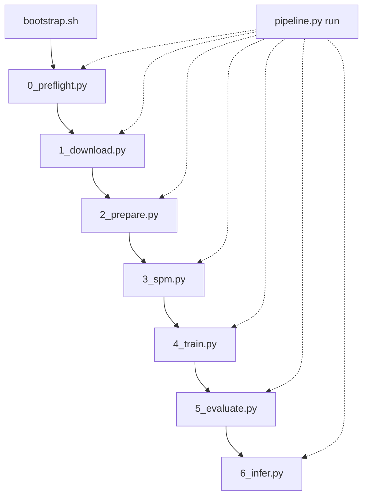

# S3T — Speech Translation (Pantagruel replication)

Réplication du système de **traduction de la parole end-to-end** décrit dans *Pantagruel* (encodeur SSL + décodeur Transformer), évalué sur **m-TEDx** (`fr-en`, `fr-pt`, `fr-es`) avec **SacreBLEU**.

| Document | Rôle |
|----------|------|
| [PRD.md](PRD.md) | Vision, exigences, hyperparamètres, risques |
| [AGENTS.md](AGENTS.md) | Conventions agents, qualité, workflow avant commit |
| [README_experiments.md](README_experiments.md) | Runbook détaillé, ablations, tracking |
| [requirements.txt](requirements.txt) | Dépendances Phase 1 |
| [requirements-dev.txt](requirements-dev.txt) | Ruff, pytest, pre-commit |

---

## Prérequis

- Python 3.10+
- GPU CUDA recommandé
- Accès réseau (OpenSLR, Hugging Face)
- Espace disque ≥ 200 GB (corpus + runs)

---

## Développement et qualité

**Langues :** code en anglais, documentation projet en français (voir [AGENTS.md](AGENTS.md)).

Installation des outils dev :

```bash
source .venv/bin/activate
pip install -r requirements-dev.txt
pre-commit install
```

Avant **chaque commit** (obligatoire) :

```bash
ruff check .
ruff format --check .
pytest
# ou : pre-commit run --all-files
```

Mettre à jour [PRD.md](PRD.md) et [README.md](README.md) dans le même commit si le comportement CLI, l'architecture ou les prérequis changent.

---

## Architecture du projet

Convention : **un fichier Python par stage**, plus un orchestrateur CLI.

| Étape | Module | Commande `pipeline.py` | Statut |
|-------|--------|------------------------|--------|
| Bootstrap | [`scripts/bootstrap.sh`](scripts/bootstrap.sh) | — | implémenté |
| 0 — Preflight | [`scripts/0_preflight.py`](scripts/0_preflight.py) | `preflight` | implémenté |
| 1 — Download | `scripts/1_download.py` | `download` | à implémenter |
| 2 — Prepare | `scripts/2_prepare.py` | `prepare` | à implémenter |
| 3 — SPM | `scripts/3_spm.py` | `spm` | à implémenter |
| 4 — Train | `scripts/4_train.py` | `train` | à implémenter |
| 5 — Evaluate | `scripts/5_evaluate.py` | `evaluate` | à implémenter |
| 6 — Infer | `scripts/6_infer.py` | `infer` | à implémenter |
| Orchestrateur | [`scripts/pipeline.py`](scripts/pipeline.py) | `run` (+ toutes les étapes) | routeur actif |

Chaque module stage est exécutable **directement** (`python scripts/N_*.py ...`) ou via `pipeline.py <subcommand>`.  
`pipeline.py` ne contient pas la logique métier : il route vers le module correspondant.

---

## Quickstart

```bash
# 0) Bootstrap — venv + dépendances Phase 1
chmod +x scripts/bootstrap.sh
./scripts/bootstrap.sh
source .venv/bin/activate

# Optionnel : PyTorch avec CUDA
# ./scripts/bootstrap.sh --with-cuda-index-url https://download.pytorch.org/whl/cu124 --lock

# 1) Vérifier l'environnement
python scripts/pipeline.py preflight

# 2) Pipeline complet (squelette — étapes en NotYetImplemented)
python scripts/pipeline.py run --langpair fr-es --run-id run_001 \
  --from-stage preflight --to-stage evaluate
```

---

## Pipeline



### 0) Bootstrap (`scripts/bootstrap.sh`)
- **But**: préparer un environnement Python reproductible pour la phase 1 du PRD.
- **Entrées**: `requirements.txt`, optionnel `--with-cuda-index-url`.
- **Actions**: crée le venv, met à jour `pip`, installe les dépendances, vérifie `torch`/CUDA.
- **Sorties**: `.venv/`, optionnel `requirements.lock.txt` avec `--lock`.
- **Validation**: le script termine sans erreur et affiche l’état CUDA (`cuda available: True/False`).

### 1) Preflight (`scripts/0_preflight.py`)
- **But**: vérifier qu’une machine distante Linux + CUDA est prête avant download/train.
- **Module**: [`scripts/0_preflight.py`](scripts/0_preflight.py) (appelable directement ou via `pipeline.py preflight`).
- **Politique**: `strict_critical` — seuls les checks critiques font échouer le script (exit `1`). Les warnings n’empêchent pas de continuer.
- **Checks critiques (fail)**:
  - Python >= 3.10
  - `torch` importable
  - CUDA disponible si `--check-gpu` (défaut: activé)
  - espace disque libre >= `--min-disk-gb` (défaut: 200 GB)
- **Checks non critiques (warn)**:
  - VRAM GPU >= `--min-vram-gb` (défaut: 8 GB)
  - `nvidia-smi` présent
  - connectivité OpenSLR + Hugging Face (`--check-network`)
  - dossiers `datasets/` et `scripts/` présents
- **Sorties**: `artifacts/preflight_report.json` (résumé + détail de chaque check).
- **Validation**: `summary.passed == true` dans le rapport JSON.

Exemple sur machine distante (après `bootstrap.sh` + activation du venv) :

```bash
python scripts/0_preflight.py --check-gpu --min-disk-gb 200 --min-vram-gb 8
# ou via l’orchestrateur :
python scripts/pipeline.py preflight --check-gpu --min-disk-gb 200 --min-vram-gb 8
```

Lecture rapide du rapport :

```bash
python -c "import json; r=json.load(open('artifacts/preflight_report.json')); print(r['summary'])"
```

### 2) Download (`scripts/1_download.py` / `pipeline.py download`)
- **Module cible**: `scripts/1_download.py` (à implémenter).
- **But**: récupérer les corpus m-TEDx nécessaires (`fr-en`, `fr-pt`, `fr-es`).
- **Entrées**: `--langpairs`, `--output-root`, option `--resume`.
- **Actions prévues**: téléchargement idempotent et extraction dans `datasets/raw`.
- **Sorties attendues**: archives et dossiers datasets disponibles localement.
- **Validation**: fichiers présents pour chaque paire demandée, tailles cohérentes, pas d’erreur réseau.

### 3) Prepare (`scripts/2_prepare.py` / `pipeline.py prepare`)
- **Module cible**: `scripts/2_prepare.py` (à implémenter).
- **But**: transformer les données brutes en données entraînables conformes PRD.
- **Entrées**: `datasets/raw`, paramètres audio (`--sample-rate`, durées min/max), règles de normalisation texte.
- **Actions prévues**:
  - conversion audio en WAV mono 16 kHz PCM16,
  - filtrage segments invalides (audio/texte vides, durées hors borne),
  - génération des manifests `train/valid/test`,
  - vérification anti-fuite entre splits.
- **Sorties attendues**:
  - `datasets/processed/`,
  - `datasets/manifests/<langpair>/*.tsv`.
- **Validation**: manifests propres, `--fail-on-leak` non déclenché, stats de prétraitement cohérentes.

### 4) SPM (`scripts/3_spm.py` / `pipeline.py spm`)
- **Module cible**: `scripts/3_spm.py` (à implémenter).
- **But**: entraîner le tokenizer SentencePiece sur la cible textuelle.
- **Entrées**: `--langpair`, `--vocab-size`, `--model-type`.
- **Actions prévues**: entraînement SPM (idéalement sur `train` uniquement, selon PRD).
- **Sorties attendues**: `datasets/processed/spm/*.model` et `*.vocab`.
- **Validation**: modèles SPM générés et chargeables sans erreur.

### 5) Train (`scripts/4_train.py` / `pipeline.py train`)
- **Module cible**: `scripts/4_train.py` (à implémenter).
- **But**: entraîner le modèle ST (encodeur SSL + décodeur Transformer).
- **Entrées**: `--config` (hyperparamètres/run), `--run-id`, optionnel `--output-dir`.
- **Actions prévues**:
  - lecture config run,
  - boucle d’entraînement avec logs/checkpoints,
  - sélection du meilleur checkpoint (PRD: priorité `BLEU dev`).
- **Sorties attendues**: `runs/<langpair>/<run_id>/checkpoints/` + logs d’entraînement.
- **Validation**: courbe loss descendante, checkpoints présents, run traçable (config + logs).

### 6) Evaluate (`scripts/5_evaluate.py` / `pipeline.py evaluate`)
- **Module cible**: `scripts/5_evaluate.py` (à implémenter).
- **But**: mesurer objectivement la qualité de traduction.
- **Entrées**: `--config`, `--run-id`, `--checkpoint`, `--beam-size`.
- **Actions prévues**:
  - décodage `valid`/`test`,
  - calcul SacreBLEU (et métriques associées) avec protocole fixe.
- **Sorties attendues**: fichiers d’éval (`BLEU dev/test`, `metrics.json`, signatures SacreBLEU).
- **Validation**: métriques produites et comparables entre runs (même commande/protocole).

### 7) Infer (`scripts/6_infer.py` / `pipeline.py infer`)
- **Module cible**: `scripts/6_infer.py` (à implémenter).
- **But**: traduire de nouveaux audios hors dataset d’entraînement.
- **Entrées**: `--checkpoint`, `--input-audio`, optionnel `--config`, `--beam-size`.
- **Actions prévues**: chargement du checkpoint, décodage des audios fournis.
- **Sorties attendues**: `inference/predictions.jsonl` (ou chemin `--output`).
- **Validation**: prédictions générées pour chaque entrée audio, format de sortie exploitable.

> Statut actuel: **`preflight` est implémenté** (`scripts/0_preflight.py`). Les étapes `download` à `infer` restent des squelettes `NotYetImplemented` (code 7). `bootstrap.sh` installe l’environnement Phase 1.

---

## Commandes par étape

```bash
python scripts/0_preflight.py --min-disk-gb 200 --check-gpu
# équivalent :
python scripts/pipeline.py preflight --min-disk-gb 200 --check-gpu

python scripts/pipeline.py download --langpairs fr-es

python scripts/pipeline.py prepare --langpair fr-es \
  --sample-rate 16000 --min-duration 1.0 --max-duration 30.0

python scripts/pipeline.py spm --langpair fr-es --vocab-size 1000

python scripts/pipeline.py train --config configs/fr-es/base.yaml --run-id run_001

python scripts/pipeline.py evaluate --config configs/fr-es/base.yaml --run-id run_001

python scripts/pipeline.py infer \
  --checkpoint runs/fr-es/run_001/checkpoints/best.pt \
  --input-audio path/to/audio.wav
```

Options communes : `--verbose`, `--dry-run`, `--log-file`.

---

## Structure du dépôt (cible)

```text
S3T/
  AGENTS.md
  tests/
  pyproject.toml
  .pre-commit-config.yaml
  scripts/
    bootstrap.sh        # Bootstrap environnement
    pipeline.py           # Orchestrateur CLI (routeur)
    0_preflight.py        # Stage 0 — preflight
    1_download.py         # Stage 1 — download (à créer)
    2_prepare.py          # Stage 2 — prepare (à créer)
    3_spm.py              # Stage 3 — tokenization (à créer)
    4_train.py            # Stage 4 — train (à créer)
    5_evaluate.py         # Stage 5 — evaluate (à créer)
    6_infer.py            # Stage 6 — infer (à créer)
  configs/              # YAML par langpair (à créer)
  datasets/
    raw/
    processed/
    manifests/
  runs/                 # checkpoints, logs, eval
  artifacts/            # rapports preflight, stats data
  inference/
```

---

## Jalons go/no-go (résumé PRD)

| Phase | Critère |
|-------|---------|
| Bootstrap | venv OK, `torch.cuda.is_available()` si GPU |
| Preflight | rapport JSON sans blocage |
| Prepare | 0 fuite train/valid/test, manifests propres |
| Train | loss ↓, `BLEU dev` > baseline |
| Evaluate | signature SacreBLEU loggée, artifacts reproductibles |

Détails : [PRD.md](PRD.md) §4 et [README_experiments.md](README_experiments.md).

---

## Codes de sortie (`pipeline.py`)

| Code | Signification |
|------|----------------|
| 0 | Succès |
| 2 | Erreur d’arguments |
| 7 | `NotYetImplemented` (étape non codée) |

---

## Prochaines étapes de développement

1. Implémenter `scripts/1_download.py` → `scripts/3_spm.py` (data m-TEDx)
2. Implémenter `scripts/4_train.py` et `scripts/5_evaluate.py` (modèle Seq2Seq + SacreBLEU)
3. Implémenter `scripts/6_infer.py` (inférence production)
4. Ajouter `configs/fr-es/base.yaml` (template dans README_experiments.md)
5. Téléchargement Pantagruel HF dans `bootstrap.sh` ou `0_preflight.py`
