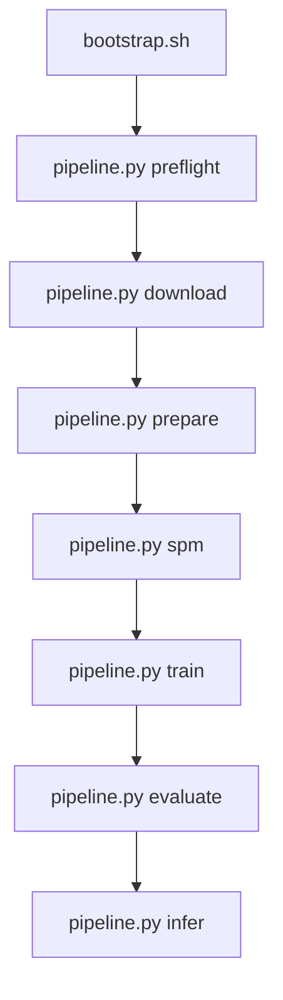

# S3T — Speech Translation (Pantagruel replication)

Réplication du système de **traduction de la parole end-to-end** décrit dans *Pantagruel* (encodeur SSL + décodeur Transformer), évalué sur **m-TEDx** (`fr-en`, `fr-pt`, `fr-es`) avec **SacreBLEU**.

| Document | Rôle |
|----------|------|
| [PRD.md](PRD.md) | Vision, exigences, hyperparamètres, risques |
| [README_experiments.md](README_experiments.md) | Runbook détaillé, ablations, tracking |
| [requirements.txt](requirements.txt) | Dépendances Phase 1 |

---

## Prérequis

- Python 3.10+
- GPU CUDA recommandé
- Accès réseau (OpenSLR, Hugging Face)
- Espace disque ≥ 200 GB (corpus + runs)

---

## Quickstart

```bash
# 0) Bootstrap — venv + dépendances Phase 1
chmod +x scripts/bootstrap.sh
./scripts/bootstrap.sh
source .venv/bin/activate

# Optionnel : PyTorch avec CUDA
# ./scripts/bootstrap.sh --with-cuda-index-url https://download.pytorch.org/whl/cu124 --lock

# 1) Vérifier l'environnement
python scripts/pipeline.py preflight

# 2) Pipeline complet (squelette — étapes en NotYetImplemented)
python scripts/pipeline.py run --langpair fr-es --run-id run_001 \
  --from-stage preflight --to-stage evaluate
```

---

## Pipeline



### 0) Bootstrap (`scripts/bootstrap.sh`)
- **But**: préparer un environnement Python reproductible pour la phase 1 du PRD.
- **Entrées**: `requirements.txt`, optionnel `--with-cuda-index-url`.
- **Actions**: crée le venv, met à jour `pip`, installe les dépendances, vérifie `torch`/CUDA.
- **Sorties**: `.venv/`, optionnel `requirements.lock.txt` avec `--lock`.
- **Validation**: le script termine sans erreur et affiche l’état CUDA (`cuda available: True/False`).

### 1) Preflight (`pipeline.py preflight`)
- **But**: vérifier que la machine est prête avant toute étape coûteuse.
- **Entrées**: seuils de contrôle (`--min-disk-gb`, `--min-vram-gb`) et checks activés (`--check-gpu`, `--check-network`).
- **Actions prévues**: contrôler disque, GPU, accès réseau et dépendances système.
- **Sorties attendues**: `artifacts/preflight_report.json`.
- **Validation**: rapport sans blocage critique (sinon on corrige avant `download`).

### 2) Download (`pipeline.py download`)
- **But**: récupérer les corpus m-TEDx nécessaires (`fr-en`, `fr-pt`, `fr-es`).
- **Entrées**: `--langpairs`, `--output-root`, option `--resume`.
- **Actions prévues**: téléchargement idempotent et extraction dans `datasets/raw`.
- **Sorties attendues**: archives et dossiers datasets disponibles localement.
- **Validation**: fichiers présents pour chaque paire demandée, tailles cohérentes, pas d’erreur réseau.

### 3) Prepare (`pipeline.py prepare`)
- **But**: transformer les données brutes en données entraînables conformes PRD.
- **Entrées**: `datasets/raw`, paramètres audio (`--sample-rate`, durées min/max), règles de normalisation texte.
- **Actions prévues**:
  - conversion audio en WAV mono 16 kHz PCM16,
  - filtrage segments invalides (audio/texte vides, durées hors borne),
  - génération des manifests `train/valid/test`,
  - vérification anti-fuite entre splits.
- **Sorties attendues**:
  - `datasets/processed/`,
  - `datasets/manifests/<langpair>/*.tsv`.
- **Validation**: manifests propres, `--fail-on-leak` non déclenché, stats de prétraitement cohérentes.

### 4) SPM (`pipeline.py spm`)
- **But**: entraîner le tokenizer SentencePiece sur la cible textuelle.
- **Entrées**: `--langpair`, `--vocab-size`, `--model-type`.
- **Actions prévues**: entraînement SPM (idéalement sur `train` uniquement, selon PRD).
- **Sorties attendues**: `datasets/processed/spm/*.model` et `*.vocab`.
- **Validation**: modèles SPM générés et chargeables sans erreur.

### 5) Train (`pipeline.py train`)
- **But**: entraîner le modèle ST (encodeur SSL + décodeur Transformer).
- **Entrées**: `--config` (hyperparamètres/run), `--run-id`, optionnel `--output-dir`.
- **Actions prévues**:
  - lecture config run,
  - boucle d’entraînement avec logs/checkpoints,
  - sélection du meilleur checkpoint (PRD: priorité `BLEU dev`).
- **Sorties attendues**: `runs/<langpair>/<run_id>/checkpoints/` + logs d’entraînement.
- **Validation**: courbe loss descendante, checkpoints présents, run traçable (config + logs).

### 6) Evaluate (`pipeline.py evaluate`)
- **But**: mesurer objectivement la qualité de traduction.
- **Entrées**: `--config`, `--run-id`, `--checkpoint`, `--beam-size`.
- **Actions prévues**:
  - décodage `valid`/`test`,
  - calcul SacreBLEU (et métriques associées) avec protocole fixe.
- **Sorties attendues**: fichiers d’éval (`BLEU dev/test`, `metrics.json`, signatures SacreBLEU).
- **Validation**: métriques produites et comparables entre runs (même commande/protocole).

### 7) Infer (`pipeline.py infer`)
- **But**: traduire de nouveaux audios hors dataset d’entraînement.
- **Entrées**: `--checkpoint`, `--input-audio`, optionnel `--config`, `--beam-size`.
- **Actions prévues**: chargement du checkpoint, décodage des audios fournis.
- **Sorties attendues**: `inference/predictions.jsonl` (ou chemin `--output`).
- **Validation**: prédictions générées pour chaque entrée audio, format de sortie exploitable.

> Statut actuel: les étapes `preflight` à `infer` sont des **squelettes** qui renvoient `NotYetImplemented` (code 7). Le seul script déjà opérationnel est `bootstrap.sh`.

---

## Commandes par étape

```bash
python scripts/pipeline.py preflight --min-disk-gb 200 --check-gpu

python scripts/pipeline.py download --langpairs fr-es

python scripts/pipeline.py prepare --langpair fr-es \
  --sample-rate 16000 --min-duration 1.0 --max-duration 30.0

python scripts/pipeline.py spm --langpair fr-es --vocab-size 1000

python scripts/pipeline.py train --config configs/fr-es/base.yaml --run-id run_001

python scripts/pipeline.py evaluate --config configs/fr-es/base.yaml --run-id run_001

python scripts/pipeline.py infer \
  --checkpoint runs/fr-es/run_001/checkpoints/best.pt \
  --input-audio path/to/audio.wav
```

Options communes : `--verbose`, `--dry-run`, `--log-file`.

---

## Structure du dépôt (cible)

```text
S3T/
  scripts/
    bootstrap.sh      # Phase 0 — environnement
    pipeline.py         # CLI unifiée (subcommands)
  configs/              # YAML par langpair (à créer)
  datasets/
    raw/
    processed/
    manifests/
  runs/                 # checkpoints, logs, eval
  artifacts/            # rapports preflight, stats data
  inference/
```

---

## Jalons go/no-go (résumé PRD)

| Phase | Critère |
|-------|---------|
| Bootstrap | venv OK, `torch.cuda.is_available()` si GPU |
| Preflight | rapport JSON sans blocage |
| Prepare | 0 fuite train/valid/test, manifests propres |
| Train | loss ↓, `BLEU dev` > baseline |
| Evaluate | signature SacreBLEU loggée, artifacts reproductibles |

Détails : [PRD.md](PRD.md) §4 et [README_experiments.md](README_experiments.md).

---

## Codes de sortie (`pipeline.py`)

| Code | Signification |
|------|----------------|
| 0 | Succès |
| 2 | Erreur d’arguments |
| 7 | `NotYetImplemented` (étape non codée) |

---

## Prochaines étapes de développement

1. Implémenter `preflight` → `prepare` (data m-TEDx)
2. Implémenter `train` / `evaluate` (modèle Seq2Seq + SacreBLEU)
3. Ajouter `configs/fr-es/base.yaml` (template dans README_experiments.md)
4. Téléchargement Pantagruel HF dans `bootstrap.sh` ou `preflight`
