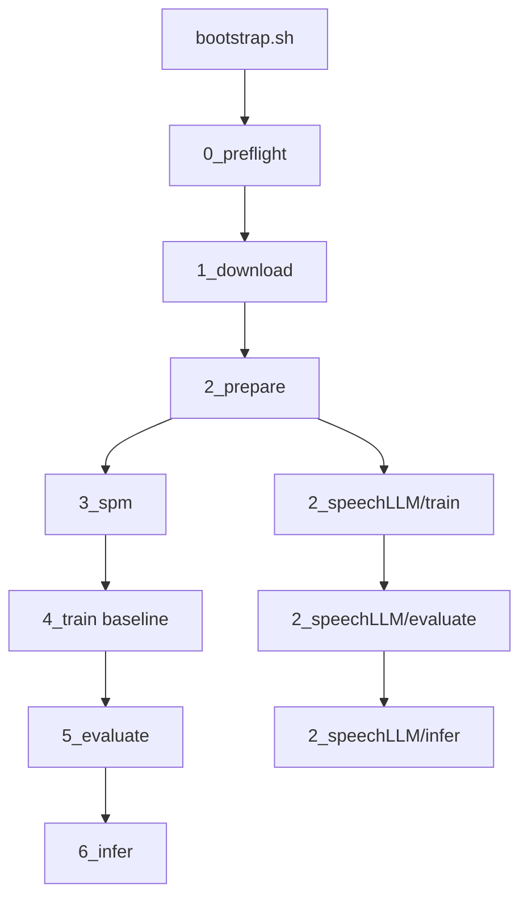

# S3T — Speech Translation (Pantagruel replication)

> **Page web** — [crispyfunicular.github.io/Pantagruel_S3T](https://crispyfunicular.github.io/Pantagruel_S3T/) · source [`web/index.html`](web/index.html)  
> **GitHub Pages** — préférer **Settings → Pages → Source : GitHub Actions** (workflow [`.github/workflows/static.yml`](.github/workflows/static.yml), artefact `web/`). Tant que la source reste « Deploy from branch /docs », une copie de secours est maintenue dans [`docs/index.html`](docs/index.html).

Réplication de la **traduction de la parole** sur **m-TEDx** (`fr-en`, `fr-pt`, `fr-es`), évaluée avec **SacreBLEU**. Le dépôt expose **cinq variantes** partageant la même préparation des données (étapes 0–2), avec un choix de **découpage audio** au moment de `prepare` :

| # | Dossier | Variante | Statut | Orchestrateur |
|---|---------|----------|--------|---------------|
| — | [`scripts_communs/`](scripts_communs/) | Données m-TEDx (étapes 0–2) | implémenté | [`scripts_communs/pipeline.py`](scripts_communs/pipeline.py) |
| **1** | [`1_Transformer/`](1_Transformer/) | Baseline ST end-to-end (Pantagruel + décodeur Transformer 6 couches, SPM) | implémenté | [`1_Transformer/pipeline.py`](1_Transformer/pipeline.py) |
| **2** | [`2_speechLLM/`](2_speechLLM/) | speechLLM B1 (projecteur seul + LLM gelé) | implémenté, priorité fr→en | [`2_speechLLM/pipeline.py`](2_speechLLM/pipeline.py) |
| **3** | [`3_Gemini/`](3_Gemini/) | Gemini 2.5 / 3.5 Flash (API audio→EN) | implémenté | [`3_Gemini/pipeline.py`](3_Gemini/pipeline.py) |
| **4** | [`4_cascade/`](4_cascade/) | Cascade ASR→MT (Whisper + Marian) | implémenté (evaluate/infer) | [`4_cascade/pipeline.py`](4_cascade/pipeline.py) |
| **5** | [`5_Pantagruel_multimodal/`](5_Pantagruel_multimodal/) | Pantagruel `Speech_Text` + décodeur ST (expérimental) | implémenté (délég. `1_Transformer`) | [`5_Pantagruel_multimodal/pipeline.py`](5_Pantagruel_multimodal/pipeline.py) |

| Document | Rôle |
|----------|------|
| [docs/PRD.md](docs/PRD.md) | Vision, exigences, hyperparamètres, ablations, template YAML, protocole runs |
| [web/vocabulaire.md](web/vocabulaire.md) | Glossaire des termes techniques, abréviations et codes du projet |
| [docs/protocole_evaluation.md](docs/protocole_evaluation.md) | **Méthodologie d'évaluation figée** (SacreBLEU, décodage, `eval/protocol.json`) |
| [docs/corpus_oralite_externe.md](docs/corpus_oralite_externe.md) | Tests ST sur audio FR externe (corpus oralité pluriTAL) |
| [docs/plan_migration_speechllm.md](docs/plan_migration_speechllm.md) | Plan speechLLM, critères B1/B2 |
| [2_speechLLM/README.md](2_speechLLM/README.md) | Usage CLI speechLLM, VRAM, format USER/ASSISTANT |
| [requirements.txt](requirements.txt) | Dépendances runtime + dev (une seule install pour les deux pistes) |
| [docs/estimation_ressources_fr_en.md](docs/estimation_ressources_fr_en.md) | Budget disque / GPU (fr→en) |

---

## État actuel (juin 2026) — variantes testées et résultats (fr→en)

Les scores ci-dessous sont des **SacreBLEU corpus** (cf. `eval/sacrebleu_*.txt` + signature).

**Référence article** — *Pantagruel* (2026), **Table 8** (ST fr→en, m-TEDx, segments **utterance**, protocole LeBenchmark / fairseq ; le papier rapporte un BLEU **test** global, pas de split dev public dans le tableau) :

| Variante | Run | Modèles (encodeur → génération / traduction) | Segment | BLEU dev | BLEU test | Remarques |
|---------|-----|---------------------------------------------|---------|----------|-----------|-----------|
| *Pantagruel (2026) — ST E2E* | — | **Pantagruel-B-1k** + décodeur Transformer 6L | `utterance` | — | **17.5 ± 0.4** | Cible de réplication S3T (`speech-base-1K` HF) |
| *Pantagruel (2026) — ST E2E* | — | LeBenchmark-w2v-**B-1k** + décodeur | `utterance` | — | **14.0 ± 0.5** | Baseline wav2vec 2.0 (même protocole ST) |
| *Pantagruel (2026) — ST E2E* | — | Pantagruel-**L-14k** + décodeur | `utterance` | — | **24.0 ± 0.4** | Cible S3T : `run_010` (échec collapse) → retry `run_014` v2 |
| *Pantagruel (2026) — ST E2E* | — | Pantagruel-**L-114k** + décodeur | `utterance` | — | **25.2 ± 0.4** | Cible S3T : `run_011` (prévu) |
| *Pantagruel (2026)* | — | speechLLM, Gemini, cascade ASR→MT | — | — | — | **Non rapportés** dans Table 8 (variantes S3T uniquement) |

**Tableaux détaillés** (par variante, `segment_mode`, décodage, runs smoke exclus) : **[rapport.md §5](rapport.md#5-résultats)**.

**Runs S3T — `sentence_like`** (juin 2026) :

| Variante | Run | BLEU dev | BLEU test | Décodage (v1) |
|----------|-----|----------|-----------|---------------|
| Gemini 2.5 Flash | `run_001_gemini_flash_sentence_like_v2` | 21.44 | 23.15 | temp 0 |
| speechLLM B1 (encodeur gelé) | `run_002_speechllm_b1_sentence_long` | 19.99 | 15.89 | beam 1 |
| speechLLM B1 (encodeur dégelé) | `run_005_speechllm_b1_sentence_long_unfreeze_encoder` | 19.25 | 18.83 | beam 1 |
| ST E2E Transformer | `run_001_transformer_baseline_sentence_like` | 16.12 | 14.97 | greedy |
| Speech_Text + ST | `run_001_pantagruel_multimodal` | 8.39 | 7.95 | greedy |

**Runs S3T — `utterance`** (bench Pantagruel, [protocole](docs/protocole_utterance_pantagruel.md)) :

| Variante | Run | BLEU dev | BLEU test | Statut |
|----------|-----|----------|-----------|--------|
| Cascade ASR→MT | `run_001_cascade_utterance` | **38.17** | **37.41** | ok (tour) |
| Gemini 2.5 Flash | `run_001_gemini_flash_utterance_full` | **33.76** | **33.72** | ok |
| Gemini 3.5 Flash | `run_003_gemini_35_flash_utterance` | 11.66 | 13.39 | ok (local, 99 min, **0,60 $** API) — troncature probable |
| Gemini 3.5 Flash | `run_003_gemini_35_flash_sentence_like` | 1.62 | 1.45 | ok (local, 42 min, **0,52 $**) — troncature probable |
| Gemini 3.5 Flash **v2** | `run_004_gemini_35_flash_utterance_v2` | 50.64* | 55.39* | smoke `--limit 5` ok ; run complet **à lancer**
| ST B-1k Table 8 | `run_002_transformer_baseline_utterance` | 3.90 | 3.79 | **échec** (collapse) |
| ST B-1k Table 8 **v2** | `run_004_transformer_baseline_utterance_v2` | **16.84** | **16.68** | ok (tour, gel 5k + early stop @20k) |
| speechLLM B1 | `run_003_speechllm_b1_utterance_long` | **10.00** | **7.47** | ok (tour, 2026-06-05) |
| speechLLM B1 **L-14k** | `run_012_speechllm_b1_utterance_large_14k` | **15.49** | **15.03** | ok (OVH, ~1,4 h GPU) |
| speechLLM B1 **L-114k** | `run_013_speechllm_b1_utterance_large_114k` | — | — | **en cours** (OVH) |
| ST L-14k Table 8 | `run_010_transformer_baseline_utterance_large_14k` | 0.00 | 0.00 | **échec** (collapse, tour, ~10 h 23 train + ~11 min éval, 2026-06-09) |
| ST L-14k Table 8 **v2** | `run_014_transformer_baseline_utterance_large_14k_v2` | — | — | **en cours** (Modyco, retry gel 5k + LR 1e-4 + early stop) |

Ne pas comparer les colonnes utterance et sentence_like entre elles ni directement à la Table 8 sans le même `segment_mode`.

### Guide de lecture des résultats

Trois axes **indépendants** (ne pas les confondre) :

| Axe | Valeurs S3T | Rapport au papier |
|-----|-------------|-------------------|
| **Paradigme** | ST E2E, speechLLM, Gemini, cascade, Speech_Text | Table 8 = ST E2E seulement |
| **Taille encodeur** | **1k** mesuré (`speech-base-1K`) ; **L-14k** tenté (`run_010`, échec) | papier **14k / 114k** (~24–25 BLEU) ; retry `run_014` v2 préparé |
| **Segmentation** | `utterance` (bench papier) et `sentence_like` (runs historiques) | utterance = Table 8 |

**Fichiers de suivi :** `runs/experiments_tracking.csv` ; tableaux complets [rapport.md §5](rapport.md#5-résultats) ; FAQ [rapport.md §1.3](rapport.md#13-clarifications-retour-encadrant-juin-2026) ; bench utterance [docs/protocole_utterance_pantagruel.md](docs/protocole_utterance_pantagruel.md).

**speechLLM run_002 vs run_005 :** même encodeur **1k** ; seul change le **gel** de l’encodeur (projecteur entraîné dans les deux cas). Ce n’est **pas** la comparaison 1k / 14k du papier.

### Ce qu’il reste à faire (priorités)

- **Baseline ST Table 8** : terminée en `sentence_like` — **16.12** dev / **14.97** test (`run_001_transformer_baseline_sentence_like`).
- Protocole d'évaluation **figé** : [docs/protocole_evaluation.md](docs/protocole_evaluation.md) (`2026-06-02-v1`) ; bench : `bash scripts/bench_evaluate_variants.sh`.
- **Bench utterance** — [docs/protocole_utterance_pantagruel.md](docs/protocole_utterance_pantagruel.md) : cascade/Gemini OK ; ST `run_002` échoué (3,79) ; **`run_004_transformer_baseline_utterance_v2` terminé** (16,84 / 16,68, tour — proche Table 8 ~17,5) ; **speechLLM `run_003` terminé** (10,00 / 7,47, tour — sous ST 16,68 ; relecture qualitative prioritaire).
- **Encodeur 14k / 114k** (priorité encadrant) : ST L-14k `run_010` **terminé** (collapse 0,00 / 0,00, tour) — **`run_014` v2 en cours** sur Modyco ; speechLLM L-14k **`run_012` terminé** (15,49 / 15,03, OVH) ; L-114k **`run_013` en cours** sur OVH — voir [`docs/protocole_utterance_pantagruel.md`](docs/protocole_utterance_pantagruel.md).
- **Gemini 3.5 Flash** : runs `run_003_*` **terminés** mais **non conclusifs** (troncature sous `max_output_tokens=256` + thinking API default) — utterance **11,66 / 13,39**, sentence_like **1,62 / 1,45**. Relance **`run_004_*_v2`** préparée (`gemini_flash_35_*_v2.yaml` : budget 1024 + `thinking_level: minimal`). Conserver les scores **2.5** pour l’historique.
- **Cascade utterance** : **38.17 / 37.41** (`run_001_cascade_utterance`, tour) — rsync `eval/` vers ThinkPad si besoin ; cascade `sentence_like` optionnelle.
- **Amélioration par variante** (modèle, hyperparamètres, corpus, décodage) : tableau [rapport.md §1.3](rapport.md#13-clarifications-retour-encadrant-juin-2026) ; piste bench `evaluate` multi-variantes une fois le protocole gelé.
- **Relecture qualitative** :
  - inspecter `eval/dev_predictions.txt` sur speechLLM vs Gemini (répétitions, longueur, erreurs systématiques).

---

## Prérequis

- Python 3.10+
- GPU CUDA recommandé (surtout entraînement ; speechLLM B1 avec LLM 7B ou Phi-2 selon config)
- Accès réseau (OpenSLR-100, Hugging Face pour Pantagruel et le LLM)
- Espace disque ≥ 200 GB (corpus + runs)
- **Une seule** installation : `./scripts_communs/bootstrap.sh` puis `pip install -r requirements.txt` (voir [Dépendances](#dépendances-requirementstxt))

---

## Enchaînement des scripts

Les étapes **0 à 2** sont **communes** aux variantes (données m-TEDx). À partir de l’étape 3, les chemins divergent selon la variante.

```text
scripts_communs/bootstrap.sh
    → 0_preflight → 1_download → 2_prepare   # commun (utterance ou sentence_like)
         │
         ├─► [1_Transformer]  3_spm → 4_train → 5_evaluate → 6_infer
         ├─► [2_speechLLM]    train → evaluate → infer
         ├─► [3_Gemini]       evaluate → infer
         ├─► [4_cascade]      evaluate → infer   (ASR→MT)
         └─► [5_Pantagruel_multimodal] spm → train → evaluate → infer
```

| # | Script | Routeur | Variantes |
|---|--------|---------|-----------|
| — | `scripts_communs/bootstrap.sh` | — | toutes |
| 0–2 | `scripts_communs/{0,1,2}_*.py` | `scripts_communs/pipeline.py` | toutes |
| 3–6 | `1_Transformer/{3..6}_*.py` | `1_Transformer/pipeline.py` | **1** uniquement |
| — | `2_speechLLM/{train,evaluate,infer}.py` | `2_speechLLM/pipeline.py` | **2** |
| — | `3_Gemini/{evaluate_gemini,infer_gemini}.py` | `3_Gemini/pipeline.py` | **3** |
| — | `4_cascade/{evaluate_cascade,infer_cascade}.py` | `4_cascade/pipeline.py` | **4** |
| — | `5_Pantagruel_multimodal/{train,evaluate,infer}_multimodal.py` | `5_Pantagruel_multimodal/pipeline.py` | **5** |

**Découpage audio (`2_prepare`) :**

| Mode | Commande | Rôle | Sorties typiques |
|------|----------|------|------------------|
| **`utterance`** (défaut) | `--segment-mode utterance` | Segments m-TEDx natifs (référence corpus) | `datasets/manifests/<pair>/`, `datasets/processed/<pair>/` |
| **`sentence_like`** | `--segment-mode sentence_like` | Fusion de segments contigus (même talk, même speaker si possible) pour approcher des **phrases complètes** | `datasets/manifests_sentence/<pair>/`, `datasets/processed_sentence/<pair>/` |

Paramètres du mode `sentence_like` : `--sentence-target-duration` (défaut 10s), `--sentence-max-duration` (défaut 15s), `--sentence-require-punctuation` (défaut activé : coupe sur `.?!` quand la durée cible est atteinte). Le rapport `artifacts/prepare_<pair>.json` enregistre `segment_mode` et des stats de fusion.

**Configs YAML :**

- Baseline : `1_Transformer/configs/<langpair>/base.yaml` (template [PRD §9](docs/PRD.md#9-template-de-configuration-run-yaml)) — référence `data.spm_model` ; pointer `data.*_manifest` vers `manifests/` ou `manifests_sentence/` selon le découpage choisi.
- speechLLM : [`2_speechLLM/configs/fr-en/b1.yaml`](2_speechLLM/configs/fr-en/b1.yaml) — pas de SPM ; champs `model.llm_name`, `prompt.template`, `prompt.format` (B2bis : [`b2bis_qwen25_3b.yaml`](2_speechLLM/configs/fr-en/b2bis_qwen25_3b.yaml), [`b2bis_mistral_7b.yaml`](2_speechLLM/configs/fr-en/b2bis_mistral_7b.yaml)).
- Gemini : **2.5** [`gemini_flash.yaml`](3_Gemini/configs/fr-en/gemini_flash.yaml) / [`gemini_flash_sentence.yaml`](3_Gemini/configs/fr-en/gemini_flash_sentence.yaml) ; **3.5** [`gemini_flash_35_utterance.yaml`](3_Gemini/configs/fr-en/gemini_flash_35_utterance.yaml) / [`gemini_flash_35_sentence.yaml`](3_Gemini/configs/fr-en/gemini_flash_35_sentence.yaml) ; **3.5 v2** (relance) [`gemini_flash_35_utterance_v2.yaml`](3_Gemini/configs/fr-en/gemini_flash_35_utterance_v2.yaml) / [`gemini_flash_35_sentence_v2.yaml`](3_Gemini/configs/fr-en/gemini_flash_35_sentence_v2.yaml) — `model.gemini_id` (`gemini-2.5-flash` vs `gemini-3.5-flash`).
- Cascade : [`cascade.yaml`](4_cascade/configs/fr-en/cascade.yaml) (utterance) ; [`cascade_sentence.yaml`](4_cascade/configs/fr-en/cascade_sentence.yaml) — champs `asr.*`, `mt.*`, `data.*_manifest` ; voir [4_cascade/README.md](4_cascade/README.md).

**Artifacts runs :** `runs/<langpair>/<run_id>/` (checkpoints, `train.log`, `eval/sacrebleu_*.txt`). Nommage conseillé : inclure le découpage dans les notes (`utterance` vs `sentence_like`) et la piste (`speechllm_b1`, `gemini_st`, etc.).



---

## Dépendances (`requirements.txt`)

Fichier unique à la racine : **runtime + outils dev**. Installé par `bootstrap.sh` ou manuellement après activation du venv.

| Paquet | Rôle | Baseline ST | speechLLM |
|--------|------|:-----------:|:---------:|
| `torch`, `torchaudio` | tenseurs, AMP, audio | oui | oui |
| `transformers` | encodeur Pantagruel (HF) | oui | oui (+ LLM causal) |
| `timm` | dépendance encodeur HF | oui | oui |
| `soundfile` | lecture WAV (`2_prepare`, collate) | oui | oui |
| `pyyaml` | configs d’expérience | oui | oui |
| `sacrebleu` | métriques dev/test | oui | oui |
| `sentencepiece` | étape `3_spm` + décodage baseline | **oui** | non |
| `tensorboard` | logs optionnels | oui | optionnel |
| `google-genai` | baseline API Gemini | non | oui (Gemini) |
| `ruff`, `pytest`, `pre-commit` | qualité (dev uniquement) | dev | dev |

## Détail des variantes (résumé)

## Baselines de l’article Pantagruel (contexte)

Dans l’article *Pantagruel: Unified Self-Supervised Encoders for French Text and Speech* (2026), les auteurs comparent Pantagruel à **trois baselines principales** pour le français :
- **Texte** : **FlauBERT** et **CamemBERT**
- **Parole** : **LeBenchmark** (famille wav2vec2/data2vec, etc. selon les tâches)

Ces baselines servent de points de référence pour les tâches aval (texte + parole) du papier ; elles sont distinctes des **variantes ST** répliquées dans ce dépôt (baseline end-to-end, speechLLM, Gemini, cascade).

### 1) `1_Transformer` — baseline ST end-to-end (PyTorch)
- **But** : répliquer la ST end-to-end « encodeur SSL + décodeur Transformer ».
- **Implémentation** : `scripts_communs/st_common.py` (`S3TModel`) + modules `1_Transformer/4_train.py`, etc.
- **Tokenisation** : SentencePiece via `1_Transformer/3_spm.py`.
- **Orchestration** : données `scripts_communs/pipeline.py` puis `1_Transformer/pipeline.py` (étapes 3→6).

### 2) `2_speechLLM` — B1 (article « projecteur »)
- **But** : répliquer l’approche *embarrassingly simple* (type SLAM-ASR) : **on n’entraîne qu’un projecteur** entre Pantagruel (gelé) et un LLM causal (gelé).
- **Implémentation** : `2_speechLLM/speechllm_common.py` (`SpeechLLMModel`) + `2_speechLLM/train.py`, `2_speechLLM/evaluate.py`, `2_speechLLM/infer.py`.
- **Orchestration** : `2_speechLLM/pipeline.py`.

### 3) `3_Gemini` — API (baseline externe)
- **But** : obtenir une baseline rapide à comparer aux pipelines locaux, avec le **même protocole SacreBLEU** et un **prompt réutilisable**.
- **Implémentation** : `3_Gemini/` (client + `evaluate` + `infer`) ; modèles supportés **`gemini-2.5-flash`** (référence) et **`gemini-3.5-flash`** (configs `gemini_flash_35_*.yaml`).
- **Orchestration** : `3_Gemini/pipeline.py`.
- **Données** : lit les manifests TSV produits par `2_prepare` (`utterance` ou `sentence_like` selon la config YAML `data.*_manifest`). Pas d’entraînement local ; clé API via `GEMINI_API_KEY`.

### 4) `4_cascade` — ASR→MT
- **But** : répliquer une baseline en **cascade** telle que citée dans l’article : on transcrit d’abord le français (ASR), puis on traduit le texte (MT).
- **Implémentation** : [`4_cascade/`](4_cascade/) — Whisper (`asr`) + Marian (`mt`) dans `cascade_common.py`, `evaluate` / `infer`, configs YAML, `--limit` pour smoke.
- **Cible** : même contrat d’artefacts `runs/.../eval/` et même signature SacreBLEU que les autres pistes.
- **Doc** : [4_cascade/README.md](4_cascade/README.md), [PRD §2.3.3](docs/PRD.md#233-baseline-cascade-asrmt).

### 5) `5_Pantagruel_multimodal` — full `speech_text` (expérimental)
- **But** : tester un checkpoint Pantagruel multimodal récent (`speech_text`) en variante dédiée, sans bloquer la piste prioritaire `2_speechLLM`.
- **Implémentation** : [`5_Pantagruel_multimodal/`](5_Pantagruel_multimodal/) — encodeur `Speech_Text_*` + décodeur Transformer (délégation `1_Transformer` 3–6), données `sentence_like`.
- **Cible** : alignement futur sur le même contrat d’artefacts `runs/.../eval/` et scoring SacreBLEU.
- **Doc** : [5_Pantagruel_multimodal/README.md](5_Pantagruel_multimodal/README.md).

**PyTorch CUDA** (recommandé sur machine GPU) :

```bash
./scripts_communs/bootstrap.sh --with-cuda-index-url https://download.pytorch.org/whl/cu124
# ou, venv déjà créé :
pip install torch torchaudio --index-url https://download.pytorch.org/whl/cu124
pip install -r requirements.txt
```

**Verrouillage** (reproductibilité) : `./scripts_communs/bootstrap.sh --lock` → `requirements.lock.txt`.

**Hors `requirements.txt` :** poids Hugging Face (Pantagruel, LLM) téléchargés au premier run ; pas de fairseq ni SpeechBrain dans le code actuel.

---

## Développement et qualité

**Langues :** code en anglais, documentation projet en français.

Installation des outils dev :

```bash
source .venv/bin/activate
pip install -r requirements.txt
pre-commit install
```

Avant **chaque commit** (obligatoire) :

```bash
ruff check .
ruff format --check .
pytest
# ou : pre-commit run --all-files
```

Mettre à jour [docs/PRD.md](docs/PRD.md) et [README.md](README.md) dans le même commit si le comportement CLI, l'architecture ou les prérequis changent.

---

## Architecture du projet

Convention : **scripts communs** (étapes 0–2) + **un dossier numéroté par variante** avec son routeur CLI. Les routeurs ne contiennent pas la logique métier.

### Scripts communs (`scripts_communs/`)

| Étape | Module | Commande | Statut |
|-------|--------|----------|--------|
| Bootstrap | [`bootstrap.sh`](scripts_communs/bootstrap.sh) | — | implémenté |
| 0 — Preflight | [`0_preflight.py`](scripts_communs/0_preflight.py) | `preflight` | implémenté |
| 1 — Download | [`1_download.py`](scripts_communs/1_download.py) | `download` | implémenté |
| 2 — Prepare | [`2_prepare.py`](scripts_communs/2_prepare.py) | `prepare` | implémenté |
| Orchestrateur | [`pipeline.py`](scripts_communs/pipeline.py) | `run` (0→2) | routeur actif |

Utilitaires partagés : [`st_common.py`](scripts_communs/st_common.py) (manifests, modèle ST, SacreBLEU).

### Variante 1 — `1_Transformer/`

| Étape | Module | Commande `1_Transformer/pipeline.py` | Statut |
|-------|--------|--------------------------------------|--------|
| 3 — SPM | [`3_spm.py`](1_Transformer/3_spm.py) | `spm` | implémenté |
| 4 — Train | [`4_train.py`](1_Transformer/4_train.py) | `train` | implémenté |
| 5 — Evaluate | [`5_evaluate.py`](1_Transformer/5_evaluate.py) | `evaluate` | implémenté |
| 6 — Infer | [`6_infer.py`](1_Transformer/6_infer.py) | `infer` | implémenté |
| Orchestrateur | [`pipeline.py`](1_Transformer/pipeline.py) | `run` (3→6) | routeur actif |

Configs : [`1_Transformer/configs/`](1_Transformer/configs/).

### Variante 2 — `2_speechLLM/`

| Étape | Module | Commande `2_speechLLM/pipeline.py` | Statut |
|-------|--------|----------------------------------|--------|
| Train | [`2_speechLLM/train.py`](2_speechLLM/train.py) | `train` | implémenté |
| Evaluate | [`2_speechLLM/evaluate.py`](2_speechLLM/evaluate.py) | `evaluate` | implémenté |
| Infer | [`2_speechLLM/infer.py`](2_speechLLM/infer.py) | `infer` | implémenté |
| Common | [`2_speechLLM/speechllm_common.py`](2_speechLLM/speechllm_common.py) | — | implémenté |
| Orchestrateur | [`2_speechLLM/pipeline.py`](2_speechLLM/pipeline.py) | `run` | routeur actif |

**Stack :** PyTorch + **transformers** (Pantagruel HF ; baseline = décodeur custom, speechLLM = LLM causal gelé + projecteur). Pas fairseq ; pas d’import SpeechBrain. Voir [PRD §2.5](docs/PRD.md#25-source-de-vérité-historique-et-transposition-speechbrain) et [PRD §2.3.1](docs/PRD.md#231-pipeline-speechllm-ligne-prioritaire-fr-en-b1).

Chaque stage est exécutable **directement** (`python scripts_communs/N_*.py`, `python 2_speechLLM/train.py`, …) ou via le routeur de sa piste.

---

## Quickstart

### Installation (commune)

```bash
chmod +x scripts_communs/bootstrap.sh
./scripts_communs/bootstrap.sh
# GPU : ./scripts_communs/bootstrap.sh --with-cuda-index-url https://download.pytorch.org/whl/cu124

source .venv/bin/activate
python scripts_communs/pipeline.py preflight
```

### Données m-TEDx (commune)

```bash
python scripts_communs/pipeline.py download --langpairs fr-en

# Découpage utterance (référence m-TEDx, défaut)
python scripts_communs/pipeline.py prepare --langpair fr-en

# Découpage phrase-like (segments fusionnés, expérimental)
python scripts_communs/2_prepare.py --langpair fr-en \
  --segment-mode sentence_like \
  --sentence-target-duration 10 \
  --sentence-max-duration 15 \
  --manifests-root datasets/manifests_sentence \
  --output-root datasets/processed_sentence
```

Pour Gemini sur segments phrase-like, utiliser [`3_Gemini/configs/fr-en/gemini_flash_sentence.yaml`](3_Gemini/configs/fr-en/gemini_flash_sentence.yaml) (manifests sous `datasets/manifests_sentence/fr-en/`).

### Piste speechLLM (fr→en, priorité)

Après `prepare` — **sans** `spm` :

```bash
python 2_speechLLM/pipeline.py train \
  --config 2_speechLLM/configs/fr-en/b1.yaml \
  --run-id run_001_speechllm_b1

python 2_speechLLM/pipeline.py evaluate \
  --config 2_speechLLM/configs/fr-en/b1.yaml \
  --run-id run_001_speechllm_b1 \
  --beam-size 4

# train + evaluate d’un coup :
python 2_speechLLM/pipeline.py run \
  --config 2_speechLLM/configs/fr-en/b1.yaml \
  --run-id run_001_speechllm_b1
```

### Piste baseline ST

Après `prepare`, enchaîner **spm** puis train/eval :

```bash
python 1_Transformer/pipeline.py spm --langpair fr-en --vocab-size 1000

python 1_Transformer/pipeline.py run --langpair fr-en --run-id run_001_fr-en_baseline \
  --config 1_Transformer/configs/fr-en/base.yaml \
  --from-stage spm --to-stage evaluate
```

(`1_Transformer/configs/fr-en/base.yaml` : voir template [PRD §9](docs/PRD.md#9-template-de-configuration-run-yaml).)

### Piste Gemini (API, sans GPU)

Après `prepare` (utterance ou `sentence_like`) :

```bash
export GEMINI_API_KEY=...   # ne pas committer

python 3_Gemini/pipeline.py evaluate \
  --config 3_Gemini/configs/fr-en/gemini_flash.yaml \
  --run-id run_001_gemini_flash_utterance

# smoke test (5 segments) :
python 3_Gemini/pipeline.py evaluate \
  --config 3_Gemini/configs/fr-en/gemini_flash.yaml \
  --run-id run_000_gemini_smoke5 --limit 5
```

Comparer utterance vs phrase-like : lancer `prepare` avec `--segment-mode sentence_like` et une config pointant vers `datasets/manifests_sentence/fr-en/` (voir [§ Prepare](#3-prepare-scripts2_preparepy--pipelinepy-prepare)).

---

## Pipeline — détail des étapes communes

### 0) Bootstrap (`scripts_communs/bootstrap.sh`)
- **But**: préparer un environnement Python reproductible pour la phase 1 du PRD.
- **Entrées**: `requirements.txt`, optionnel `--with-cuda-index-url`.
- **Actions**: crée le venv, met à jour `pip`, installe les dépendances, vérifie `torch`/CUDA.
- **Sorties**: `.venv/`, optionnel `requirements.lock.txt` avec `--lock`.
- **Validation**: le script termine sans erreur et affiche l’état CUDA (`cuda available: True/False`).

### 1) Preflight (`scripts_communs/0_preflight.py`)
- **But**: vérifier qu’une machine distante Linux + CUDA est prête avant download/train.
- **Module**: [`scripts_communs/0_preflight.py`](scripts_communs/0_preflight.py) (appelable directement ou via `pipeline.py preflight`).
- **Politique**: `strict_critical` — seuls les checks critiques font échouer le script (exit `1`). Les warnings n’empêchent pas de continuer.
- **Checks critiques (fail)**:
  - Python >= 3.10
  - `torch` importable
  - CUDA disponible si `--check-gpu` (défaut: activé)
  - espace disque libre >= `--min-disk-gb` (défaut: 200 GB)
- **Checks non critiques (warn)**:
  - VRAM GPU >= `--min-vram-gb` (défaut: 8 GB)
  - `nvidia-smi` présent
  - connectivité OpenSLR + Hugging Face (`--check-network`)
  - dossiers `datasets/`, `scripts_communs/` et `1_Transformer/` présents
- **Sorties**: `artifacts/preflight_report.json` (résumé + détail de chaque check).
- **Validation**: `summary.passed == true` dans le rapport JSON.

Exemple sur machine distante (après `bootstrap.sh` + activation du venv) :

```bash
python scripts_communs/0_preflight.py --check-gpu --min-disk-gb 200 --min-vram-gb 8
# ou via l’orchestrateur :
python scripts_communs/pipeline.py preflight --check-gpu --min-disk-gb 200 --min-vram-gb 8
```

Lecture rapide du rapport :

```bash
python -c "import json; r=json.load(open('artifacts/preflight_report.json')); print(r['summary'])"
```

### 2) Download (`scripts_communs/1_download.py`)
- **But**: récupérer les corpus m-TEDx depuis OpenSLR-100.
- **Module**: [`scripts_communs/1_download.py`](scripts_communs/1_download.py) (direct ou `pipeline.py download`).
- **Défaut**: `--langpairs fr-en` (une seule paire si non précisé).
- **Paires supportées**: `fr-en`, `fr-pt`, `fr-es`.
- **Entrées**: `--langpairs`, `--output-root`, `--resume` / `--no-resume`, `--extract` / `--no-extract`.
- **Actions**: téléchargement HTTP (reprise simple si possible) + extraction `.tgz` optionnelle.
- **Sorties**: `datasets/raw/mtedx_<pair>.tgz`, dossiers extraits, `artifacts/download_manifest.json`.
- **Validation**: manifest sans erreur (`exit_code == 0`), archives présentes pour chaque paire demandée.

Exemple :

```bash
python scripts_communs/1_download.py
# équivalent :
python scripts_communs/pipeline.py download

# plusieurs paires
python scripts_communs/1_download.py --langpairs fr-en,fr-pt,fr-es
```

### 3) Prepare (`scripts_communs/2_prepare.py` / `pipeline.py prepare`)

Transforme le corpus m-TEDx brut en **WAV 16 kHz mono** + **manifests TSV** exploitables par toutes les pistes (baseline ST, speechLLM, Gemini).

#### Deux modes de découpage (intra-fichier)

Le split **train / valid / test** reste celui du corpus m-TEDx. Ce qui change, c’est la **granularité des clips audio** extraits de chaque talk :

| | `utterance` (défaut) | `sentence_like` |
|---|---------------------|-----------------|
| **Source** | Un segment YAML m-TEDx = un clip | Segments contigus **fusionnés** dans le même talk |
| **Objectif** | Alignement strict sur le corpus publié | Unités plus **syntaxiques / sémantiques** (phrases complètes) |
| **Avantage** | Comparabilité directe, protocole fixe | Souvent meilleure traduction (plus de contexte local) |
| **Risque** | Clips parfois très courts ou tronqués | Segments plus longs ; comparer avec prudence entre runs |
| **Chemins** | `datasets/manifests/<pair>/`, `datasets/processed/<pair>/` | `datasets/manifests_sentence/<pair>/`, `datasets/processed_sentence/<pair>/` |

Règles de fusion (`sentence_like`) :
- même **talk** (`talk_id` dérivé du FLAC parent) ;
- de préférence même **speaker** ;
- durée cible ~ `--sentence-target-duration` (défaut 10 s) ;
- durée max `--sentence-max-duration` (défaut 15 s) ;
- coupe préférentielle sur ponctuation forte **`.?!`** (`--sentence-require-punctuation`, défaut activé).

Les ids fusionnés prennent la forme `{talk_id}_m{index}` (ex. `9fxo9YJhnG8_m0`).

#### Entrées / sorties / validation

- **Entrées** : `datasets/raw/...` (après download), `--sample-rate`, `--min-duration`, `--max-duration`, `--text-norm`, `--lowercase`, `--segment-mode`, paramètres `sentence_*`.
- **Actions** : extraction FLAC → WAV, normalisation texte, filtrage durée/texte, écriture manifests, anti-fuite (`--fail-on-leak`, défaut activé).
- **Sorties** :
  - audio : `--output-root` (défaut `datasets/processed/`) ;
  - manifests : `--manifests-root` (défaut `datasets/manifests/`) ;
  - rapport : `artifacts/prepare_<pair>.json` (inclut `segment_mode` + stats de fusion si `sentence_like`).
- **Validation** : `exit_code == 0`, pas de fuite train↔valid/test, WAV 16 kHz mono PCM16 vérifiés (`--verify-only`).

```bash
# Référence utterance (défaut)
python scripts_communs/2_prepare.py --langpair fr-en
python scripts_communs/pipeline.py prepare --langpair fr-en --min-duration 1.0 --max-duration 30.0

# Variante phrase-like (manifests séparés — ne pas écraser la référence)
python scripts_communs/2_prepare.py --langpair fr-en \
  --segment-mode sentence_like \
  --sentence-target-duration 10 \
  --sentence-max-duration 15 \
  --manifests-root datasets/manifests_sentence \
  --output-root datasets/processed_sentence
```

**Reprise (run long, safe to relaunch):** `--resume` est activé par défaut — les WAV déjà valides sont ignorés.

```bash
source .venv/bin/activate
./scripts_communs/prepare_status.sh fr-en          # état actuel
./scripts_communs/resume_prepare.sh fr-en          # reprise + vérif finale (log: logs/prepare_fr-en.log)
# ou manuellement :
python scripts_communs/2_prepare.py --langpair fr-en --resume --verbose
python scripts_communs/2_prepare.py --langpair fr-en --verify-only
```

Prérequis : download terminé (`datasets/raw/fr-en/` ou `artifacts/download_manifest.json` avec `exit_code: 0`).
Format WAV produit : **16 kHz, mono, PCM_16** ; progression dans `artifacts/prepare_<pair>.progress.json`.

### 4) SPM (`1_Transformer/3_spm.py` / `pipeline.py spm`)
- **Module**: `1_Transformer/3_spm.py` (implémenté).
- **Piste** : **baseline ST uniquement** — ignorer pour speechLLM (tokenizer = LLM Hugging Face).
- **But**: entraîner le tokenizer SentencePiece sur la cible textuelle.
- **Entrées**: `--langpair`, `--vocab-size`, `--model-type`, optionnel `--train-text`.
- **Actions**: entraînement SPM sur `datasets/manifests/<pair>/train.target.txt` (par défaut).
- **Sorties**: `datasets/processed/spm/<pair>_<vocab>.model` et `.vocab`, rapport `artifacts/spm_<pair>_<vocab>.json`.
- **Validation**: modèles SPM générés et chargeables sans erreur.

### 5) Train — baseline (`1_Transformer/4_train.py` / `pipeline.py train`)
- **Module**: `1_Transformer/4_train.py` (implémenté).
- **But**: entraîner le modèle ST (encodeur SSL + décodeur Transformer).
- **Entrées**: `--config` (hyperparamètres/run), `--run-id`, optionnel `--output-dir`.
- **Actions**:
  - lecture config run,
  - boucle d’entraînement (HF encoder + décodeur Transformer) avec logs/checkpoints,
  - sélection du meilleur checkpoint (PRD: priorité `BLEU dev`).
- **Sorties**: `runs/<langpair>/<run_id>/checkpoints/{best,last}.pt`, `train.log`, `metrics.json`, copie `config.yaml`.
- **Validation**: courbe loss descendante, checkpoints présents, run traçable (config + logs).

### 6) Evaluate — baseline (`1_Transformer/5_evaluate.py` / `pipeline.py evaluate`)
- **Module**: `1_Transformer/5_evaluate.py` (implémenté).
- **But**: mesurer objectivement la qualité de traduction.
- **Entrées**: `--config`, `--run-id`, `--checkpoint`, `--beam-size`.
- **Actions**:
  - décodage `valid`/`test`,
  - calcul SacreBLEU (et métriques associées) avec protocole fixe.
- **Sorties**: `runs/<pair>/<run_id>/eval/{dev,test}_predictions.txt`, `sacrebleu_{dev,test}.txt`, `metrics.json`.
- **Validation**: métriques produites et comparables entre runs (même commande/protocole).

### 7) Infer — baseline (`1_Transformer/6_infer.py` / `pipeline.py infer`)
- **Module**: `1_Transformer/6_infer.py` (implémenté).
- **But**: traduire de nouveaux audios hors dataset d’entraînement.
- **Entrées**: `--checkpoint`, `--input-audio`, optionnel `--config`, `--beam-size`.
- **Actions**: chargement du checkpoint, décodage greedy des audios fournis.
- **Sorties**: `inference/predictions.jsonl` (ou chemin `--output`), une ligne JSON par audio.
- **Validation**: prédictions générées pour chaque entrée audio, format de sortie exploitable.

> Statut : étapes données **`preflight` → `prepare`** communes ; **baseline** `spm` → `infer` et **speechLLM** `train` → `infer` implémentées.

### 8) Train / Evaluate / Infer — speechLLM B1

- **Modules** : [`2_speechLLM/train.py`](2_speechLLM/train.py), [`evaluate.py`](2_speechLLM/evaluate.py), [`infer.py`](2_speechLLM/infer.py).
- **But** : entraîner le **projecteur** seul (Pantagruel + LLM gelés), scorer SacreBLEU sur texte anglais brut, inférer sur WAV.
- **Entrées** : `--config 2_speechLLM/configs/fr-en/b1.yaml`, `--run-id`, manifests issus de `2_prepare` (pas de SPM).
- **Sorties** : même contrat `runs/…/` ; checkpoint `trainable_state` (projecteur) ; `eval/sacrebleu_*.txt` avec signature.
- **Détail** : [2_speechLLM/README.md](2_speechLLM/README.md).

```bash
python 2_speechLLM/pipeline.py train \
  --config 2_speechLLM/configs/fr-en/b1.yaml --run-id run_001_speechllm_b1

python 2_speechLLM/pipeline.py infer \
  --checkpoint runs/fr-en/run_001_speechllm_b1/checkpoints/best.pt \
  --input-audio path/to/audio.wav \
  --config 2_speechLLM/configs/fr-en/b1.yaml
```

---

## Commandes par étape

### Données (commun)

```bash
python scripts_communs/pipeline.py preflight --min-disk-gb 200 --check-gpu
python scripts_communs/pipeline.py download --langpairs fr-en,fr-pt

# Prepare utterance (défaut)
python scripts_communs/pipeline.py prepare --langpair fr-en \
  --sample-rate 16000 --min-duration 1.0 --max-duration 30.0

# Prepare sentence_like (segments fusionnés)
python scripts_communs/2_prepare.py --langpair fr-en \
  --segment-mode sentence_like \
  --sentence-target-duration 10 \
  --sentence-max-duration 15 \
  --manifests-root datasets/manifests_sentence \
  --output-root datasets/processed_sentence
```

### Baseline ST

```bash
python 1_Transformer/pipeline.py spm --langpair fr-en --vocab-size 1000
python 1_Transformer/pipeline.py train --config 1_Transformer/configs/fr-en/base.yaml --run-id run_001_baseline
python 1_Transformer/pipeline.py evaluate --config 1_Transformer/configs/fr-en/base.yaml --run-id run_001_baseline
python 1_Transformer/pipeline.py infer \
  --checkpoint runs/fr-en/run_001_baseline/checkpoints/best.pt \
  --input-audio path/to/audio.wav
```

### speechLLM

```bash
python 2_speechLLM/pipeline.py train \
  --config 2_speechLLM/configs/fr-en/b1.yaml --run-id run_001_speechllm_b1
python 2_speechLLM/pipeline.py evaluate \
  --config 2_speechLLM/configs/fr-en/b1.yaml --run-id run_001_speechllm_b1 --beam-size 4
python 2_speechLLM/pipeline.py infer \
  --checkpoint runs/fr-en/run_001_speechllm_b1/checkpoints/best.pt \
  --input-audio path/to/audio.wav \
  --config 2_speechLLM/configs/fr-en/b1.yaml
```

### Gemini (API)

```bash
export GEMINI_API_KEY=...

python 3_Gemini/pipeline.py evaluate \
  --config 3_Gemini/configs/fr-en/gemini_flash.yaml \
  --run-id run_001_gemini_flash

python 3_Gemini/pipeline.py infer \
  --config 3_Gemini/configs/fr-en/gemini_flash.yaml \
  --input-audio path/to/audio.wav
```

### Cascade (ASR→MT)

```bash
python 4_cascade/pipeline.py evaluate \
  --config 4_cascade/configs/fr-en/cascade_sentence.yaml \
  --run-id run_001_cascade_sentence_like -v

python 4_cascade/pipeline.py infer \
  --config 4_cascade/configs/fr-en/cascade_sentence.yaml \
  --input-audio path/to/audio.wav -v
```

Options communes : `--verbose`, `--dry-run` (`scripts_communs/pipeline.py` : aussi `--log-file`).

---

## Structure du dépôt

```text
S3T/
  requirements.txt
  pyproject.toml
  scripts_communs/            # commun : 0–2 + st_common + bootstrap
    bootstrap.sh
    pipeline.py
    0_preflight.py … 2_prepare.py
    st_common.py
    variant_bootstrap.py
  1_Transformer/              # variante 1 : 3–6 + configs
    pipeline.py
    3_spm.py … 6_infer.py
    configs/fr-en/base.yaml
  2_speechLLM/                # variante 2
    pipeline.py
    configs/fr-en/b1.yaml
  3_Gemini/                   # variante 3
    pipeline.py
    configs/fr-en/
  4_cascade/                  # variante 4
    pipeline.py
    configs/fr-en/
  datasets/
    raw/
    processed/                # utterance (défaut)
    processed_sentence/         # sentence_like (option prepare)
    manifests/                # utterance
    manifests_sentence/       # sentence_like
  runs/                       # artifacts train + eval (les deux pistes)
  artifacts/                  # preflight, download, prepare, …
  inference/                  # JSONL inférence (baseline + speechLLM)
  tests/
```

---

## Jalons go/no-go (résumé PRD)

| Phase | Critère | Pistes |
|-------|---------|--------|
| Bootstrap | venv OK, `requirements.txt`, CUDA si GPU | commun |
| Preflight | rapport JSON sans blocage | commun |
| Prepare | 0 fuite train/valid/test, manifests propres ; `segment_mode` tracé dans le rapport | commun |
| SPM | modèles `.model` chargeables | baseline |
| Train | loss ↓, checkpoints `best.pt` | les deux |
| Evaluate | signature SacreBLEU dans `eval/` | les deux |

Détails : [PRD.md §4](docs/PRD.md#4-plan-de-projet--étapes-dexécution-gantt-conceptuel) et [§8](docs/PRD.md#8-protocole-opérationnel-des-runs). speechLLM : [plan_migration_speechllm.md](docs/plan_migration_speechllm.md).

---

## Machine GPU Modyco (tour)

Connexion habituelle (alias `~/.bashrc`) :

```bash
modyco    # équivalent : ssh mpellissier@10.8.0.2
```

Script dépôt (rsync `eval/`, commandes distantes, **sans** invite de mot de passe si la clé SSH est déjà configurée — comme pour `modyco`) :

```bash
./scripts/tour.sh check
./scripts/tour.sh ssh
./scripts/tour.sh rsync-eval run_001_gemini_flash_sentence_like_v2
./scripts/tour.sh rsync-checkpoints              # checkpoints tour → local (runs/fr-en/)
./scripts/tour.sh rsync-checkpoints RUN_ID       # un seul run
```

Raccourcis optionnels : [`scripts/tour.bashrc.snippet`](scripts/tour.bashrc.snippet) (`modyco-s3t`, `modyco-rsync-eval`, …).

---

## Serveur IMAG aker (déploiement pipelines)

Connexion : `ssh bonapelm@aker.imag.fr` — nœud **login** (pas de `nvidia-smi` direct ; jobs GPU via nœuds compute, ex. `lig-gpu1`, souvent même `$HOME` NFS).

Déployer le code des **cinq pipelines** (+ `scripts_communs`, `docs/`, tests) **sans** données lourdes (`datasets/processed*`, `runs/`, `.venv`) :

```bash
ssh-copy-id bonapelm@aker.imag.fr   # une fois
./scripts/aker.sh check
./scripts/aker.sh rsync-code
./scripts/aker.sh rsync-checkpoint run_005_speechllm_b1_sentence_long_unfreeze_encoder
```

Puis sur aker : `cd ~/S3T`, créer `.venv`, `pip install -r requirements.txt`, lancer infer/eval ; se connecter à un nœud GPU si besoin (`ssh lig-gpu1` ou Slurm selon politique labo).

---

## Expérimentation et reproductibilité

### Convention de nommage des runs

- **Baseline** : `run_<id>_<langpair>_seed<seed>_freeze<updates>_vocab<size>_beam<n>` — ex. `run_001_fr-en_seed42_freeze5k_vocab1k_beam5`.
- **speechLLM** : `run_<id>_fr-en_speechllm_b1_*` (ex. `run_001_speechllm_b1`).
- **Gemini** : `run_<id>_gemini_*` ; noter le découpage (`utterance` / `sentence_like`) dans les notes ou le nom du run.

Répertoire : `runs/<langpair>/<run_id>/` avec le [contrat d'artifacts](docs/PRD.md#contrat-dartifacts-par-run-commun-temps-a-et-b) (config, checkpoints, eval, SacreBLEU). Agrégat : [`runs/experiments_tracking.csv`](runs/experiments_tracking.csv) — mis à jour automatiquement après `3_Gemini` / `2_speechLLM` `evaluate`, ou via `python scripts_communs/update_experiments_tracking.py --all`. Colonnes clés : `pipeline`, `segment_mode`, `bleu_*`, `gemini_duration_min`, `gemini_cost_usd`, `gemini_input_usd_per_1m`, `gemini_output_usd_per_1m` — grilles dans les configs : **2.5** audio 1,00 / sortie 2,50 (`gemini_flash*.yaml`) ; **3.5** 1,50 / 9,00 (`gemini_flash_35_*.yaml`, [tarifs](https://ai.google.dev/gemini-api/docs/pricing)).

### Verrouillage d'environnement

```bash
./scripts_communs/bootstrap.sh --lock   # écrit requirements.lock.txt
```

### Suivi et checklist

- Agrégat recommandé : `runs/experiments_tracking.csv` (colonnes : voir [PRD §8.3](docs/PRD.md#83-suivi-des-expériences)).
- Checklist de clôture : [PRD §8.4](docs/PRD.md#84-checklist-de-clôture-dun-run).

### Baselines et ablations

- **speechLLM (priorité)** : valider B1 (projecteur seul) sur fr→en, ≥ 2 seeds, puis ablations B2/B3 — [plan_migration_speechllm.md](docs/plan_migration_speechllm.md).
- **Baseline ST** (comparaison) : ordre [PRD §6](docs/PRD.md#6-baselines--mini-ablations-obligatoire) — freeze encodeur, vocab 1k/5k, beam (greedy aujourd’hui dans `5_evaluate.py`).

Promouvoir une variante seulement si **BLEU dev** progresse de façon stable sur au moins **2 seeds** (même protocole SacreBLEU entre pistes).

### Templates de config

| Piste | Fichier | Référence |
|-------|---------|-----------|
| Baseline ST | `1_Transformer/configs/<langpair>/base.yaml` | [PRD §9](docs/PRD.md#9-template-de-configuration-run-yaml) |
| speechLLM B1 | [`2_speechLLM/configs/fr-en/b1.yaml`](2_speechLLM/configs/fr-en/b1.yaml) | [2_speechLLM/README.md](2_speechLLM/README.md) |

---

## Smoke test FR→FR (ASR / encodeur Pantagruel)

Hors pipeline ST m-TEDx : valider l'environnement sur un petit corpus local (`corpus_audio/`).

```bash
source .venv/bin/activate

# Encodeur HF : forward audio (pas de transcription)
python 1_Transformer/quick_eval_hf_asr.py corpus_audio/ \
  --transcription pantagruel-encoder

# Proxy ASR Whisper (WER/CER reproductible)
python 1_Transformer/quick_eval_hf_asr.py corpus_audio/ \
  --transcription whisper
```

Rapport : `artifacts/quick_eval_*.json`. L'évaluation ST cible reste **SacreBLEU** via `5_evaluate.py`.

---

## Codes de sortie

| Code | `scripts_communs/pipeline.py` | `2_speechLLM/pipeline.py` |
|------|----------------------|-------------------------|
| 0 | Succès | Succès |
| 2 | Erreur d’arguments / entrées manquantes | Idem |
| 4 | Erreur d'exécution stage (ex. download) | — |
| 7 | Stage non implémenté (`NotYetImplemented`) | — |

---

## Prochaines étapes de développement

1. **speechLLM** : runs GPU B1 fr→en (≥ 2 seeds), puis comparaison optionnelle avec baseline ST / Table 8 Pantagruel
2. Ajouter ou versionner `1_Transformer/configs/fr-en/base.yaml` (et fr-pt, fr-es) pour la baseline
3. Beam search complet dans `5_evaluate.py` (baseline ; speechLLM utilise déjà `llm.generate` avec beam)
4. Tracking systématique `runs/experiments_tracking.csv` (colonne `pipeline`)
5. Cache HF + vérifs preflight pour Pantagruel / LLM
