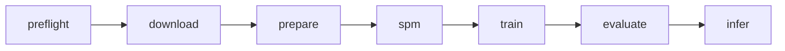

# Présentation — Traduction parole → texte (fr→en) avec Pantagruel

**Public :** collègues et encadrants  
**Durée cible :** 20–25 min (+ 5 min questions)  
**Projet :** S3T — réplication Pantagruel 2026, stack SpeechBrain/PyTorch (pas fairseq)

---

## Slide 1 — Titre

**Ajouter un modèle ST fr→en à la famille Pantagruel**

- Réplication de l’expérience *Speech-to-Text Translation* du papier Pantagruel (2026)
- Première direction : **français → anglais** (m-TEDx, ~50 h)
- Implémentation : pipeline reproductible dans le dépôt **S3T**

*Notes orateur (~30 s)*  
« L’objectif n’est pas seulement de porter du code : on vise une expérience scientifique comparable au papier, avec des artifacts traçables, pour pouvoir publier ou déposer un checkpoint dans l’écosystème Pantagruel. »

---

## Slide 2 — Contexte Pantagruel

**Pantagruel** = encodeurs auto-supervisés unifiés pour le **texte** et la **parole** en français (JEPA / data2vec 2.0).

Collections Hugging Face (extrait) :

| Famille | Exemple | Rôle pour nous |
|---------|---------|----------------|
| Speech-only | `speech-base-1K`, `speech-large-14K` | Encodeurs acoustiques SSL |
| Speech-Text | `Speech_Text_Base_fr_1K_4GB` | Multimodal (prétrain, pas notre finetune ST complet) |
| Text | `Text_Base_fr_4GB_*` | Branche texte |

**Notre positionnement :** fine-tuning **ST end-to-end** = encodeur parole Pantagruel + **décodeur Transformer** (6 couches) → texte anglais.

*Notes orateur*  
Montrer la capture des collections HF si disponible : on s’inscrit surtout dans **Speech-Text** / ST, pas dans un simple ASR fr→fr.

---

## Slide 3 — Question scientifique

**Question :** un encodeur SSL Pantagruel, couplé à un décodeur Transformer entraîné sur m-TEDx fr→en, atteint-il un **BLEU** comparable au protocole LeBenchmark / Table 8 ?

**Hypothèses de travail :**

1. Le checkpoint Pantagruel **pré-entraîné** (HF) suffit comme encodeur (pas de re-prétrain multimodal dans S3T Temps A).
2. Le protocole **SacreBLEU** figé permet une comparaison équitable.
3. Les écarts fairseq → SpeechBrain seront **documentés**, pas masqués.

*Notes orateur*  
Insister : on sépare « réplication fidèle » (Temps A) et « améliorations » (Temps B : beam, speed pert., ablations).

---

## Slide 4 — Architecture du modèle

```text
[ Audio FR, 16 kHz mono ] 
        ↓
[ Encodeur SSL Pantagruel (HF) ]  →  représentations continues
        ↓
[ Décodeur Transformer, 6 couches, cross-attention ]
        ↓
[ Tokens anglais (SentencePiece) ]  →  détokenisation → phrase EN
```

| Composant | Choix PRD / papier |
|-----------|-------------------|
| Encodeur | Pantagruel-Base (768) ou Large (1024) |
| Décodeur | 6 layers, 4–8 têtes |
| Entrée audio | Raw waveform 16 kHz |
| Cible | Texte anglais tokenisé (SPM, vocab 1k–5k) |

*Notes orateur*  
Schéma simple : **pas de pipeline ASR puis MT** — traduction directe audio → texte cible.

---

## Slide 5 — Pourquoi SpeechBrain / S3T (et pas fairseq seul)

| Aspect | Historique (fairseq) | S3T (ce dépôt) |
|--------|----------------------|----------------|
| Orchestration | Scripts Hydra / fairseq | `scripts/0…6` + `pipeline.py` |
| Données | prep m-TEDx | manifests TSV maison, anti-fuite |
| Tokenisation | BPE fairseq | Stage dédié `3_spm.py` |
| Évaluation | generate + scorers | `5_evaluate.py` + **SacreBLEU** externe |
| Traçabilité | variable | `runs/<pair>/<run_id>/` contractuel |

**Message clé :** même expérience scientifique, stack d’entraînement modernisée et **ops-friendly**.

---

## Slide 6 — Pipeline de bout en bout



| Stage | Script | Sortie principale |
|-------|--------|-------------------|
| 0 | `0_preflight.py` | `artifacts/preflight_report.json` |
| 1 | `1_download.py` | m-TEDx fr-en (OpenSLR-100) |
| 2 | `2_prepare.py` | WAV 16 kHz + manifests TSV |
| 3 | `3_spm.py` | `*.model` / `*.vocab` |
| 4 | `4_train.py` | `checkpoints/best.pt` |
| 5 | `5_evaluate.py` | BLEU dev/test + signatures |
| 6 | `6_infer.py` | `predictions.jsonl` |

*Notes orateur*  
Tous les stages sont **implémentés** ; l’orchestrateur délègue sans logique métier inline.

---

## Slide 7 — Données fr→en (m-TEDx)

**Corpus :** multilingual TEDx, partition **fr→en** (~50 h train).

**Préparation (`2_prepare.py`) :**

- Audio : FLAC → **WAV 16 kHz, mono, PCM_16**
- Filtres : texte vide, durée \< 1 s ou \> 30 s
- Manifests : `train.tsv`, `valid.tsv`, `test.tsv`
- **Anti-fuite** : aucun overlap train/valid/test (IDs + textes cibles)

**Arborescence :**

```text
datasets/manifests/fr-en/train.tsv
datasets/processed/fr-en/train/*.wav
```

*Notes orateur*  
La qualité des manifests conditionne tout le reste — jalon go/no-go avant SPM/train.

---

## Slide 8 — Tokenisation (SentencePiece)

**Règle :** SPM entraîné **uniquement** sur `train.target.txt` (anglais).

```bash
python scripts/pipeline.py spm --langpair fr-en --vocab-size 1000
```

**Sorties :**

- `datasets/processed/spm/fr-en_1000.model`
- `datasets/processed/spm/fr-en_1000.vocab`

**Ablations prévues :** vocab **1k** vs **5k** (petits corpus → petits vocabs).

---

## Slide 9 — Entraînement (vue d’ensemble)

**Objectif :** apprendre à prédire le **prochain token anglais** conditionné par l’audio français.

| Élément | Valeur cible (PRD / LeBenchmark) |
|---------|----------------------------------|
| Loss | Cross-entropy + label smoothing **0.1** |
| Optimiseur | AdamW (β₁=0.9, β₂=0.98) |
| LR | pic 1e-4 – 3e-4, warmup 10k updates |
| Freeze encodeur | 5k–10k premières updates |
| Régularisation | Dropout 0.1, SpecAugment (cible) |
| Stabilité | Grad clip 1.0, AMP fp16/bf16, accumulation |
| Meilleur checkpoint | **BLEU dev** (loss secondaire) |

```bash
python scripts/pipeline.py train \
  --config configs/fr-en/base.yaml \
  --run-id run_001_fr-en
```

---

## Slide 10 — Cross-entropie (cœur de la loss)

**À chaque pas de décodage :**

1. Le décodeur produit des **logits** (scores bruts, taille = vocabulaire).
2. **Softmax** → probabilités sur tous les tokens.
3. **Cross-entropy** pénalise si la probabilité du **bon** token est faible.

\[
\text{CE} = -\log p(\text{token correct})
\]

**Perplexité** (même information, lecture intuitive) :

\[
\text{PPL} = e^{\text{CE}}
\]

→ « Le modèle hésite entre combien d’alternatives équiprobables ? »

*Notes orateur*  
**Loss qui baisse** ≠ **bon BLEU** : la CE est locale (token), le BLEU est global (phrase).

---

## Slide 11 — Démo numérique (mini)

Vocabulaire = 4 tokens. Logits = `[2.0, 1.0, 0.1, -1.0]`. **Cible = token 0.**

| Token | Logit | softmax ≈ | Commentaire |
|-------|-------|-----------|-------------|
| 0 ✓ | 2.0 | ~0.66 | plus probable |
| 1 | 1.0 | ~0.24 | |
| 2 | 0.1 | ~0.08 | |
| 3 | -1.0 | ~0.02 | |

- CE ≈ \(-\log(0.66) \approx 0.41\) → faible (bon)
- Si la cible était le token 3 : CE ≈ \(-\log(0.02) \approx 3.9\) → fort (mauvais)
- PPL ≈ \(e^{0.41} \approx 1.5\) dans le bon cas

**Label smoothing 0.1 :** la cible n’est plus 100 % sur un seul token → régularisation sur petit corpus.

---

## Slide 12 — Freeze encodeur (pourquoi)

**Problème :** décodeur initialisé aléatoirement → gradients « agressifs » → risque de **catastrophic forgetting** sur Pantagruel.

**Stratégie :**

```text
updates 0 ────────── freeze_encoder_updates ──────────► fin
         [encodeur FIGÉ]              [encodeur DÉGELÉ]
         décodeur apprend             fine-tune joint
```

**Ablations :** freeze **5k** vs **10k** updates.

---

## Slide 13 — Évaluation (point 8 détaillé)

**But :** mesurer la qualité de **traduction** de façon **reproductible**.

**Étapes :**

1. Charger `checkpoints/best.pt` (sélectionné sur BLEU dev).
2. Décoder `valid` et `test` (beam=5 cible papier ; greedy en baseline actuelle).
3. Calculer **SacreBLEU** (+ CHRF, TER) avec commande **identique** pour tous les runs.
4. Logger la **signature SacreBLEU** dans les artifacts.

```bash
python scripts/pipeline.py evaluate \
  --config configs/fr-en/base.yaml \
  --run-id run_001_fr-en
```

**Sorties :**

```text
runs/fr-en/<run_id>/eval/
  dev_predictions.txt
  test_predictions.txt
  sacrebleu_dev.txt    # contient la signature
  sacrebleu_test.txt
  metrics.json
```

---

## Slide 14 — CE vs BLEU vs beam (ne pas confondre)

| Métrique / outil | Niveau | Quand ? | Question |
|----------------|--------|---------|----------|
| Cross-entropy / PPL | token | entraînement | « Bon mot suivant probable ? » |
| BLEU (SacreBLEU) | phrase | valid/test | « Phrase proche de la référence ? » |
| Beam search | phrase | inférence | « Meilleure **séquence** entière ? » |

**Critère de promotion d’un run :** gain **BLEU dev** stable (≥ 2 seeds), pas loss seule.

---

## Slide 15 — Baselines et mini-ablations

**Ordre recommandé (fr→en) :**

| Run | Freeze | Vocab | Beam | Rôle |
|-----|--------|-------|------|------|
| BL-01 | full / long | 1k | 1 | baseline minimale |
| A | 5k | 1k | 1 | effet freeze |
| B | 10k | 1k | 1 | effet freeze |
| C | 5k | 1k | 5 | effet décodage |
| D | 5k | 5k | 5 | effet vocab |

**Règle :** ne garder qu’une variante si **BLEU dev** monte de façon stable.

---

## Slide 16 — Risques et mitigation

| Risque | Impact | Mitigation |
|--------|--------|------------|
| Oubli encodeur | BLEU effondré | freeze + LR encodeur plus faible |
| Overfitting m-TEDx | écart train/test | SpecAugment, dropout, early stopping |
| Protocole BLEU différent | comparaison invalide | commande SacreBLEU figée + signature |
| Non-reproductibilité | runs incomparables | seeds, commit Git, config YAML par run |
| Corpus petit (~50 h) | variance élevée | plusieurs seeds, ablations courtes |

---

## Slide 17 — Jalons go/no-go (fr→en)

| Phase | Critère GO |
|-------|------------|
| Preflight | CUDA OK, disque ≥ 200 GB, HF reachable |
| Prepare | 0 fuite, manifests + WAV valides |
| SPM | modèle chargeable, vocab cohérent |
| Train | loss ↓, pas d’explosion grad, BLEU dev \> baseline |
| Evaluate | signature SacreBLEU + `metrics.json` complets |
| Livrable Pantagruel | checkpoint + model card + protocole d’éval |

---

## Slide 18 — Livrables « nouveau modèle Pantagruel »

**Package minimal par run :**

```text
runs/fr-en/<run_id>/
  config.yaml              # hyperparamètres figés
  train.log
  checkpoints/best.pt
  eval/metrics.json
  eval/sacrebleu_test.txt  # avec signature
```

**Plus tard (HF) :**

- Nommage aligné famille (`Speech_Text_Base_fr_1K_…` / convention équipe)
- Model card : données, métriques, limites, dépendances
- Comparaison explicite Table 8 Pantagruel

---

## Slide 19 — État actuel du dépôt S3T

**Fait :**

- Pipeline `preflight` → `infer` branché
- Données : download + prepare fr-en (et autres paires)
- Train / eval / infer : encodeur HF + décodeur Transformer

**En cours / prochaine itération :**

- Fichiers `configs/fr-en/base.yaml` (template dans `README_experiments.md`)
- Beam search complet (au-delà du greedy baseline)
- Alignement fin sur hyperparamètres Table 8

*Notes orateur*  
Être transparent : la **structure** du pipeline est prête ; la **qualité chiffre** dépend des runs GPU à lancer.

---

## Slide 20 — Plan d’exécution fr→en (concret)

```bash
source .venv/bin/activate

# 1. Environnement
python scripts/pipeline.py preflight --check-gpu

# 2. Données
python scripts/pipeline.py download --langpairs fr-en
python scripts/pipeline.py prepare --langpair fr-en

# 3. Tokenisation + entraînement + évaluation
python scripts/pipeline.py spm --langpair fr-en --vocab-size 1000
python scripts/pipeline.py train --config configs/fr-en/base.yaml --run-id run_001
python scripts/pipeline.py evaluate --config configs/fr-en/base.yaml --run-id run_001

# 4. Inférence (audio hors corpus)
python scripts/pipeline.py infer \
  --checkpoint runs/fr-en/run_001/checkpoints/best.pt \
  --config configs/fr-en/base.yaml \
  --input-audio path/to/audio.wav
```

**Ressources :** GPU CUDA, ~200 GB disque, accès Hugging Face.

**Budget détaillé :** voir [estimation_ressources_fr_en.md](estimation_ressources_fr_en.md) (disque, VRAM, heures GPU, coût cloud indicatif).

---

## Slide 21 — Besoins machine (fr→en, synthèse)

| Ressource | Recommandé | Commentaire |
|-----------|------------|-------------|
| Disque | **80–120 GB** (fr→en seul) ; **200 GB** si 3 paires + ablations | archive + WAV + venv + runs |
| GPU VRAM | **16 GB** | 8 GB possible avec batch réduit / segments plus courts |
| Temps GPU (1 run, 120k updates) | **~25–45 h** | calibrer avec run pilote 2k updates |
| Grille ablations (5–10 runs) | **~120–280 h GPU** | après baseline validée |
| Réseau initial | **~15–20 GB** | OpenSLR + Hugging Face + venv |

*Notes orateur*  
« Avant d’engager la machine distante : un run pilote de 2 000 updates (~2–4 h GPU) pour mesurer secondes/update et VRAM max, puis extrapoler. »

---

## Slide 22 — Message de clôture

> « On ne fait pas qu’un portage SpeechBrain : on construit une **chaîne reproductible** pour ajouter un modèle **fr→en** comparable au protocole Pantagruel, avec des preuves d’évaluation (SacreBLEU, configs, checkpoints), avant d’étendre à fr→pt et fr→es. »

**Questions attendues :**

- Pourquoi pas fairseq ? → traçabilité, maintenance, même science.
- Pourquoi freeze ? → protéger l’encodeur SSL.
- Quand un modèle HF ? → après baseline fr→en validée sur BLEU dev/test.

---

## Annexe A — Glossaire rapide

| Terme | Définition courte |
|-------|-------------------|
| SSL | Self-supervised learning (prétrain sans labels de tâche) |
| ST | Speech Translation (audio → texte dans autre langue) |
| SPM | SentencePiece (sous-mots) |
| Teacher forcing | en train, le décodeur voit les tokens cibles précédents |
| SacreBLEU | BLEU standardisé et reproductible |
| Signature SacreBLEU | empreinte version/tokenizer du calcul BLEU |

---

## Annexe B — Template config fr→en (extrait)

À placer dans `configs/fr-en/base.yaml` (voir `README_experiments.md`) :

```yaml
experiment:
  name: "fr-en_base"
  lang_pair: "fr-en"
  output_dir: "runs/fr-en/run_001_fr-en_seed42"
  seed: 42
  deterministic: true

data:
  train_manifest: "datasets/manifests/fr-en/train.tsv"
  valid_manifest: "datasets/manifests/fr-en/valid.tsv"
  test_manifest: "datasets/manifests/fr-en/test.tsv"
  spm_model: "datasets/processed/spm/fr-en_1000.model"
  sample_rate: 16000

model:
  encoder_name: "PantagrueLLM/Pantagruel-Base"  # à confirmer avec l’équipe HF
  decoder_layers: 6
  decoder_heads: 8
  hidden_dim: 768
  dropout: 0.1

train:
  max_updates: 120000
  warmup_updates: 10000
  freeze_encoder_updates: 5000
  learning_rate_peak: 0.0002
  label_smoothing: 0.1
  batch_size: 8
  gradient_accumulation: 8
  eval_every_updates: 1000
  best_checkpoint_metric: "bleu_dev"

decode:
  beam_size: 5
  max_len_b: 128
```

---

## Annexe C — Conversion vers PowerPoint / Google Slides

1. Une section `## Slide N` = une diapositive.
2. Copier le titre + puces ; garder les tableaux et le schéma mermaid (export via mermaid.live si besoin).
3. Mettre les *Notes orateur* dans le champ « notes » de l’outil de présentation.
4. Slides recommandées pour une version courte (15 min) : 1, 3, 4, 6, 7, 9, 10, 13, 14, 17, 20, 21, 22.
5. Budget machine détaillé : [estimation_ressources_fr_en.md](estimation_ressources_fr_en.md).

---

*Document généré pour le dépôt S3T — à adapter avec vos résultats chiffrés après les premiers runs.*
