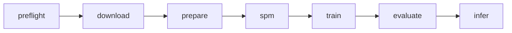

# Présentation — Traduction parole → texte (fr→en) avec Pantagruel

**Public :** collègues et encadrants  
**Durée cible :** 20–25 min (+ 5 min questions)  
**Version 10 diapos :** [presentation_fr_en_pantagruel_10slides.md](presentation_fr_en_pantagruel_10slides.md) (~12–15 min)  
**Projet :** S3T — réplication Pantagruel 2026, stack SpeechBrain/PyTorch (pas fairseq)

---

## Slide 1 — Titre

**Ajouter un modèle ST fr→en à la famille Pantagruel**

- Réplication de l’expérience *Speech-to-Text Translation* du papier Pantagruel (2026)
- Première direction : **français → anglais** (m-TEDx, ~50 h)
- Implémentation : pipeline reproductible dans le dépôt **S3T**

*Notes orateur (~30 s)*  
« L’objectif n’est pas seulement de porter du code : on vise une expérience scientifique comparable au papier, avec des artifacts traçables, pour pouvoir publier ou déposer un checkpoint dans l’écosystème Pantagruel. »

---

## Slide 2 — Contexte Pantagruel

**Pantagruel** = encodeurs auto-supervisés unifiés pour le **texte** et la **parole** en français (JEPA / data2vec 2.0).

Collections Hugging Face (extrait) :

| Famille | Exemple | Rôle pour nous |
|---------|---------|----------------|
| Speech-only | `speech-base-1K`, `speech-large-14K` | Encodeurs acoustiques SSL |
| Speech-Text | `Speech_Text_Base_fr_1K_4GB` | Multimodal (prétrain, pas notre finetune ST complet) |
| Text | `Text_Base_fr_4GB_*` | Branche texte |

**Notre positionnement :** fine-tuning **ST end-to-end** = encodeur parole Pantagruel + **décodeur Transformer** (6 couches) → texte anglais.

*Notes orateur*  
Montrer la capture des collections HF si disponible : on s’inscrit surtout dans **Speech-Text** / ST, pas dans un simple ASR fr→fr.

---

## Slide 3 — Question scientifique

**Question :** un encodeur SSL Pantagruel, couplé à un décodeur Transformer entraîné sur m-TEDx fr→en, atteint-il un **BLEU** comparable au protocole LeBenchmark / Table 8 ?

**Hypothèses de travail :**

1. Le checkpoint Pantagruel **pré-entraîné** (HF) suffit comme encodeur (pas de re-prétrain multimodal dans S3T Temps A).
2. Le protocole **SacreBLEU** figé permet une comparaison équitable.
3. Les écarts fairseq → SpeechBrain seront **documentés**, pas masqués.

*Notes orateur*  
Insister : Temps A = même protocole que le papier (données, SacreBLEU, **beam 5** à l’éval quand codé) ; Temps B = extensions (speed pert., ablations, optimisations) — le **greedy** seul est une baseline intermédiaire, pas la comparaison Table 8.

---

## Slide 4 — Architecture du modèle

```text
[ Audio FR, 16 kHz mono ] 
        ↓
[ Encodeur SSL Pantagruel (HF) ]  →  représentations continues
        ↓
[ Décodeur Transformer, 6 couches, cross-attention ]
        ↓
[ Tokens anglais (SentencePiece) ]  →  détokenisation → phrase EN
```

| Composant | Choix PRD / papier |
|-----------|-------------------|
| Encodeur | Pantagruel-Base (768) ou Large (1024) |
| Décodeur | 6 layers, 4–8 têtes |
| Entrée audio | Raw waveform 16 kHz |
| Cible | Texte anglais tokenisé (SPM, vocab 1k–5k) |

*Notes orateur*  
Schéma simple : **pas de pipeline ASR puis MT** — traduction directe audio → texte cible.

---

## Slide 5 — Pourquoi SpeechBrain / S3T (et pas fairseq seul)

| Aspect | Historique (fairseq) | S3T (ce dépôt) |
|--------|----------------------|----------------|
| Orchestration | Scripts Hydra / fairseq | `scripts/0…6` + `pipeline.py` |
| Données | prep m-TEDx | manifests TSV maison, anti-fuite |
| Tokenisation | BPE fairseq | Stage dédié `3_spm.py` |
| Évaluation | generate + scorers | `5_evaluate.py` + **SacreBLEU** externe |
| Traçabilité | variable | `runs/<pair>/<run_id>/` contractuel |

**Message clé :** même expérience scientifique, stack d’entraînement modernisée et **ops-friendly**.

---

## Slide 6 — Pipeline de bout en bout



| Stage | Script | Sortie principale |
|-------|--------|-------------------|
| 0 | `0_preflight.py` | `artifacts/preflight_report.json` |
| 1 | `1_download.py` | m-TEDx fr-en (OpenSLR-100) |
| 2 | `2_prepare.py` | WAV 16 kHz + manifests TSV |
| 3 | `3_spm.py` | `*.model` / `*.vocab` |
| 4 | `4_train.py` | `checkpoints/best.pt` |
| 5 | `5_evaluate.py` | BLEU dev/test + signatures |
| 6 | `6_infer.py` | `predictions.jsonl` |

*Notes orateur*  
Tous les stages sont **implémentés** ; l’orchestrateur délègue sans logique métier inline.

---

## Slide 7 — Données fr→en (m-TEDx)

**Corpus :** multilingual TEDx, partition **fr→en** (~50 h train).

**Préparation (`2_prepare.py`) :**

- Audio : FLAC → **WAV 16 kHz, mono, PCM_16**
- Filtres : texte vide, durée \< 1 s ou \> 30 s
- Manifests : `train.tsv`, `valid.tsv`, `test.tsv`
- **Anti-fuite** : aucun overlap train/valid/test (IDs + textes cibles)

**Arborescence :**

```text
datasets/manifests/fr-en/train.tsv
datasets/processed/fr-en/train/*.wav
```

*Notes orateur*  
La qualité des manifests conditionne tout le reste — jalon go/no-go avant SPM/train.

---

## Slide 8 — Tokenisation (SentencePiece)

**Règle :** SPM entraîné **uniquement** sur `train.target.txt` (anglais).

```bash
python scripts/pipeline.py spm --langpair fr-en --vocab-size 1000
```

**Sorties :**

- `datasets/processed/spm/fr-en_1000.model`
- `datasets/processed/spm/fr-en_1000.vocab`

**Ablations prévues :** vocab **1k** vs **5k** (petits corpus → petits vocabs).

---

## Slide 9 — Entraînement (vue d’ensemble)

**Objectif :** apprendre à prédire le **prochain token anglais** conditionné par l’audio français.

**Ce que fait le stage `4_train.py` (en une phrase) :**  
pour chaque extrait m-TEDx, le modèle lit l’audio français (via Pantagruel), lit le début de la phrase anglaise de référence, et apprend à deviner le token anglais suivant ; périodiquement, on mesure le **BLEU dev** et on garde le meilleur checkpoint.

### Chaîne de données → modèle (rappel)

```text
train.tsv :  id | chemin WAV fr | texte anglais (référence)
                    │                    │
                    ▼                    ▼
              waveform 16 kHz      SentencePiece (slide 8)
                    │                    │
                    └────────┬───────────┘
                             ▼
                    S3TModel (scripts/st_common.py)
                    encodeur HF + décodeur 6 couches
```

### Comment l’audio « aide » le token anglais (mécanisme)

1. **Encodeur Pantagruel** transforme l’audio en une suite de vecteurs `memory` (représentation riche, latente — pas du texte français explicite).
2. **Décodeur Transformer** lit un **préfixe anglais** (`BOS`, puis les vrais tokens en entraînement = *teacher forcing*).
3. **Attention croisée** : à chaque position, le décodeur **interroge** `memory` pour savoir quelle partie de l’audio est pertinente pour le mot anglais à produire.
4. **Tête de sortie** : scores sur tout le vocabulaire SPM → le token le plus probable (ou la loss sur le bon token).

```text
Audio fr ──► Pantagruel ──► memory [T × 768]
                                  ▲
                                  │ cross-attention
Préfixe en : BOS, the, cat ──► décodeur ──► logits ──► "is" ?
```

**Teacher forcing (entraînement) :** on donne au modèle la **vraie** traduction anglaise du corpus, décalée d’un cran (`tokens_in` → prédire `tokens_out`). Ce n’est **pas** encore la génération libre (ça, c’est à l’éval / inférence — voir **greedy / beam**, slide 14).

### Hyperparamètres — tableau commenté

| Élément | Valeur cible (PRD / LeBenchmark) | À quoi ça sert |
|---------|----------------------------------|----------------|
| Loss | Cross-entropy + label smoothing **0.1** | punir les mauvaises prédictions de token ; le smoothing évite une confiance excessive (slide 10–11) |
| Optimiseur | AdamW (β₁=0.9, β₂=0.98) | mise à jour adaptative des poids ; decay séparé du LR |
| LR | pic 1e-4 – 3e-4, warmup 10k updates | vitesse d’apprentissage ; montée progressive au début (**warmup : cible PRD**, pas encore dans `4_train.py`) |
| Freeze encodeur | 5k–10k premières updates | protéger Pantagruel pendant que le décodeur aléatoire apprend (slide 12) |
| Régularisation | Dropout 0.1, SpecAugment (cible) | limiter l’overfitting sur ~50 h ; SpecAugment = masquage temps/fréquence sur l’audio (**cible**, pas encore codé) |
| Stabilité | Grad clip 1.0, AMP fp16/bf16, accumulation | éviter gradients explosifs ; économiser VRAM ; simuler un gros batch (ex. 8×8 = 64 séquences) |
| Meilleur checkpoint | **BLEU dev** (loss secondaire) | la loss peut baisser sans meilleures **phrases** ; on garde `best.pt` si SacreBLEU dev augmente |

### Une « update » d’entraînement (ordre réel)

```text
1. Charger un batch (audio + paires tokens_in / tokens_out)
2. Geler ou non l’encodeur selon le numéro d’update
3. Forward : logits pour chaque position
4. Cross-entropy (+ label smoothing) → backward
5. Accumuler N mini-batches → grad clip → pas AdamW
6. Tous les eval_every updates : **greedy** decode sur dev → SacreBLEU → maybe best.pt (pas de beam en train ; slide 14)
```

### Commande et artifacts

```bash
python scripts/pipeline.py train \
  --config configs/fr-en/base.yaml \
  --run-id run_001_fr-en
```

**Sorties typiques :**

```text
runs/fr-en/run_001_fr-en/
  config.yaml          # copie figée de la config
  checkpoints/best.pt  # poids encodeur + décodeur (meilleur BLEU dev)
  checkpoints/last.pt  # dernier état
  train.log            # loss, lr, freeze, bleu_dev par update
  metrics.json         # résumé final
```

*Notes orateur (2–3 min)*  
- Insister : on **ne réentraîne pas** Pantagruel from scratch ; on charge **HF** (`PantagrueLLM/Pantagruel-Base`).  
- Le travail principal du run = apprendre le **décodeur** (et affiner l’encodeur après dégel).  
- Mentionner les **écarts code actuel** : warmup scheduler, SpecAugment, early stopping = cibles PRD, à documenter si absents.  
- Lien slide suivante : la CE explique *comment* le modèle apprend token par token ; le BLEU (slide 13–14) juge la phrase complète.

---

## Slide 10 — Cross-entropie (cœur de la loss)

**Rôle :** dire au modèle « à cette position, tu aurais dû mettre **ce** morceau de texte anglais (token SPM), pas un autre ».

### Pipeline token par token (entraînement)

À **chaque position** `i` de la phrase anglaise :

1. **Entrées disponibles**
   - tout l’audio encodé (`memory`, fixe pour la phrase) ;
   - le préfixe anglais déjà connu : `tokens_in[0..i]` (ex. `BOS`, `▁The`, `▁cat`).
2. Le décodeur produit des **logits** `z` : un score brut par id du vocabulaire (ex. 1000 ou 5000).
3. **Softmax** convertit les logits en probabilités `p` qui somment à 1.
4. On compare `p` à la cible **`tokens_out[i]`** (le vrai token suivant).
5. **Cross-entropy (CE)** — pénalité sur le **bon** token à cette position :
   - après softmax, chaque token a une probabilité `p` ;
   - on lit **p_corr** = probabilité du token correct (`tokens_out[i]`) ;
   - **formule :** `CE = −log(p_corr)` (logarithme naturel) ;
   - si **p_corr** ≈ 1 (modèle confiant) → CE ≈ 0 ; si **p_corr** ≈ 0,01 → CE ≈ 4,6 (forte punition).

**En clair :** la CE mesure la « surprise » du modèle face à la bonne réponse — plus il était sûr du bon token, plus la CE est faible.

La loss d’un batch = **moyenne** de ces CE sur toutes les positions non-padding (tous les tokens de toutes les phrases du lot).

### Intuition softmax

- Logit **grand** → probabilité **haute** pour ce token.
- Les logits sont **relatifs** : ajouter une constante à tous les logits ne change pas le softmax.
- Si le modèle est **incertain** (probas étalées), même le bon token peut avoir une probabilité moyenne → CE plus élevée.

### Perplexité (PPL) — même information, autre lecture

**Formule :** `PPL = exp(CE)` (exponentielle de la cross-entropy ; souvent notée **e^CE**).

**En clair :** si CE ≈ 0,4, alors PPL ≈ 1,5 → le modèle se comporte comme s’il hésitait entre environ **1 à 2** tokens équiprobables à chaque pas.

| PPL (ordre de grandeur) | Lecture intuitive |
|-------------------------|-------------------|
| ≈ 1 | très confiant (quasi toujours le bon token) |
| ≈ 10 | hésite entre ~10 choix « équivalents » |
| ≫ 100 | très mauvais / vocabulaire mal calibré |

→ Utile dans `train.log` pour voir si le modèle **apprend encore** (PPL qui baisse), mais **pas** le critère final du projet.

### Label smoothing 0.1 (pourquoi sur m-TEDx)

Sans smoothing : la cible est « 100 % sur le token exact du corpus » → le réseau peut devenir **trop confiant** et mal généraliser sur un petit corpus (~50 h).

Avec smoothing 0.1 : une petite masse de probabilité est répartie sur les **autres** tokens ; la CE pousse encore vers le bon token, mais moins brutalement.

**Dans le code :** `F.cross_entropy(..., label_smoothing=0.1)` dans `4_train.py`.

### CE vs BLEU (ne pas confondre — approfondi slide 14)

| | Cross-entropy | BLEU (SacreBLEU) |
|--|---------------|------------------|
| **Granularité** | un token à la fois | phrase entière |
| **Référence** | id SPM exact à chaque position | n-grammes de mots en surface |
| **Utilisation** | entraînement + diagnostic | choix de `best.pt` + comparaison Table 8 |
| **Piège** | loss ↓ mais traductions médiocres possibles | peut stagner si le modèle « joue » la CE sans bonnes phrases |

*Notes orateur*  
- Analogie : la CE = corriger l’orthographe **lettre par lettre** pendant l’exercice ; le BLEU = noter la **qualité de la phrase finale** à l’examen.  
- En entraînement on optimise la CE ; en sélection de modèle on fait confiance au **BLEU dev**.

---

## Slide 11 — Démo numérique (mini)

**But de la slide :** rendre concrets logits, softmax et CE avant de parler de vocabulaires à 1000+ tokens.

### Setup

- Vocabulaire fictif = **4 tokens** (en réalité SPM ≈ 1000–5000).
- Logits du modèle à une position : `[2.0, 1.0, 0.1, -1.0]`.
- **Cible = token 0** (le bon morceau de phrase anglaise à cet endroit).

### Étape 1 — Softmax (calcul mental)

On calcule `exp(logit)` (e puissance logit) pour chaque token, puis on normalise pour que les probas somment à 1 :

| Token | Logit | `exp(logit)` (relatif) | softmax ≈ | Commentaire |
|-------|-------|-------------------------------|-----------|-------------|
| 0 ✓ | 2.0 | 7.39 | **~0.66** | le modèle pointe déjà vers la bonne réponse |
| 1 | 1.0 | 2.72 | ~0.24 | plausible mais moins que 0 |
| 2 | 0.1 | 1.11 | ~0.08 | peu probable |
| 3 | -1.0 | 0.37 | ~0.02 | très peu probable |

→ Le modèle est **relativement confiant** pour le bon token (66 %).

### Étape 2 — Cross-entropy

**Formule :** `CE = −log(p_corr)` où **p_corr** = probabilité que le modèle donne au **token de référence** (celui du corpus anglais à cette position).

Ici la cible est le **token 0** → on lit la colonne softmax du token 0 : **p_corr ≈ 0,66** (66 %).

| Proba du bon token (p_corr) | `CE = −log(p_corr)` | Lecture |
|-----------------------------|---------------------|---------|
| **0,66** (élevée) | **≈ 0,41** (petit) | le modèle avait **raison** → **faible** punition |
| **0,02** (très faible) | **≈ 3,9** (grand) | le modèle avait **tort** → **forte** punition |

**En clair :** la loss dit au réseau « mets une **grosse** probabilité sur le token qu’on te demande d’apprendre ». Ce n’est pas une « note sur 100 » : c’est une **pénalité logarithmique** — plus **p_corr** est proche de 1, plus **CE** tend vers 0 ; plus **p_corr** s’effondre, plus **CE** explose.

#### Cas normal (cible = token 0)

→ `CE = −log(0,66) ≈ 0,41` (**faible** = bonne prédiction).

Le modèle place déjà **66 %** sur la bonne réponse : l’entraînement considère cette position comme **correcte** (petite contribution à la loss du batch).

#### Contre-exemple (même softmax, autre cible)

On **ne recalcule pas** le softmax : on change seulement **quel** token doit gagner.

Si la cible avait été le **token 3** (alors que le modèle ne lui donne que **p_corr ≈ 0,02**) :

→ `CE = −log(0,02) ≈ 3,9` (**élevée** = punition forte).

Même réseau, mêmes logits — ce qui compte pour la CE, c’est **la proba sur le token qu’on compare à la référence**, pas le token le plus probable en absolu.

→ Une seule position mal prédite peut contribuer fortement à la loss du batch.

#### Pourquoi **−log** ? (intuition)

Analogie QCM : la bonne réponse est **A**.

- Le modèle affiche **A = 66 %** → « presque bon » → petite amende (**0,41**).
- Le modèle affiche **A = 2 %** (il mise ailleurs) → « tu as loupé » → grosse amende (**3,9**).

Le **log** fait que la punition **augmente vite** quand la confiance sur le bon token chute : une petite baisse de proba en fin de course coûte cher à l’optimiseur.

#### Lien avec l’entraînement réel (`4_train.py`)

Pour **chaque position** de **chaque phrase** du batch :

1. le modèle produit des probas (softmax sur les logits) ;
2. on lit **p_corr** sur le vrai token anglais (`tokens_out[i]`) ;
3. on calcule **−log(p_corr)** (avec label smoothing 0.1 : la cible n’est plus « 100 % sur un seul token ») ;
4. on **moyenne** sur toutes les positions → la **loss** affichée dans `train.log`.

#### Pièges fréquents (slide orateur)

| Confusion | Clarification |
|-----------|----------------|
| « 0,66 = 66 % de CE » | **0,66** = la **proba** ; **0,41** = la **CE** calculée **à partir** de cette proba |
| « Pourquoi le signe moins ? » | C’est **minus log** : on veut que « bonne proba » → **petit** nombre positif (0,41), pas un score négatif |
| « Le contre-exemple change le softmax » | Non : **même** tableau de probas ; on change seulement **quel** token est la référence |

### Étape 3 — Perplexité

Bon cas : `PPL = exp(0,41) ≈ 1,5` → équivalent à hésiter entre ~1–2 choix nets.

Mauvais cas (cible token 3) : `PPL = exp(3,9) ≈ 50` → très incertain / faux.

### Chaîne exp / log (pourquoi on alterne)

**Chaîne conceptuelle (slide 11) :**

```text
logits  →  exp (softmax)  →  probas p
        →  −log(p)         →  CE
        →  exp(CE)         →  PPL
```

Ce n’est pas une oscillation du modèle à chaque batch : à chaque étape on change **d’espace** pour un **rôle** différent.

| Étape | Opération | Objectif |
|-------|-----------|----------|
| Softmax | `exp` puis division | obtenir des **probas** ∈ ]0, 1], somme = 1 |
| Cross-entropy | `−log` | **pénaliser** : petite si le bon token est probable, grande sinon |
| Perplexité | `exp(CE)` | **re-lire** la CE en « nombre de choix équivalents » (PPL ≈ 1,5 ≈ hésite entre 1–2 tokens) |

**Analogie :** logits = notes brutes ; softmax = parts du gâteau (%) ; CE = amende si la bonne part est trop petite ; PPL = traduction de l’amende en échelle humaine.

**En pratique (`4_train.py`) :** `F.cross_entropy` ne fait pas naïvement softmax puis log en deux passes — PyTorch utilise une version **stable** (log-softmax / log-sum-exp). La slide **décompose** pour comprendre ; le code **fusionne** pour l’optimisation. La PPL sert surtout au **diagnostic** dans `train.log`, pas comme loss.

### Échelle vers le vrai projet

| Mini-démo | S3T fr→en |
|-----------|-----------|
| 4 tokens | 1000 ou 5000 pièces SPM |
| 1 position | des centaines de positions × milliers d’updates |
| logits inventés | logits issus de `S3TModel` + cross-attention sur l’audio |

**Label smoothing 0.1 (rappel) :** au lieu d’exiger probabilité 1.0 sur le token 0, la cible devient un mélange (ex. 0.9 sur 0, un peu réparti sur 1–3) → CE un peu plus « douce », moins d’overfitting.

---

## Slide 12 — Freeze encodeur (pourquoi)

### Les deux composants au départ du fine-tuning

| Composant | État initial | Rôle |
|-----------|--------------|------|
| **Encodeur Pantagruel** (HF) | poids **pré-entraînés** (SSL français) | « comprend » l’audio → `memory` |
| **Décodeur 6 couches** | poids **aléatoires** | mappe `memory` + préfixe en → tokens anglais |

Le déséquilibre est le cœur du problème : un décodeur naïf envoie des gradients **bruyants** vers l’encodeur dès les premières updates.

### Problème : catastrophic forgetting

Si l’encodeur est mis à jour trop tôt :

- les gradients viennent surtout d’un décodeur **pas encore compétent** ;
- Pantagruel peut **perdre** ce qu’il savait du français général (prétrain SSL) ;
- symptôme possible : loss qui bouge, mais **BLEU dev** qui stagne ou s’effondre.

→ On **gèle** d’abord l’encodeur (`requires_grad = False`) pour forcer le décodeur à apprendre **sans casser** l’oreille française.

### Stratégie en deux phases

```text
updates 0 ────────── freeze_encoder_updates (ex. 5000) ──────────► fin
         │                              │                          │
         │  Phase A : encodeur FIGÉ     │  Phase B : encodeur      │
         │  seul le décodeur apprend    │  DÉGELÉ (petits ajustements) │
         │  à lire memory stable        │  fine-tune joint           │
```

**Dans le code (`st_common.py` + `4_train.py`) :**

```python
should_freeze = global_update < freeze_encoder_updates
model.freeze_encoder(should_freeze)
```

### Ce qui s’entraîne dans chaque phase

| Phase | Encodeur | Décodeur | Effet attendu |
|-------|----------|----------|---------------|
| A (gel) | poids Pantagruel **fixes** | embeddings, attention, FFN, `output_proj` | apprendre **où regarder** dans `memory` et produire de l’anglais cohérent |
| B (dégel) | petites adaptations | continue | aligner finement l’audio sur la tâche ST m-TEDx |

**LR encodeur :** souvent plus faible que pour le décodeur une fois dégelé (cible PRD / fairseq : `feature_grad_mult` faible) — à documenter dans la config du run.

### Lien avec les ablations (slide 15)

| Run | `freeze_encoder_updates` | Question testée |
|-----|--------------------------|-----------------|
| BL-01 | très long / « full freeze » | baseline minimale : ne jamais toucher Pantagruel |
| A | 5 000 | compromis papier / PRD |
| B | 10 000 | décodeur plus longtemps seul avant dégel |

**Règle :** promouvoir une variante seulement si **BLEU dev** monte de façon stable (≥ 2 seeds).

### Erreurs fréquentes à éviter

- **Dégeler trop tôt** → encodeur dégradé, BLEU instable.
- **Ne jamais dégeler** → plafond de performance (décodeur seul doit tout faire).
- **Oublier le freeze dans les logs** → `train.log` contient `encoder_frozen=true/false` pour auditer.

*Notes orateur*  
- Image : Pantagruel = **professeur d’écoute** du français ; le décodeur = **élève traducteur** ; on ne corrige pas le professeur tant que l’élève ne sait pas lire ses notes.  
- Après dégel, on **affine** l’oreille pour m-TEDx, on ne refait pas un prétrain SSL.

---

## Slide 13 — Évaluation (point 8 détaillé)

**But :** mesurer la qualité de **traduction** de façon **reproductible**.

**Étapes :**

1. Charger `checkpoints/best.pt` (sélectionné sur BLEU dev).
2. **Générer** les traductions sur `valid` et `test` (voir ci-dessous : greedy vs beam).
3. Calculer **SacreBLEU** (+ CHRF, TER) avec commande **identique** pour tous les runs.
4. Logger la **signature SacreBLEU** dans les artifacts.

```bash
python scripts/pipeline.py evaluate \
  --config configs/fr-en/base.yaml \
  --run-id run_001_fr-en
```

**Sorties :**

```text
runs/fr-en/<run_id>/eval/
  dev_predictions.txt
  test_predictions.txt
  sacrebleu_dev.txt    # contient la signature
  sacrebleu_test.txt
  metrics.json
```

### Décodage à l’éval : greedy (aujourd’hui) vs beam (cible papier)

| | **Greedy** (glouton) | **Beam search** (ex. beam = 5) |
|---|----------------------|--------------------------------|
| À chaque pas | 1 seul choix : le token le plus probable **sur le coup** | **K** hypothèses de phrase en parallèle ; on garde les **K** meilleures |
| Idée | « Je prends le meilleur maintenant » | « J’explore plusieurs fins de phrase, je garde la meilleure **au global** » |
| Vitesse | Plus rapide | Plus lent |
| Qualité BLEU | Souvent un peu plus bas | Souvent un peu meilleur (protocole LeBenchmark / fairseq) |

**Analogie :** compléter une phrase mot par mot — le greedy peut se tromper tôt ; le beam garde plusieurs brouillons (ex. 5) et ne jette pas une bonne piste à cause d’un mauvais mot local.

**Où dans le pipeline :**

| Phase | Décodage utilisé |
|-------|------------------|
| **Entraînement** (`4_train.py`) | **Teacher forcing** (vrais tokens en entrée) — **ni greedy ni beam** pour la loss |
| **BLEU dev pendant le train** | **Greedy** (`greedy_decode_batch` dans `st_common.py`) |
| **Évaluation finale** (`5_evaluate.py`) | **Greedy aujourd’hui** ; **beam = 5** = cible article / fairseq |
| **Inférence** (`6_infer.py`) | Idem : `--beam-size` loggé, décodage **glouton** pour l’instant |

**État S3T :** `--beam-size` (défaut 5) est accepté en CLI et enregistré dans `metrics.json`, mais `5_evaluate.py` / `6_infer.py` appellent encore **`greedy_decode_batch`** — écart documenté à combler pour comparer fidèlement la Table 8.

*Notes orateur*  
- Le papier / `pantagruel_uni` évaluent souvent avec **beam 5** ; comparer nos scores au tableau sans beam = risque de **sous-estimer** légèrement le modèle (ou de comparer des choses non homogènes).  
- L’ablation slide 15 (run C : beam 5) n’a de sens qu’une fois le beam **implémenté** dans le code.

---

## Slide 14 — CE vs BLEU vs beam (ne pas confondre)

| Métrique / outil | Niveau | Quand ? | Question |
|----------------|--------|---------|----------|
| Cross-entropy / PPL | token | entraînement | « Bon mot suivant probable ? » |
| BLEU (SacreBLEU) | phrase | valid/test | « Phrase proche de la référence ? » |
| Greedy decode | phrase | inférence (baseline S3T) | « Meilleur token **localement** à chaque pas ? » |
| Beam search | phrase | inférence (cible papier) | « Meilleure **séquence** entière parmi K pistes ? » |

**Trois moments différents — ne pas les mélanger :**

```text
TRAIN     : teacher forcing + CE  →  optimise token par token (pas de génération libre)
VALIDATION: greedy (S3T actuel)   →  choisit best.pt via BLEU dev
PAPIER    : beam 5 (fairseq)      →  protocole Table 8 à reproduire pour comparaison officielle
```

**Critère de promotion d’un run :** gain **BLEU dev** stable (≥ 2 seeds), pas loss seule — en notant si le BLEU dev est mesuré en **greedy** ou **beam** (les deux ne sont pas interchangeables).

---

## Slide 15 — Baselines et mini-ablations

**Ordre recommandé (fr→en) :**

| Run | Freeze | Vocab | Beam | Rôle |
|-----|--------|-------|------|------|
| BL-01 | full / long | 1k | 1 | baseline minimale |
| A | 5k | 1k | 1 | effet freeze |
| B | 10k | 1k | 1 | effet freeze |
| C | 5k | 1k | 5 | effet décodage |
| D | 5k | 5k | 5 | effet vocab |

**Règle :** ne garder qu’une variante si **BLEU dev** monte de façon stable.

---

## Slide 16 — Risques et mitigation

| Risque | Impact | Mitigation |
|--------|--------|------------|
| Oubli encodeur | BLEU effondré | freeze + LR encodeur plus faible |
| Overfitting m-TEDx | écart train/test | SpecAugment, dropout, early stopping |
| Protocole BLEU différent | comparaison invalide | commande SacreBLEU figée + signature |
| Non-reproductibilité | runs incomparables | seeds, commit Git, config YAML par run |
| Corpus petit (~50 h) | variance élevée | plusieurs seeds, ablations courtes |

---

## Slide 17 — Jalons go/no-go (fr→en)

| Phase | Critère GO |
|-------|------------|
| Preflight | CUDA OK, disque ≥ 200 GB, HF reachable |
| Prepare | 0 fuite, manifests + WAV valides |
| SPM | modèle chargeable, vocab cohérent |
| Train | loss ↓, pas d’explosion grad, BLEU dev \> baseline |
| Evaluate | signature SacreBLEU + `metrics.json` complets |
| Livrable Pantagruel | checkpoint + model card + protocole d’éval |

---

## Slide 18 — Livrables « nouveau modèle Pantagruel »

**Package minimal par run :**

```text
runs/fr-en/<run_id>/
  config.yaml              # hyperparamètres figés
  train.log
  checkpoints/best.pt
  eval/metrics.json
  eval/sacrebleu_test.txt  # avec signature
```

**Plus tard (HF) :**

- Nommage aligné famille (`Speech_Text_Base_fr_1K_…` / convention équipe)
- Model card : données, métriques, limites, dépendances
- Comparaison explicite Table 8 Pantagruel

---

## Slide 19 — État actuel du dépôt S3T

**Fait :**

- Pipeline `preflight` → `infer` branché
- Données : download + prepare fr-en (et autres paires)
- Train / eval / infer : encodeur HF + décodeur Transformer

**En cours / prochaine itération :**

- Fichiers `configs/fr-en/base.yaml` (template dans [PRD.md §9](PRD.md#9-template-de-configuration-run-yaml))
- **Beam search** dans `5_evaluate.py` / `6_infer.py` (aujourd’hui : greedy seul ; `--beam-size` loggé mais non utilisé — slide 13–14)
- Alignement fin sur hyperparamètres Table 8

*Notes orateur*  
Être transparent : la **structure** du pipeline est prête ; la **qualité chiffre** dépend des runs GPU à lancer.

---

## Slide 20 — Plan d’exécution fr→en (concret)

```bash
source .venv/bin/activate

# 1. Environnement
python scripts/pipeline.py preflight --check-gpu

# 2. Données
python scripts/pipeline.py download --langpairs fr-en
python scripts/pipeline.py prepare --langpair fr-en

# 3. Tokenisation + entraînement + évaluation
python scripts/pipeline.py spm --langpair fr-en --vocab-size 1000
python scripts/pipeline.py train --config configs/fr-en/base.yaml --run-id run_001
python scripts/pipeline.py evaluate --config configs/fr-en/base.yaml --run-id run_001

# 4. Inférence (audio hors corpus)
python scripts/pipeline.py infer \
  --checkpoint runs/fr-en/run_001/checkpoints/best.pt \
  --config configs/fr-en/base.yaml \
  --input-audio path/to/audio.wav
```

**Ressources :** GPU CUDA, ~200 GB disque, accès Hugging Face.

**Budget détaillé :** voir [estimation_ressources_fr_en.md](estimation_ressources_fr_en.md) (disque, VRAM, heures GPU, coût cloud indicatif).

---

## Slide 21 — Besoins machine (fr→en, synthèse)

| Ressource | Recommandé | Commentaire |
|-----------|------------|-------------|
| Disque | **80–120 GB** (fr→en seul) ; **200 GB** si 3 paires + ablations | archive + WAV + venv + runs |
| GPU VRAM | **16 GB** | 8 GB possible avec batch réduit / segments plus courts |
| Temps GPU (1 run, 120k updates) | **~25–45 h** | calibrer avec run pilote 2k updates |
| Grille ablations (5–10 runs) | **~120–280 h GPU** | après baseline validée |
| Réseau initial | **~15–20 GB** | OpenSLR + Hugging Face + venv |

*Notes orateur*  
« Avant d’engager la machine distante : un run pilote de 2 000 updates (~2–4 h GPU) pour mesurer secondes/update et VRAM max, puis extrapoler. »

---

## Slide 22 — Message de clôture

> « On ne fait pas qu’un portage SpeechBrain : on construit une **chaîne reproductible** pour ajouter un modèle **fr→en** comparable au protocole Pantagruel, avec des preuves d’évaluation (SacreBLEU, configs, checkpoints), avant d’étendre à fr→pt et fr→es. »

**Questions attendues :**

- Pourquoi pas fairseq ? → traçabilité, maintenance, même science.
- Pourquoi freeze ? → protéger l’encodeur SSL.
- Quand un modèle HF ? → après baseline fr→en validée sur BLEU dev/test.
- C’est quoi le beam ? → slide 13–14 : exploration de K traductions en parallèle à l’éval (pas pendant la loss).

---

## Annexe A — Glossaire rapide

| Terme | Définition courte |
|-------|-------------------|
| SSL | Self-supervised learning (prétrain sans labels de tâche) |
| ST | Speech Translation (audio → texte dans autre langue) |
| SPM | SentencePiece (sous-mots) |
| Teacher forcing | en train, le décodeur voit les tokens cibles précédents |
| Greedy decode | à l’inférence, choisir le token le plus probable à chaque pas (1 piste) |
| Beam search | à l’inférence, garder K hypothèses de phrase et garder les K meilleures à chaque pas |
| SacreBLEU | BLEU standardisé et reproductible |
| Signature SacreBLEU | empreinte version/tokenizer du calcul BLEU |

---

## Annexe B — Template config fr→en (extrait)

À placer dans `configs/fr-en/base.yaml` (voir [PRD.md §9](PRD.md#9-template-de-configuration-run-yaml)) :

```yaml
experiment:
  name: "fr-en_base"
  lang_pair: "fr-en"
  output_dir: "runs/fr-en/run_001_fr-en_seed42"
  seed: 42
  deterministic: true

data:
  train_manifest: "datasets/manifests/fr-en/train.tsv"
  valid_manifest: "datasets/manifests/fr-en/valid.tsv"
  test_manifest: "datasets/manifests/fr-en/test.tsv"
  spm_model: "datasets/processed/spm/fr-en_1000.model"
  sample_rate: 16000

model:
  encoder_name: "PantagrueLLM/Pantagruel-Base"  # à confirmer avec l’équipe HF
  decoder_layers: 6
  decoder_heads: 8
  hidden_dim: 768
  dropout: 0.1

train:
  max_updates: 120000
  warmup_updates: 10000
  freeze_encoder_updates: 5000
  learning_rate_peak: 0.0002
  label_smoothing: 0.1
  batch_size: 8
  gradient_accumulation: 8
  eval_every_updates: 1000
  best_checkpoint_metric: "bleu_dev"

decode:
  beam_size: 5
  max_len_b: 128
```

---

## Annexe C — Conversion vers PowerPoint / Google Slides

1. Une section `## Slide N` = une diapositive.
2. Copier le titre + puces ; garder les tableaux et le schéma mermaid (export via mermaid.live si besoin).
3. Mettre les *Notes orateur* dans le champ « notes » de l’outil de présentation.
4. Slides recommandées pour une version courte (15 min) : 1, 3, 4, 6, 7, 9, 10, 13, 14, 17, 20, 21, 22.
5. Budget machine détaillé : [estimation_ressources_fr_en.md](estimation_ressources_fr_en.md).

---

*Document généré pour le dépôt S3T — à adapter avec vos résultats chiffrés après les premiers runs.*
