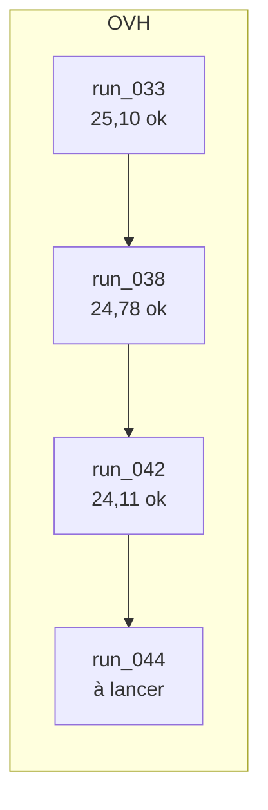
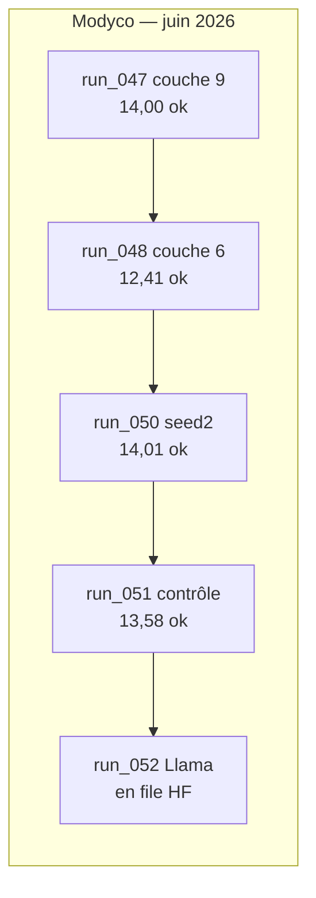

# Recommandations et pistes d'amélioration — pipeline S3T

Document de synthèse unique regroupant toutes les pistes d'amélioration du projet S3T, pour les deux variantes prioritaires (ST end-to-end et speechLLM). Mis à jour en juin 2026 après consultation de Gemini.

## Pistes d'amélioration principales

Meilleur ST local : **26,12 BLEU** (`run_026`, L-14k + SpecAugment, au-dessus de la Table 8 Pantagruel). Réplication L-114k confirmée : **25,10 BLEU** (`run_033`, encodeur L-114k + vocabulaire SPM 5k), proche de la référence article (**25,2 ± 0,4**). speechLLM B1 plafonne autour de **15 BLEU** (`run_012` / `run_013`). Gemini 3.5 atteint **~41 BLEU** via API, mais n’est ni reproductible localement ni strictement comparable (modèle fermé, risque de chevauchement avec des contenus TED publics).

### 1. Affiner l'entraînement ST end-to-end (variante 1)

Poursuivre les ablations sur l'architecture déjà performante : **SpecAugment** (masquage temporel plus fort, masquage fréquentiel), **warmup** plus long sur L-114k, **batch effectif** intermédiaire (32 séquences, entre le réglage actuel et celui du papier). Objectif : consolider ou dépasser les scores Table 8 sur L-14k et L-114k, et documenter l'impact de chaque levier.

### 2. Exploiter les couches intermédiaires de l'encodeur Pantagruel (speechLLM)

Aujourd'hui, le projecteur speechLLM utilise par défaut la **dernière couche** de l'encodeur (`encoder_layer: -1` → `last_hidden_state`). Le paramètre **`model.encoder_layer`** est **implémenté** (juin 2026). Ablation piste J **terminée** (juin 2026) : couche **9** `run_047` **14,00** ; couche **6** `run_048` **12,41** ; contrôle `encoder_layer: -1` `run_051` **13,58** — toutes **sous** `run_012` **15,03** : pas de gain à changer de couche.

### 3. Renforcer la rigueur expérimentale

Avant de tirer des conclusions fortes : **relecture qualitative** des hypothèses (boucles, longueur, erreurs systématiques), **réévaluation** des meilleurs checkpoints (greedy en entraînement vs beam à l'évaluation), et **runs avec une seconde seed** (le papier indique ±0,4 BLEU de variabilité). Indispensable pour valider les gains observés (ex. écart ~1,3 BLEU entre deux réplications identiques de `run_026`).

### 4. Baselines ST open source réplicables *(piste complémentaire)*

Compléter les variantes **Pantagruel entraînées sur m-TEDx** (1–2) par des **modèles pré-entraînés open source**, évalués sur le **même protocole** (utterance, SacreBLEU, `valid`/`test`) — à la manière de la cascade Whisper→Marian déjà à **~37 BLEU** (`4_cascade/`), mais avec des systèmes **speech-to-text** ou **speech+LLM** plus récents et **reproductibles hors API** :

| Modèle / stack | Intérêt pour fr→en | Déploiement typique |
|----------------|-------------------|---------------------|
| **SeamlessM4T v2** (Meta) | ST multilingue direct audio→texte | Hugging Face / `fairseq2` |
| **Canary-1B** (NVIDIA) | ASR + traduction multilingue compacte | NeMo / HF |
| **Granite Speech 3.3** (IBM) | Parole + LLM intégré, instructions | Hugging Face |
| **Ollama** (+ modèle speech-compatible) | Inférence **locale** reproductible (Qwen2-Audio, etc.) | Serveur Ollama, zéro API cloud |

**Objectif :** situer Pantagruel et speechLLM par rapport à l’état de l’art **ouvert** et **vérifiable** — sans confondre avec Gemini (score élevé mais non reproductible). **Priorité P3** : nouvelle variante `6_open_baselines/` ou extension de `3_Gemini/` / `4_cascade/` ; premier candidat **SeamlessM4T v2** (ST directe, le plus proche de la tâche). Détail : [Piste K](#piste-k--baselines-st-open-source-réplicables).

---

**Sources fusionnées :** `plan_amelioration_table8.md`, `plan_migration_speechllm.md`, `documentation/speechllm.md §2.6`, recommandations Gemini (17 juin 2026).

> **Lecture rapide :** la [file d'attente GPU](#file-dattente-gpu) et la [roadmap des prochaines pistes](#roadmap-des-prochaines-pistes) sont la source de vérité pour savoir quoi lancer ensuite. Les sections [Piste A](#piste-a--stabiliser-l-114k-ovh) à [Piste K](#piste-k--baselines-st-open-source-réplicables) détaillent le contexte et les configs.

---

## File d'attente GPU

Dernière mise à jour : **30 juin 2026** (piste J **clos** ; `run_052` Llama-3.2-3B **en file** sur Modyco).

### OVH

Hôte : `ubuntu@145.239.52.158`

**État :** GPU **libre** — serveur **éteignable** tant que `run_044` n'est pas lancé.

**Prochain run OVH :** **`run_044`** — speechLLM L-114k + SpecAugment ([piste H](#piste-h--speechllm--suite-des-ablations-b1--b2)). Bloqué sur Modyco (HF `speech-large-114K` gated) ; seule machine cible pour cette ablation. Durée estimée **~2–3 h GPU**.

| Pos. | Statut | Run | Variante | Piste | Notes |
|------|--------|-----|----------|-------|-------|
| — | **terminé** | `run_033` | ST L-114k SPM 5k | — | test **25,10** |
| — | **terminé** | `run_038` | ST L-114k SpecAugment freq | [A](#piste-a--stabiliser-l-114k-ovh) | test **24,78** ; early stop @ 30k |
| — | **terminé** | `run_042` | ST L-114k warmup 10k | [A](#piste-a--stabiliser-l-114k-ovh) | test **24,11** ; early stop @ 38k |
| **1** | **à lancer** | `run_044` | speechLLM L-114k SpecAugment | [H](#piste-h--speechllm--suite-des-ablations-b1--b2) | **prochain run OVH** — config + nohup prêts |

**Lancement `run_044` sur OVH** (après `huggingface-cli login` pour L-114k) :

```bash
# Depuis la machine locale — rsync puis lancement
rsync -avz 2_speechLLM/configs/fr-en/b1_utterance_large_114k_v5_specaug.yaml \
  2_speechLLM/scripts/run_044_b1_utterance_large_114k_v5_specaug_nohup.sh \
  ubuntu@145.239.52.158:~/S3T/2_speechLLM/{configs/fr-en/,scripts/}

ssh ubuntu@145.239.52.158 'cd ~/S3T && source .venv/bin/activate && mkdir -p logs && \
  nohup bash 2_speechLLM/scripts/run_044_b1_utterance_large_114k_v5_specaug_nohup.sh \
  > logs/run_044_ovh_wrapper.log 2>&1 &'

# Surveillance :
# ssh ubuntu@145.239.52.158 'tail -f ~/S3T/logs/run_044_speechllm_b1_utterance_large_114k_v5_specaug_train_eval.log'
```



### Modyco

**État :** GPU **libre** — waiter actif pour **`run_052`** (Llama-3.2-3B, attente approbation HF Meta après acceptation licence).

| Pos. | Statut | Run | Variante | Piste | Notes |
|------|--------|-----|----------|-------|-------|
| — | **terminé** | `run_037` | ST L-14k SpecAugment fort | [C](#piste-c--specaugment-fort-modyco) | test **24,55** |
| — | **terminé** | Piste D | rééval `last.pt` | [D](#piste-d--cohérence-greedy--beam-pour-bestpt) | run_026 **25,27** ; run_037 **24,62** |
| — | **terminé** | `run_046` | ST batch 32 | [B](#piste-b--batch-effectif-intermédiaire-modyco) | **collapse** **2,76** @ 12k |
| — | **terminé** | `run_006` | speechLLM B-1k dégel | [H](#piste-h--speechllm--suite-des-ablations-b1--b2) | test **9,60** (vs run_003 gelé **7,47** ; loin de run_012 **15,03**) |
| — | **terminé** | `run_049` | ST v5 seed 2 | [F](#piste-f--réplicabilité-et-seeds-multiples) | test **23,84** (vs run_026 **26,12**, run_043 **24,78**) |
| — | **terminé** | `run_047` | speechLLM couche 9 | [J](#piste-j--speechllm--couche-de-sortie-de-lencodeur-pantagruel) | **14,00** test / **15,10** dev (22 juin) |
| — | **terminé** | `run_048` | speechLLM couche 6 | [J](#piste-j--speechllm--couche-de-sortie-de-lencodeur-pantagruel) | **12,41** test / **13,69** dev (22 juin) — sous run_047 et run_012 |
| — | **terminé** | `run_050` | speechLLM L-14k seed 2 | [F](#piste-f--réplicabilité-et-seeds-multiples) | **14,01** test / **14,56** dev (22–23 juin) — légèrement sous run_012 **15,03** |
| — | **terminé** | `run_051` | speechLLM contrôle couche -1 | [J](#piste-j--speechllm--couche-de-sortie-de-lencodeur-pantagruel) | **13,58** test / **14,57** dev (27 juin) — sous run_012 **15,03** |
| — | **échec** | `run_036` | ST warmup 10k (reprise) | warmup ablation | **0,60** test (23 juin) — **ne pas relancer** |
| **1** | **en file** | `run_052` | speechLLM L-14k + Llama-3.2-3B | [H](#piste-h--speechllm--suite-des-ablations-b1--b2) | waiter HF actif ; ~**3,5–5 h** GPU estimées ; format `llama_inst` implémenté |

#### Historique scripts Modyco récents

| Début | Fin | Script | Run | Résultat |
|-------|-----|--------|-----|----------|
| 18 juin 17h42 | 18 juin 22h23 | `run_modyco_st_14k_v11_batch32.sh` | `run_046` | **échec** — collapse **2,76** @ 12k |
| 18 juin 22h38 | 19 juin 00h01 | `run_modyco_wait_after_046_then_006.sh` | `run_006` | **ok** — **9,60** test |
| 19 juin 00h03 | 19 juin 04h29 | `run_modyco_wait_chain_night_until_10h.sh` | `run_049` | **ok** — **23,84** test |
| 21 juin 22h25 | 22 juin 01h15 | `run_modyco_speechllm_14k_layer9.sh` | `run_047` | **ok** — **14,00** test / **15,10** dev (~2,5 h GPU) |
| 22 juin 18h02 | 22 juin 20h31 | `run_modyco_speechllm_14k_layer6.sh` | `run_048` | **ok** — **12,41** test / **13,69** dev (~2,5 h GPU) |
| 22 juin 20h53 | 23 juin 00h24 | waiter `048→050` | `run_050` | **ok** — **14,01** test / **14,56** dev (~2,9 h GPU) |
| 23 juin 00h24 | 23 juin 02h01 | waiter `050→036` | `run_036` | **échec** — **0,60** test (warmup 10k L-14k instable) |
| 23 juin 06h07 | 27 juin 02h09 | `run_modyco_speechllm_14k_encoder_control.sh` | `run_051` | **ok** — **13,58** test / **14,57** dev (~2,9 h GPU) |
| 30 juin 18h26 | — | `run_modyco_wait_hf_then_speechllm_llama32_3b.sh` | `run_052` | **en file** — attente approbation HF Llama-3.2-3B |

Logs : `logs/run_048_*`, `logs/run_050_*`, `logs/run_051_*`, `logs/run_052_modyco_wait_hf_chain.log`, `logs/chain_048_050_modyco_wait.log`, `logs/chain_050_036_modyco_wait.log`.

**Blocage connu :** modèles HF `speech-large-114K` **gated** sur Modyco — réserver speechLLM L-114k (`run_044`) à **OVH**. **`meta-llama/Llama-3.2-3B-Instruct`** : licence acceptée, approbation Meta en cours (waiter `run_052`).



**Waiters :** `run_modyco_wait_hf_then_speechllm_llama32_3b.sh` **actif** (lance `run_052` dès accès HF).

```bash
# Surveillance run_052 (waiter puis train) :
# tail -f ~/S3T/logs/run_052_modyco_wait_hf_chain.log
# tail -f ~/S3T/logs/run_052_speechllm_b2bis_utterance_large_14k_llama32_3b_train_eval.log
```

### Légende des statuts

| Statut | Signification |
|--------|---------------|
| **en cours** | entraînement actif sur la machine |
| **en file** | démarrage automatique dès que le run précédent se termine (waiter actif) |
| **à lancer** | config + script prêts, lancement manuel immédiat possible |
| **à préparer** | config ou script manquant — dev court avant lancement |
| **à implémenter** | changement code requis avant le run |
| **reporté** | décision prise, en attente de disponibilité GPU |
| **interrompu** | run arrêté manuellement avant fin |
| **analyse** | pas d'entraînement long (rééval, relecture qualitative) |
| **bloqué** | contrainte externe (HF gated, checkpoint 404, etc.) |

---

## Roadmap des prochaines pistes

Ordre de priorité **scientifique** (indépendant de la disponibilité GPU). Croiser avec la [file d'attente](#file-dattente-gpu) pour l'exécution.

| Pri. | Piste | Action concrète | Machine cible | Run(s) | Statut |
|------|-------|-----------------|---------------|--------|--------|
| — | **OVH** | Chaîne 038→042 terminée ; **`run_044`** **à lancer** | OVH | `run_044` | **à lancer** — prochain run OVH |
| — | **Modyco** | `run_052` Llama-3.2-3B en file (waiter HF) | Modyco | `run_052` | **en file** |
| **P0** | [D](#piste-d--cohérence-greedy--beam-pour-bestpt) | Réévaluer run_026 et run_037 avec `last.pt` | Modyco | `run_026_eval_lastpt`, `run_037_eval_lastpt` | **ok** |
| **P0** | [H](#piste-h--speechllm--suite-des-ablations-b1--b2) | Relecture qualitative `run_003` | local | — | **à faire** |
| **P1** | [B](#piste-b--batch-effectif-intermédiaire-modyco) | Batch 32 | Modyco | `run_046` | **échec** (collapse **2,76**) |
| **P1** | [J](#piste-j--speechllm--couche-de-sortie-de-lencodeur-pantagruel) | Ablation couches 9 / 6 / -1 | Modyco | `run_047`, `run_048`, `run_051` | **ok** — 9 **14,00** ; 6 **12,41** ; -1 **13,58** — **pas de gain** vs run_012 **15,03** |
| **P1** | [H](#piste-h--speechllm--suite-des-ablations-b1--b2) | Dégel B-1k utterance | Modyco | `run_006` | **ok** — **9,60** (gain modeste) |
| **P1** | [H](#piste-h--speechllm--suite-des-ablations-b1--b2) | speechLLM L-114k SpecAugment | **OVH** | `run_044` | **à lancer** — **prochain run OVH** |
| **P2** | [F](#piste-f--réplicabilité-et-seeds-multiples) | 2e seed ST run_026 (`seed: 1`) | Modyco | `run_049` | **ok** — **23,84** |
| **P2** | [F](#piste-f--réplicabilité-et-seeds-multiples) | 2e seed speechLLM (run_012) | Modyco | `run_050` | **ok** — **14,01** (légèrement sous run_012 **15,03**) |
| **P3** | [E](#piste-e--vocabulaire-spm-avec-gel-encodeur-prolongé) | SPM 5k + gel encodeur 15k L-14k (run_033 L-114k **25,10** ≈ papier) | Modyco | — | **backlog** — priorité basse |
| **P3** | [H](#piste-h--speechllm--suite-des-ablations-b1--b2) | B2 — Llama-3.2-3B | Modyco | `run_052` | **en file** — code + config prêts ; waiter HF actif |
| **P3** | [G](#piste-g--extensions-multilingues-fres-et-frpt) | fr→es / fr→pt (clone configs + `2_prepare`) | — | — | **backlog** |
| **P3** | [K](#piste-k--baselines-st-open-source-réplicables) | Éval SeamlessM4T v2 / Canary / Granite / Ollama sur m-TEDx | local | — | **backlog** |
| — | [I](#piste-i--tâches-downstream-non-st) | NER / SLU / SER | — | — | **hors scope** |

**Règle d'exécution :** une seule variable par run (règle B2 speechLLM) ; mettre à jour cette section et la file d'attente après chaque run terminé ou échec.

---

## Résultats de référence (fr→en, utterance, juin 2026)

| Variante | Run | BLEU test | Statut |
|----------|-----|-----------|--------|
| **ST L-14k v5 SpecAugment** | `run_026` | **26,12** | ok — **meilleur ST local** |
| ST L-14k v10 finetune freq | `run_041` | **25,95** | ok — sous run_026 |
| ST L-14k v5 replicate (seed 42) | `run_043` | **24,78** | ok — écart ~1,3 vs run_026 |
| ST L-14k v5 seed 2 | `run_049` | **23,84** | ok (Modyco, 19 juin) — confirme variabilité |
| ST L-14k batch 32 | `run_046` | **2,76** | **échec** — collapse @ 12k (comme batch 64) |
| ST L-14k SpecAugment fort | `run_037` | **24,55** | ok — sous run_026 |
| ST L-114k v5 SpecAugment | `run_028` | **23,51** | ok |
| ST L-114k SPM 5k | `run_033` | **25,10** | ok (OVH) — ≈ papier **25,2** |
| ST L-114k SpecAugment freq | `run_038` | **24,78** | ok (OVH, 18 juin) |
| ST L-114k warmup 10k | `run_042` | **24,11** | ok (OVH, 19 juin) — sous run_033 |
| ST L-14k warmup 10k | `run_036` | **0,60** | **échec** (Modyco, 23 juin) — ne pas relancer |
| speechLLM B-1k dégel | `run_006` | **9,60** | ok — au-dessus run_003 (**7,47**) |
| speechLLM L-14k SpecAugment fort | `run_045` | **13,69** | ok — sous run_023 **14,23** |
| speechLLM L-114k SpecAugment | `run_044` | — | **échec** HF gated (Modyco) ; **à lancer sur OVH** |
| speechLLM couche 9 | `run_047` | **14,00** | ok (Modyco, 22 juin) — sous run_012 **15,03** ; dev **15,10** |
| speechLLM couche 6 | `run_048` | **12,41** | ok (Modyco, 22 juin) — sous run_047 et run_012 ; dev **13,69** |
| speechLLM L-14k seed 2 | `run_050` | **14,01** | ok (Modyco, 22–23 juin) — légèrement sous run_012 **15,03** ; dev **14,56** |
| speechLLM contrôle couche -1 | `run_051` | **13,58** | ok (Modyco, 27 juin) — sous run_012 **15,03** ; dev **14,57** |
| speechLLM L-14k + Llama-3.2-3B | `run_052` | — | **en file** (Modyco, waiter HF ; ~3,5–5 h GPU estimées) |
| speechLLM B1 L-14k gelé | `run_012` | **15,03** | ok — référence piste J / B2bis |

Référence papier (Table 8, fr→en, utterance) : B-1k **17,5 ± 0,4** ; L-14k **24,0 ± 0,4** ; L-114k **25,2 ± 0,4**.

> Runs **en cours** ou **planifiés** : voir [file d'attente GPU](#file-dattente-gpu).

---

## Piste A — Stabiliser L-114k (OVH)

### Contexte

Le modèle L-114k (23,51 BLEU) reste **2 pts sous le papier** (~25,2). Hypothèse principale : un encodeur de cette taille nécessite un warmup plus long pour éviter que les gradients du décodeur — initialisé aléatoirement — ne perturbent ses poids pré-entraînés.

> **Gemini :** « Un warmup long (10 000 pas) est crucial pour éviter que le décodeur n'envoie des gradients destructeurs à un encodeur d'une telle capacité. Le régime d'entraînement PyTorch est probablement trop agressif au démarrage par rapport aux schedulers fairseq. »

### Runs planifiés

> Chaîne OVH **terminée** (19 juin ~06h08 UTC).

| Run | Config | Changement vs run_028 | Statut |
|-----|--------|-----------------------|--------|
| `run_038` | [`base_utterance_large_114k_v9_specaug_freq.yaml`](../1_Transformer/configs/fr-en/base_utterance_large_114k_v9_specaug_freq.yaml) | + SpecAugment fréquentiel | **ok** — test **24,78** |
| `run_042` | [`base_utterance_large_114k_v10_warmup10k.yaml`](../1_Transformer/configs/fr-en/base_utterance_large_114k_v10_warmup10k.yaml) | warmup 4k → **10k** | **ok** — test **24,11** (sous run_033 **25,10**) |

**Synthèse :** SPM 5k (`run_033`, **25,10**) reste la meilleure recette L-114k ; warmup 10k + SpecAugment freq n'ont pas dépassé cette baseline.

---

## Piste B — Batch effectif intermédiaire (Modyco)

### Contexte

Le batch 64 (`gradient_accumulation: 64`) a provoqué un collapse systématique (run_024 : 0,35 BLEU ; run_025 : 0,31 BLEU). La recette actuelle utilise `gradient_accumulation: 8` (batch effectif 8). Le papier utilise 64–256 séquences.

> **Gemini :** « En environnement PyTorch/HF, une forte accumulation de gradients (64) combinée à un LR de 2e-4 peut provoquer des gradients explosifs. Testez un batch intermédiaire (32) avec LR conservateur (1e-4). Cela permet de lisser le gradient sans heurter les limites de stabilité numérique de l'AMP. »

### Run terminé (`run_046`)

**Résultat :** **collapse** — test **2,76** BLEU @ 12k (early stop). Même famille d'échec que batch 64 (`run_024`/`run_025`). **Conclusion :** batch 32 + LR 1e-4 **instable** ; conserver batch 8 (`run_026`). Piste B **clos** sauf test LR `5e-5` (priorité basse).

Config : [`base_utterance_large_14k_v11_batch32.yaml`](../1_Transformer/configs/fr-en/base_utterance_large_14k_v11_batch32.yaml) ; script [`run_modyco_st_14k_v11_batch32.sh`](../scripts/run_modyco_st_14k_v11_batch32.sh).

### Interprétation (run_046)

- ~~Si stable et > 26,12~~ → **non** (collapse).
- ~~Si stable mais ≈ 26,12~~ → **non**.
- **Collapse** → batch 32 + LR 1e-4 **refusé** ; batch 8 (`run_026`) reste la recette ST L-14k.

---

## Piste C — SpecAugment fort (Modyco)

### Contexte

run_026 utilise `mask_time_prob: 0.05`. La piste d'augmentation plus agressive (0.10) n'a jamais été lancée suite à la chaîne abandonnée 036→037.

### Run à lancer

**Run ID :** `run_037_transformer_baseline_utterance_large_14k_v9_specaug_strong`

Config existante : [`1_Transformer/configs/fr-en/base_utterance_large_14k_v9_specaug_strong.yaml`](../1_Transformer/configs/fr-en/base_utterance_large_14k_v9_specaug_strong.yaml)

Seul changement vs run_026 : `mask_time_prob: 0.10` (vs 0.05).

**Action :** script `scripts/run_modyco_st_14k_v9_specaug_strong.sh` — **lancé** 17 juin ~17h (Modyco). Distinct de **`run_045`** (speechLLM SpecAugment fort, terminé).

```bash
# Surveillance Modyco
./scripts/tour.sh ssh 'tail -f ~/S3T/logs/run_037_*_spm_train_eval.log'
```

---

## Piste D — Cohérence greedy / beam pour best.pt

### Contexte

`4_train.py` sélectionne `best.pt` sur le BLEU **greedy** en cours d'entraînement ; `5_evaluate.py` rapporte le BLEU **beam 5**. Le vrai meilleur checkpoint pourrait ne pas être le même avec beam.

> **Gemini :** « Plutôt qu'implémenter `eval_beam_during_training: true` (ralentirait les runs de 10h), décodez simplement les 3–5 meilleurs checkpoints sauvegardés par le greedy, puis sélectionnez le vainqueur ex post. C'est un gain marginal, mais gratuit en temps GPU d'entraînement, et cela vous aligne sur la philosophie d'évaluation du papier. »

### Options

**Option A (immédiate, sans modifier le code) :** `best.pt` et `last.pt` sont tous deux disponibles. Comparer en relançant `5_evaluate.py` avec `--checkpoint last.pt` sur les meilleurs runs terminés :

```bash
source .venv/bin/activate
python 1_Transformer/pipeline.py evaluate \
  --config 1_Transformer/configs/fr-en/base_utterance_large_14k_v5.yaml \
  --checkpoint runs/fr-en/run_026_transformer_baseline_utterance_large_14k_v5/checkpoints/last.pt \
  --run-id run_026_eval_lastpt
```

**Option B (dev ~2 h) :** ajouter `train.checkpoint_keep_n_best: 3` dans `4_train.py` pour conserver les 3 meilleurs checkpoints. Utile si l'option A révèle un écart significatif.

**Recommandation : commencer par l'option A** sur run_026 et run_028.

---

## Piste E — Vocabulaire SPM avec gel encodeur prolongé

### Contexte

SPM 5k (run_031 : 24,02) et 8k (run_034 : 22,24) sont **sous** vocab 1k + SpecAugment (run_026 : 26,12). Résultat contre-intuitif vs LeBenchmark (~8k).

> **Gemini :** « Un vocabulaire plus large implique une matrice d'embedding du décodeur beaucoup plus vaste à initialiser. Si vous relancez SPM 5k ou 8k, augmentez drastiquement la durée du gel de l'encodeur (`freeze_encoder_updates > 5k`, peut-être 10k ou 15k). Le décodeur a besoin de plus d'étapes pour structurer un espace de 8000 sous-mots avant que les gradients n'atteignent l'encodeur. »

### Hypothèse à tester

Config : recette run_026 (SpecAugment) + SPM 5k + `freeze_encoder_updates: 15000`.

**Priorité basse** — `run_033` L-114k SPM 5k a atteint **25,10 BLEU test** (≈ papier) ; à relancer sur L-14k seulement après run_046 et run_037.

---

## Piste F — Réplicabilité et seeds multiples

### Contexte

run_026 (26,12) vs run_043 (24,78) : écart ~1,3 BLEU avec seed et config identiques. L'écart suggère une variabilité résiduelle GPU (fp16, CuDNN, machine partagée).

Le PRD §6 recommande ≥ 2 seeds avant de promouvoir une variante. **Non fait** pour les runs récents.

### Action

Lancer run_026 avec `seed: 1` (ou 2) après les run_044 et run_037 sur Modyco. Durée : ~8 h.

Config à créer : `base_utterance_large_14k_v5_seed2.yaml` (seul changement : `seed: 1`, `deterministic: true`).

---

## Piste G — Extensions multilingues fr→es et fr→pt

La Table 8 couvre trois directions. Les données sont téléchargeables via `1_download.py`.

| Direction | Données m-TEDx | Cible papier L-14k / L-114k |
|-----------|----------------|------------------------------|
| fr→en | ~50 h | 24,0 / 25,2 — **dépassé** (26,12) |
| fr→es | ~38 h | 25,5 / 25,4 |
| fr→pt | ~25 h | 21,9 / 24,5 |

**Action :** cloner les configs `fr-en/base_utterance_large_14k_v5.yaml` vers `fr-es/` et `fr-pt/`, lancer `2_prepare` pour ces paires, puis entraîner. Effort ~20 min de setup par paire + ~8 h GPU chacune.

---

## Piste H — speechLLM : suite des ablations B1 / B2

### État (juin 2026)

| Run | Encodeur | Gel | BLEU test | Segmentation |
|-----|----------|-----|-----------|--------------|
| `run_012` | L-14k | gelé | **15,03** | utterance |
| `run_013` | L-114k | gelé | **15,24** | utterance |
| `run_023` | L-14k | gelé | **14,23** | utterance (replicate) |
| `run_039` | L-14k | gelé + SpecAugment (0.05) | **13,84** | utterance — sous run_023 |
| `run_045` | L-14k | gelé + SpecAugment fort (0.10) | **13,69** | utterance — sous run_039 et run_023 |
| `run_044` | L-114k | gelé + SpecAugment | — | **échec** Modyco (HF gated) — **à lancer sur OVH** |
| `run_005` | B-1k | **dégelé** | **18,83** | sentence_like |
| `run_015` | L-14k | dégelé | **3,65** | utterance — **sous** gelé |
| `run_006` | B-1k | dégelé | **9,60** | utterance — gain vs run_003 (**7,47**), loin de run_012 |

### Prochaines étapes speechLLM

Voir la [roadmap](#roadmap-des-prochaines-pistes) (P0–P3) et la [file Modyco / OVH](#file-dattente-gpu). Règle B2 : changer une seule chose par rapport au run de référence ; relire `plan_migration_speechllm.md` §B2bis avant de lancer.

| Action clé | Run | Priorité | Statut |
|------------|-----|----------|--------|
| Relecture qualitative `run_003` | — | P0 | à faire |
| Ablation dégel utterance (LR `5e-5`) | `run_006` | P1 | **ok** — **9,60** |
| Ablation couche encodeur (Piste J) | `run_047`–`run_051` | P1 | **ok** — 9 **14,00** ; 6 **12,41** ; -1 **13,58** — **pas de gain** |
| Relancer L-114k SpecAugment | `run_044` | P1 | **à lancer sur OVH** — **prochain run OVH** |
| 2e seed | `run_050` | P2 | **ok** — **14,01** (vs run_012 **15,03**) |
| B2 Llama-3.2-3B | `run_052` | P3 | **en file** — format `llama_inst` + config prêts ; waiter Modyco |
| SpecAugment speechLLM | run_039 vs run_045 | clos | **n'aide pas** (13,84 → 13,69) |

---

## Piste J — speechLLM : couche de sortie de l'encodeur Pantagruel

### Contexte

La variante **2 speechLLM** alimente le projecteur avec la **dernière couche** de l'encodeur Pantagruel, via `last_hidden_state` codé en dur dans [`2_speechLLM/speechllm_lib.py`](../2_speechLLM/speechllm_lib.py) (`encode_speech`, ligne ~331). Aucun paramètre YAML ni option CLI ne permet aujourd'hui de choisir une couche intermédiaire.

Pantagruel est pré-entraîné en **JEPA / data2vec 2.0** : les couches finales sont spécialisées pour prédire les représentations latentes d'un encodeur enseignant (EMA), pas pour une tâche aval comme la ST. Sur des encodeurs SSL proches (wav2vec 2.0, HuBERT, data2vec), la littérature montre souvent que les **couches intermédiaires** (typiquement autour des couches 6–9 sur ~12) portent des représentations plus utiles pour l'ASR, la ST ou la SER que la sortie finale. Le papier Pantagruel utilise d'ailleurs des **sondes par couche** pour les tâches downstream (NER, SLU — Annexe B.2), ce qui suggère que la couche optimale n'est pas forcément la dernière.

### Écart observé

Avec le **même encodeur L-14k** et la segmentation `utterance` :

| Variante | Run | BLEU test | Sortie encodeur |
|----------|-----|-----------|-----------------|
| ST end-to-end (décodeur 6L) | `run_026` | **26,12** | `last_hidden_state` (cross-attention) |
| speechLLM B1 couche 9 | `run_047` | **14,00** | couche **9** (projecteur) |
| speechLLM B1 couche 6 | `run_048` | **12,41** | couche **6** (projecteur) |
| speechLLM B1 couche -1 (contrôle) | `run_051` | **13,58** | `encoder_layer: -1` — **ok** (sous run_012 **15,03**) |
| speechLLM B1 (projecteur + Phi-2) | `run_012` | **15,03** | `last_hidden_state` (projecteur linéaire) |

L'écart (~11 BLEU) s'explique en partie par l'architecture (décodeur entraîné vs projecteur léger + LLM gelé). L'ablation piste J (juin 2026) montre que les couches intermédiaires **ne surpassent pas** la dernière couche (`run_012` **15,03** > `run_047` **14,00** > `run_048` **12,41**).

### État du code (juin 2026)

- **speechLLM** : `model.encoder_layer` implémenté dans `speechllm_lib.py` (défaut **`-1`** = dernière couche).
- **ST variante 1** : inchangé (`last_hidden_state` via `st_common.py`).

### Action proposée

**1. Rendre la couche configurable** dans `speechllm_lib.py` :

- Nouveau champ YAML `model.encoder_layer` (entier, défaut **`-1`** = dernière couche, comportement actuel inchangé).
- Si `encoder_layer >= 0` : forward avec `output_hidden_states=True`, puis `hidden_states[encoder_layer]`.
- Adapter `_resolve_encoder_output_dim` pour sonder la couche choisie (la dimension peut différer de `config.hidden_size` sur les checkpoints Large).

**2. Ablation systématique** — une seule variable vs `run_012` (référence L-14k gelé, utterance) :

| Run suggéré | `encoder_layer` | Hypothèse |
|-------------|-----------------|-----------|
| `run_047` | **9** | **ok** — **14,00** test (sous run_012 **15,03**) |
| `run_048` | **6** | **ok** — **12,41** test (sous run_047) |
| `run_051` | **-1** | **ok** — **13,58** test (contrôle post-implémentation) |

Config de départ : dupliquer [`b1_utterance_large_14k.yaml`](../2_speechLLM/configs/fr-en/b1_utterance_large_14k.yaml), ne changer que `encoder_layer` et `experiment.output_dir`.

**3. Protocole d'interprétation**

- Si une couche intermédiaire dépasse **15 BLEU** nettement → documenter la couche retenue dans le PRD §2.3.1 et les configs par défaut.
- Si toutes les couches ≈ run_012 → le goulot n'est probablement pas la couche ; prioriser Piste H (dégel prudent, autre LLM).
- Comparer aussi la **longueur des hypothèses** et les erreurs qualitatives (`eval/dev_predictions.txt`) : certaines couches peuvent stabiliser la génération sans gagner beaucoup en BLEU.

### Priorité

**P1 — clos** : ablation piste J terminée — couche 9 **14,00** > couche 6 **12,41** > contrôle -1 **13,58** ≪ run_012 **15,03**. **Prochaine action GPU Modyco :** `run_052` Llama-3.2-3B (waiter HF). **Prochaine action OVH :** `run_044` (speechLLM L-114k SpecAugment).

---

## Piste K — Baselines ST open source réplicables

### Contexte

Le projet compare déjà **Pantagruel entraîné sur m-TEDx** (variantes 1–2) à **Gemini** (variante 3, ~41 BLEU) et à une **cascade ASR→MT** open source (variante 4, ~37 BLEU). Gemini reste une référence haute mais **non reproductible** (API, modèle fermé, incertitude sur l’exposition aux TED publics). Pour le rapport et la comparaison scientifique, il manque des baselines **open weights** récentes, sur le **même jeu de test** et la **même signature SacreBLEU**.

### Candidats prioritaires

| Modèle | Rôle | Remarque |
|--------|------|----------|
| **SeamlessM4T v2** | ST directe multilingue (audio fr → texte en) | Candidat **#1** : tâche la plus proche de la ST E2E Pantagruel ; checkpoints HF Meta |
| **Canary-1B** | ASR / traduction multilingue (NVIDIA) | Compact ; utile pour comparer taille vs qualité |
| **Granite Speech 3.3** | Parole + modèle de langue (IBM) | Piste speechLLM-like open source ; vérifier support fr→en et VRAM |
| **Ollama** | Runtime d’inférence locale | Pas un modèle : enveloppe pour tester Qwen2-Audio, Whisper-large, ou Granite en **zéro dépendance API** — intérêt **reproductibilité** pour un encadrant / relecteur externe |

### Protocole proposé

- **Entrées** : mêmes manifests `valid.tsv` / `test.tsv` (`segment_mode: utterance`) issus de `2_prepare`.
- **Sorties** : `eval/sacrebleu_*.txt` avec signature SacreBLEU (comme variantes 3–4).
- **Pas d’entraînement** sur m-TEDx (zero-shot ou pretrained only) — comparable à Gemini et cascade.
- **Un modèle par run** ; documenter version, dépendances et VRAM.

### Implémentation suggérée

1. Créer `6_open_baselines/` (ou sous-dossier par modèle) avec `evaluate.py` + `infer.py` + `pipeline.py`.
2. **Premier run** : SeamlessM4T v2 large (ou medium si VRAM limitée) — `run_050_seamlessm4t_v2_utterance` (ID à confirmer).
3. Enchaîner Canary-1B et Granite Speech si le premier run est stable.
4. Option **Ollama** : script d’évaluation batch si un modèle speech-fr→en est disponible localement.

### Priorité

**P3 — backlog** — après consolidation des pistes Pantagruel (1–3) et speechLLM (J). Utile pour le **cadrage rapport** (positionnement vs SOTA ouvert) plus que pour la réplication Table 8 stricte.

---

## Piste I — Tâches downstream non-ST

La Table 8 couvre aussi NER speech, SLU (MEDIA) et SER (AlloSat). Ces tâches ne font pas partie du pipeline S3T actuel.

| Tâche | Corpus | Métrique | Architecture papier |
|-------|--------|----------|---------------------|
| NER speech | PxCorpus, ETAPE | F1↑ / NEER↓ | encodeur SSL + sonde 3 couches |
| SLU | MEDIA | CER↓ | Transformer seq2seq concepts |
| SER | AlloSat | CCC↑ | encodeur gelé + 5-BiLSTM |

**Action :** nouvelle variante `6_downstream/` ou module dédié. Hors scope ST actuel. Détails : Annexe B.2 du papier Pantagruel.

---

## Checklist de suivi

Synthèse alignée sur la [file d'attente](#file-dattente-gpu) et la [roadmap](#roadmap-des-prochaines-pistes). Mettre à jour les deux sections en tête de document après chaque changement.

| Machine | Pos. | Run / action | Piste | Statut |
|---------|------|--------------|-------|--------|
| OVH | **1** | `run_044` speechLLM L-114k | H | **à lancer** — **prochain run OVH** |
| OVH | — | `run_033` ST L-114k SPM 5k | — | **ok** — test **25,10** |
| OVH | — | `run_038` SpecAugment freq | A | **ok** — **24,78** |
| OVH | — | `run_042` warmup 10k | A | **ok** — **24,11** |
| Modyco | **1** | `run_052` Llama-3.2-3B | H | **en file** (waiter HF) |
| Modyco | — | `run_051` contrôle couche -1 | J | **ok** — **13,58** |
| Modyco | — | `run_048` couche encodeur 6 | J | **ok** — **12,41** |
| Modyco | — | `run_050` seed 2 speechLLM | F | **ok** — **14,01** |
| Modyco | — | `run_036` warmup 10k L-14k | — | **échec** — **0,60** |
| local | — | relecture qualitative run_003 | H-P0 | **à faire** |
| — | — | SPM + gel long | E | **backlog** |
| — | — | fr→es / fr→pt | G | **backlog** |
| — | — | Mistral-7B 4-bit (B2bis) | H-P3 | **backlog** |
| — | — | Baselines open source (SeamlessM4T, etc.) | K | **backlog** |
| — | — | NER / SLU / SER | I | **hors scope** |

---

## Références

| Document | Rôle |
|----------|------|
| [`documentation/PRD.md`](PRD.md) §5–6 | Hyperparamètres cibles LeBenchmark et ablations obligatoires |
| [`documentation/protocole_utterance_pantagruel.md`](protocole_utterance_pantagruel.md) | Tous les runs utterance avec configs, statuts et commandes |
| [`documentation/protocole_evaluation.md`](protocole_evaluation.md) | Protocole SacreBLEU figé |
| [`documentation/estimation_ressources_fr_en.md`](estimation_ressources_fr_en.md) | Budget GPU par run |
| [`1_Transformer/configs/fr-en/`](../1_Transformer/configs/fr-en/) | Configs YAML par run |
| [`rapport.md §5`](../rapport.md#5-résultats) | Tableaux complets tous pipelines |
| [`runs/experiments_tracking.csv`](../runs/experiments_tracking.csv) | Agrégat chiffré |
