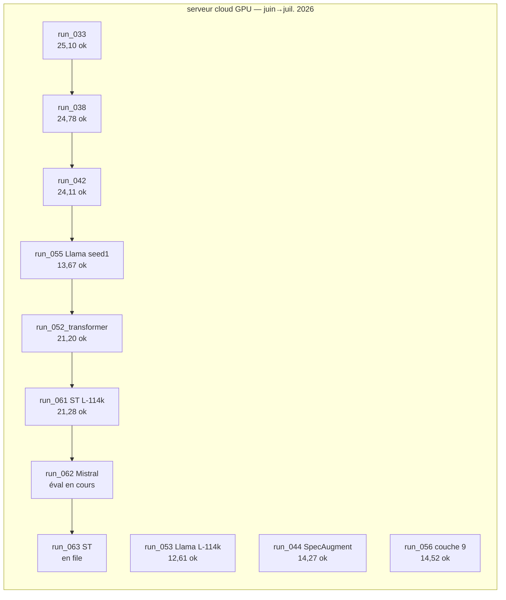
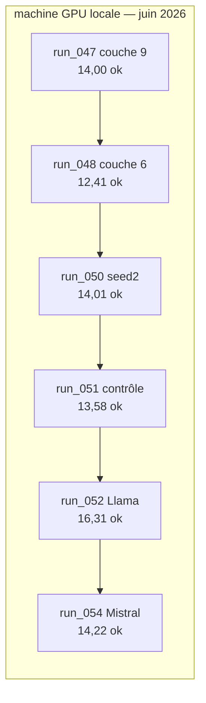

# Recommandations et pistes d'amélioration — pipeline S3T

Document de synthèse unique regroupant toutes les pistes d'amélioration du projet S3T, pour les deux variantes prioritaires (ST end-to-end et speechLLM). Mis à jour en **juillet 2026** (runs 052–077 ; **run_066 cluster GETALP** **20,12** ; open baselines machine GPU locale Canary **40,04** ; matrice trois machines GPU complète).

## Pistes d'amélioration principales

Meilleur ST local : **26,12 BLEU** (`run_026`, L-14k + SpecAugment, au-dessus de la Table 8 Pantagruel). Réplication L-114k confirmée : **25,10 BLEU** (`run_033`, encodeur L-114k + vocabulaire SPM 5k), proche de la référence article (**25,2 ± 0,4**). speechLLM B1 plafonne autour de **15 BLEU** (`run_012` / `run_013`). Gemini 3.5 atteint **~41 BLEU** via API, mais n’est ni reproductible localement ni strictement comparable (modèle fermé, risque de chevauchement avec des contenus TED publics).

### 1. Affiner l'entraînement ST end-to-end (variante 1)

Poursuivre les ablations sur l'architecture déjà performante : **SpecAugment** (masquage temporel plus fort 0.15), **SPM 5k + gel 15k** combiné (piste E, `run_063`), **batch effectif 32 avec warmup 15k** (piste B relancée, `run_065`), **L-114k SpecAugment fort** (`run_064`). Les configs v13 sont créées et prêtes pour serveur cloud GPU.

### 2. Exploiter les couches intermédiaires de l'encodeur Pantagruel (speechLLM)

Aujourd'hui, le projecteur speechLLM utilise par défaut la **dernière couche** de l'encodeur (`encoder_layer: -1` → `last_hidden_state`). Le paramètre **`model.encoder_layer`** est **implémenté** (juin 2026). Ablation piste J **terminée** (juin 2026) : couche **9** `run_047` **14,00** ; couche **6** `run_048` **12,41** ; contrôle `encoder_layer: -1` `run_051` **13,58** — toutes **sous** `run_012` **15,03** : pas de gain à changer de couche.

### 3. Renforcer la rigueur expérimentale

Avant de tirer des conclusions fortes : **relecture qualitative** des hypothèses (boucles, longueur, erreurs systématiques), **réévaluation** des meilleurs checkpoints (greedy en entraînement vs beam à l'évaluation), et **runs avec une seconde seed** (le papier indique ±0,4 BLEU de variabilité). Indispensable pour valider les gains observés (ex. écart ~1,3 BLEU entre deux réplications identiques de `run_026`).

### 4. Débloquer le plafond speechLLM

Deux nouvelles pistes (juillet 2026) : **dégel de l'encodeur sur Llama** (`run_066`, LR 1e-5 — **20,12 BLEU test** sur cluster GETALP H100, au-dessus de `run_052` **16,31**) et **downsampling k=7** (`run_067`, **7,54** test sur cluster GETALP — **sans gain**). Voir [Piste L](#piste-l--speechllm--dégel-de-lencodeur-sur-llama--réduction-séquence-downsampling-k7).

### 5. Baselines ST open source réplicables *(piste complémentaire)*

Compléter les variantes **Pantagruel entraînées sur m-TEDx** (1–2) par des **modèles pré-entraînés open source**, évalués sur le **même protocole** (utterance, SacreBLEU, `valid`/`test`) — à la manière de la cascade Whisper→Marian déjà à **~37 BLEU** (`4_cascade/`), mais avec des systèmes **speech-to-text** ou **speech+LLM** plus récents et **reproductibles hors API** :

| Modèle / stack | Intérêt pour fr→en | Déploiement typique |
|----------------|-------------------|---------------------|
| **SeamlessM4T v2** (Meta) | ST multilingue direct audio→texte | Hugging Face / `fairseq2` |
| **Canary-1B** (NVIDIA) | ASR + traduction multilingue compacte | NeMo / HF |
| **Granite Speech 3.3** (IBM) | Parole + LLM intégré, instructions | Hugging Face |
| **Ollama** (+ modèle speech-compatible) | Inférence **locale** reproductible (Qwen2-Audio, etc.) | Serveur Ollama, zéro API cloud |

**Objectif :** situer Pantagruel et speechLLM par rapport à l’état de l’art **ouvert** et **vérifiable** — sans confondre avec Gemini (score élevé mais non reproductible). **Statut : implémenté** — variante `6_open_baselines/` (Whisper-ST, SeamlessM4T v2, Canary-1B) ; runs serveur cloud GPU `run_072`–`run_074`. Détail : [Piste K](#piste-k--baselines-st-open-source-réplicables).

---

**Sources fusionnées :** `plan_amelioration_table8.md`, `plan_migration_speechllm.md`, `documentation/speechllm.md §2.6`, recommandations Gemini (17 juin 2026).

> **Lecture rapide :** la [file d'attente GPU](#file-dattente-gpu) et la [roadmap des prochaines pistes](#roadmap-des-prochaines-pistes) sont la source de vérité pour savoir quoi lancer ensuite. Les sections [Piste A](#piste-a--stabiliser-l-114k-serveur cloud GPU) à [Piste L](#piste-l--speechllm--dégel-de-lencodeur-sur-llama--réduction-séquence-downsampling-k7) détaillent le contexte et les configs.

---

## File d'attente GPU

Dernière mise à jour : **16 juillet 2026** — machine GPU locale : chaîne 13 h **terminée** (`run_044` **13,32** ; `run_046` batch32 **échec** **2,75**) ; cluster GETALP : **`run_060` ST** **25,00** test ; **`run_043` ST replicate bf16** **25,96** test / **26,65** dev (OAR train **129671** + éval **129744**) ; `run_077` layer6 **12,72**.

### serveur cloud GPU

Hôte : `ubuntu@145.239.52.158` — **serveur arrêté** (8 juil. 2026).

**État :** plus de GPU serveur cloud GPU. Derniers runs rappatriés : `run_065` (**18,91** test), `run_064` (**22,08**), open baselines `run_072`–`run_073`.

| Pos. | Statut | Run | Variante | Piste | Notes |
|------|--------|-----|----------|-------|-------|
| — | **terminé** | `run_065` | ST L-14k batch32 safe | [B](#piste-b--batch-effectif-intermédiaire-machine GPU locale) | **18,91** test — timeout 16 h @ ~15k |
| — | **terminé** | `run_063` | ST L-14k SpecAugment fort + gel 15k | [E+C](#piste-e--vocabulaire-spm-avec-gel-encodeur-prolongé) | **17,17** test / best dev **18,82** |
| — | **terminé** | `run_062` | speechLLM Mistral-7B 4-bit | [H](#piste-h--speechllm--suite-des-ablations-b1--b2) | **13,68** test ; best dev **12,44** |
| — | **terminé** | `run_061` | ST L-114k gel 15k | [E](#piste-e--vocabulaire-spm-avec-gel-encodeur-prolongé) | **21,28** test |
| — | **terminé** | `run_064` | ST L-114k SpecAugment fort 0.15 | [A+C](#piste-a--stabiliser-l-114k-serveur cloud GPU) | **22,08** test / **23,53** dev — sous run_033 **25,10** |
| — | **terminé** | `run_072`–`run_073` | Open baselines ST (Whisper / SeamlessM4T) | [K](#piste-k--baselines-st-open-source-réplicables) | **36,60** / **38,02** test — proche cascade **37,4** |
| — | **échec env** | `run_074` | Canary-1B (NeMo) | [K](#piste-k--baselines-st-open-source-réplicables) | serveur cloud GPU échec — relance **machine GPU locale** **en cours** |
| **—** | **reporté cluster GETALP** | `run_066`–`run_067` | speechLLM Llama | [L](#piste-l--speechllm--dégel-de-lencodeur-sur-llama--réduction-séquence-downsampling-k7) | `run_066` **ok** ; `run_067` **ok** (**7,54** — k=7 sans gain) |

```bash
ssh ubuntu@145.239.52.158 'tail -f ~/S3T/logs/run_064_transformer_baseline_utterance_large_114k_v13_heavy_specaug_train_eval.log'
```

**Rappatriement** :

```bash
./scripts/pull_remote_results.sh run_061_transformer_baseline_utterance_large_114k_v12_spm5k_freeze15k   # ok — 21,28
./scripts/pull_remote_results.sh run_062_speechllm_b2bis_utterance_large_14k_mistral_7b              # après fin
```

#### Historique serveur cloud GPU récent

| Début | Fin | Script | Run | Résultat |
|-------|-----|--------|-----|----------|
| 2 juil. 17h39 | 2 juil. 22h15 | `script d'orchestration (serveur cloud GPU)` | `run_053` | **ok** — **12,61** test / **13,05** dev (~4,5 h GPU ; early stop @ ~10,4k) |
| 2 juil. 22h15 | 3 juil. 06h16 | waiter `053→044` + `script d'orchestration (serveur cloud GPU)` | `run_044` | **ok** — **14,27** test / **15,06** dev (~8 h GPU ; 20k updates) |
| 3 juil. 07h02 | 3 juil. 14h56 | `script d'orchestration (serveur cloud GPU)` | `run_056` | **ok** — **14,52** test / **15,30** dev (~7,2 h GPU ; 20k updates) |
| 3 juil. 17h43 | 4 juil. ~08h | `script d'orchestration (serveur cloud GPU)` | `run_055` / `run_052_transformer` | **055 ok** **13,67** ; **052 ok** **21,20** test (early stop ~46k) |
| 4 juil. 08h06 | 4 juil. 22h06 | `script d'orchestration (serveur cloud GPU)` | `run_061` | **timeout 14 h** @ ~50k/80k ; best dev **20,44** @ 44k ; éval non lancée |
| 5 juil. 10h33 | 5 juil. ~11h16 | `script d'orchestration (serveur cloud GPU)` | éval 052/061 | évals OK ; **run_062 échoué** (`bitsandbytes`) |
| 5 juil. ~11h20 | 5 juil. ~13h55 | waiter + `script d'orchestration (serveur cloud GPU)` | `run_061` reprise | **ok** — **21,28** test ; ~55k updates |
| 5 juil. ~16h50 | 6 juil. ~05h22 | `script d'orchestration (serveur cloud GPU)` | `run_062` Mistral | train ok early stop ~17k ; best dev **12,44** ; éval en cours |
| 6 juil. ~05h26 | — | waiter → `script d'orchestration (serveur cloud GPU)` | `run_063` ST | **en file** |


```mermaid
flowchart LR
  subgraph serveur cloud GPU [serveur cloud GPU — juin→juil. 2026]
    r033["run_033\n25,10 ok"]
    r038["run_038\n24,78 ok"]
    r042["run_042\n24,11 ok"]
    r053["run_053 Llama L-114k\n12,61 ok"]
    r044["run_044 SpecAugment\n14,27 ok"]
    r056["run_056 couche 9\n14,52 ok"]
    r055["run_055 Llama seed1\n13,67 ok"]
    r052t["run_052_transformer\n21,20 ok"]
    r061["run_061 ST L-114k\n21,28 ok"]
    r062["run_062 Mistral\néval en cours"]
    r063["run_063 ST\nen file"]
    r033 --> r038 --> r042 --> r055 --> r052t --> r061 --> r062 --> r063
  end
```

**Scripts serveur cloud GPU actifs :** aucun — **serveur arrêté** (8 juil. 2026).

### cluster GETALP (cluster GETALP / nœud GPU)

Chaîne : ThinkPad → **ligone** → **cluster GETALP** (NFS) → **OAR** → nœud GPU (RTX 2080 Ti 11 Go ; **nœud GPU** H100 pour Llama / Seamless).

**État (16 juil. 2026) :** **idle** — aucun job OAR `bonapelm` actif. **`run_060` ST** **25,00** test. **`run_043` ST replicate bf16** **25,96** test / **26,65** dev (train **129671** + éval **129744**). 1ʳᵉ passe fp16 **129663** = **échec** **1,11**.

| Statut | Run | Script / lancement | Notes |
|--------|-----|-------------------|-------|
| **terminé** | `run_043` ST v5 replicate | train **129671** bf16 + éval **129744** | **25,96** test / **26,65** dev — proche run_026 **26,12** |
| **terminé** | `run_060` ST v5 | OAR 129507 (H100) | **25,00** test — reprise `--resume` après OOM 2080 Ti |
| **terminé** | `run_077` layer6 | OAR 129046 resume | **12,72** test / **13,50** dev |
| **terminé** | `run_079` Phi-2 r4 | waiter OAR 078→079 | **15,37** test |
| **terminé** | `run_078` encoder control | waiter OAR 078→079 | **14,71** test |
| **terminé** | `run_075b` SeamlessM4T | OAR 128930 | **38,01** test / **37,54** dev (H100) |
| **walltime partiel** | `run_077` layer6 (v1) | OAR 128866 | ~11,3k/20k ; **KILLED** walltime 12 h — reprise 129046 ok |
| **échec immédiat** | `run_077` resume (v1) | OAR 129041 | `pipeline.py` sans `--resume` |
| **terminé** | `run_066` Llama dégel | OAR 128585 | **20,12** test — **meilleur speechLLM** (H100) |
| **terminé** | `run_067` Llama k=7 | OAR 128641 | **7,54** test / **11,16** dev — early stop ~6,9k ; **sans gain** vs run_066 |
| **terminé** | `run_076` layer9 | OAR 128577 | **12,06** test |
| **terminé** | `run_075` Whisper-ST | OAR 128569 | **36,65** test — open baseline |
| **échec** | `run_075b` SeamlessM4T (v1) | OAR 128837 | **0,00** — bug `audios=` ; relance **128930 ok** |
| **terminé** | `run_071_speechllm_l14k` | OAR 128411 | **14,69** test — seed 42 |
| **terminé** | `run_070_speechllm_l14k_seed2` | OAR 128406 resume | **15,41** test / **15,82** dev — meilleur seed 1 cluster GETALP |
| **walltime partiel** | `run_069_speechllm_l14k_seed2` | OAR 128315 | ~11,4k/20k ; best dev **12,19** ; **KILLED** walltime — pas d’éval |
| **terminé** | `run_068_speechllm_l14k` | OAR 128303 | **13,71** test / **15,14** dev |
| **terminé** | `run_059_speechllm_l14k` | OAR 128265 | **14,77** test |
| **échec OOM** | `run_060` ST v5 | OAR 128275 / 129505 | 2080 Ti insuffisant — relance **129507** sur H100 |
| **échec fp16** | `run_043` ST replicate | OAR 129663 | from-scratch H100 fp16 — collapse BLEU **1,11** @12k ; relance bf16 **129671** |

**Scripts OAR cluster GETALP :** `run_oar_st_l14k_v5_replicate_aker.sh` (bf16), `run_oar_eval_043_st_replicate_aker.sh`, `run_oar_st_l14k_v5_aker.sh` (`run_060`).

**Note H100 :** ST from-scratch en **fp16** peut collapser après dégel encodeur ; préférer **`amp_dtype: bf16`**. `run_060` a réussi en fp16 car **reprise** d’un checkpoint déjà entraîné sur 2080 Ti.

**Relance cluster GETALP :** aucun job planifié — idle.

### machine GPU locale

**État (16 juil. 2026) :** GPU **libre** ; waiter 13 h **terminé** (~02h13) — **`run_044`** L-114k SpecAug **13,32** ; **`run_046`** v11 batch32 **échec** à nouveau (**2,75** test, overwrite). Pas de run ~2–2,5 h utile en file (`run_040` multimodal bloqué faute d’auth HF sur dépôt privé Speech_Text — corrigé juil. 2026, smoke test OK).

| Pos. | Statut | Run | Variante | Piste | Notes |
|------|--------|-----|----------|-------|-------|
| — | **échec** | `run_046` | ST L-14k batch 32 (relance) | [B](#piste-b--batch-effectif-intermédiaire-machine GPU locale) | **2,75** test (16 juil., overwrite) — collapse confirmé |
| — | **terminé** | `run_044` | speechLLM L-114k SpecAug | [H](#piste-h--speechllm--suite-des-ablations-b1--b2) | **13,32** test (15–16 juil.) — sous run_013 **15,24** |
| **—** | **terminé** | `run_066` | Llama dégel encodeur | [L](#piste-l--speechllm--dégel-de-lencodeur-sur-llama--réduction-séquence-downsampling-k7) | **18,88** test (14 juil.) — sous cluster GETALP **20,12** ; au-dessus run_052 **16,31** |
| **—** | **terminé** | `run_023` | Phi-2 replicate L-14k | [H](#piste-h--speechllm--suite-des-ablations-b1--b2) | **15,33** test — proche run_012 **15,03** |
| **—** | **terminé** | `run_055` | Llama seed 2 | [F](#piste-f--réplicabilité-et-seeds-multiples) | **17,84** test (15 juil.) — entre run_052 **16,31** et run_066 machine GPU locale **18,88** |
| **—** | **en cours** | `run_054` | Mistral-7B 4-bit | [H](#piste-h--speechllm--suite-des-ablations-b1--b2) | relance **15 juil.** cap 4 h (`OVERWRITE=1`) |
| — | **terminé** | `run_075` / `run_075b` | Whisper + Seamless | [K](#piste-k--baselines-st-open-source-réplicables) | **36,64** / **38,00** test (10 juil.) |
| — | **terminé** | `run_074` | Canary-1B v2 | [K](#piste-k--baselines-st-open-source-réplicables) | **40,04** test / **41,19** dev |
| — | **terminé** | `run_037` | ST L-14k SpecAugment fort | [C](#piste-c--specaugment-fort-machine GPU locale) | test **24,55** |
| — | **terminé** | Piste D | rééval `last.pt` | [D](#piste-d--cohérence-greedy--beam-pour-bestpt) | run_026 **25,27** ; run_037 **24,62** |
| — | **terminé** | `run_046` | ST batch 32 | [B](#piste-b--batch-effectif-intermédiaire-machine GPU locale) | **collapse** **2,76** @ 12k |
| — | **terminé** | `run_006` | speechLLM B-1k dégel | [H](#piste-h--speechllm--suite-des-ablations-b1--b2) | test **9,60** (vs run_003 gelé **7,47** ; loin de run_012 **15,03**) |
| — | **terminé** | `run_049` | ST v5 seed 2 | [F](#piste-f--réplicabilité-et-seeds-multiples) | test **23,84** (vs run_026 **26,12**, run_043 **24,78**) |
| — | **terminé** | `run_047` | speechLLM couche 9 | [J](#piste-j--speechllm--couche-de-sortie-de-lencodeur-pantagruel) | **14,00** test / **15,10** dev (22 juin) |
| — | **terminé** | `run_048` | speechLLM couche 6 | [J](#piste-j--speechllm--couche-de-sortie-de-lencodeur-pantagruel) | **12,41** test / **13,69** dev (22 juin) — sous run_047 et run_012 |
| — | **terminé** | `run_050` | speechLLM L-14k seed 2 (Phi-2) | [F](#piste-f--réplicabilité-et-seeds-multiples) | **14,01** test / **14,56** dev (22–23 juin) — légèrement sous run_012 **15,03** |
| — | **terminé** | `run_051` | speechLLM contrôle couche -1 | [J](#piste-j--speechllm--couche-de-sortie-de-lencodeur-pantagruel) | **13,58** test / **14,57** dev (27 juin) — sous run_012 **15,03** |
| — | **échec** | `run_036` | ST warmup 10k (reprise) | warmup ablation | **0,60** test (23 juin) — **ne pas relancer** |
| — | **terminé** | `run_052` | speechLLM L-14k + Llama-3.2-3B | [H](#piste-h--speechllm--suite-des-ablations-b1--b2) | **16,31** test / **18,28** dev (30 juin) — **meilleur speechLLM** ; au-dessus run_013 **15,24** |
| — | **terminé** | `run_054` | speechLLM L-14k + Mistral-7B 4-bit | [H](#piste-h--speechllm--suite-des-ablations-b1--b2) | **14,22** test / **14,76** dev (2 juil.) — sous run_052 et run_012 ; timeout 14 h @ ~16,9k |
| **1** | **terminé** | `run_055` | speechLLM L-14k + Llama seed 1 (serveur cloud GPU) | [F](#piste-f--réplicabilité-et-seeds-multiples) | **13,67** test / **15,94** dev (3 juil.) — sous run_052 **16,31** ; early stop @ 6k |

#### Historique scripts machine GPU locale récents

| Début | Fin | Script | Run | Résultat |
|-------|-----|--------|-----|----------|
| 18 juin 17h42 | 18 juin 22h23 | `script d'orchestration (machine GPU locale)` | `run_046` | **échec** — collapse **2,76** @ 12k |
| 18 juin 22h38 | 19 juin 00h01 | `script d'orchestration (machine GPU locale)` | `run_006` | **ok** — **9,60** test |
| 19 juin 00h03 | 19 juin 04h29 | `script d'orchestration (machine GPU locale)` | `run_049` | **ok** — **23,84** test |
| 21 juin 22h25 | 22 juin 01h15 | `script d'orchestration (machine GPU locale)` | `run_047` | **ok** — **14,00** test / **15,10** dev (~2,5 h GPU) |
| 22 juin 18h02 | 22 juin 20h31 | `script d'orchestration (machine GPU locale)` | `run_048` | **ok** — **12,41** test / **13,69** dev (~2,5 h GPU) |
| 22 juin 20h53 | 23 juin 00h24 | waiter `048→050` | `run_050` | **ok** — **14,01** test / **14,56** dev (~2,9 h GPU) |
| 23 juin 00h24 | 23 juin 02h01 | waiter `050→036` | `run_036` | **échec** — **0,60** test (warmup 10k L-14k instable) |
| 23 juin 06h07 | 27 juin 02h09 | `script d'orchestration (machine GPU locale)` | `run_051` | **ok** — **13,58** test / **14,57** dev (~2,9 h GPU) |
| 30 juin 18h26 | 30 juin 20h47 | `script d'orchestration (machine GPU locale)` | `run_052` | **ok** — **16,31** test / **18,28** dev (~2,7 h GPU) |
| 1 juil. 11h57 | 2 juil. 01h57 | `script d'orchestration (machine GPU locale)` | `run_054` | **ok** — **14,22** test / **14,76** dev (~14 h GPU, timeout ; éval manuelle post-hoc) |

Logs : `logs/run_048_*`, `logs/run_050_*`, `logs/run_051_*`, `logs/run_052_*`, `logs/run_054_*`.

**Blocage connu :** modèles HF `speech-large-114K` **gated** sur machine GPU locale — réserver speechLLM L-114k (`run_053`, `run_044`) à **serveur cloud GPU**.


```mermaid
flowchart LR
  subgraph machine GPU locale [machine GPU locale — juin 2026]
    r047["run_047 couche 9\n14,00 ok"]
    r048["run_048 couche 6\n12,41 ok"]
    r050["run_050 seed2\n14,01 ok"]
    r051["run_051 contrôle\n13,58 ok"]
    r052["run_052 Llama\n16,31 ok"]
    r054["run_054 Mistral\n14,22 ok"]
    r047 --> r048 --> r050 --> r051 --> r052 --> r054
  end
```

**Waiters :** `script d'orchestration (machine GPU locale)` (066 Llama dégel → 023 Phi-2 replicate).

```bash
# run_055 — terminé sur serveur cloud GPU (3 juil.) : **13,67** test / **15,94** dev ; seed 1 ; early stop @ 6k.
# Déjà rappatrié localement dans runs/fr-en/run_055_speechllm_b2bis_utterance_large_14k_llama32_3b_seed2/
```

### Légende des statuts

| Statut | Signification |
|--------|---------------|
| **en cours** | entraînement actif sur la machine |
| **en file** | démarrage automatique dès que le run précédent se termine (waiter actif) |
| **à lancer** | config + script prêts, lancement manuel immédiat possible |
| **à préparer** | config ou script manquant — dev court avant lancement |
| **à implémenter** | changement code requis avant le run |
| **reporté** | décision prise, en attente de disponibilité GPU |
| **interrompu** | run arrêté manuellement avant fin |
| **analyse** | pas d'entraînement long (rééval, relecture qualitative) |
| **bloqué** | contrainte externe (HF gated, checkpoint 404, etc.) |

---

## Roadmap des prochaines pistes

Ordre de priorité **scientifique** (indépendant de la disponibilité GPU). Croiser avec la [file d'attente](#file-dattente-gpu) pour l'exécution.

| Pri. | Piste | Action concrète | Machine cible | Run(s) | Statut |
|------|-------|-----------------|---------------|--------|--------|
| — | **serveur cloud GPU** | **`run_062` éval** en cours ; waiter **`run_063`** | serveur cloud GPU | `run_063` | backlog **064–066** |
| — | **cluster GETALP** | **`run_071`** Phi-2 seed 42 en cours (OAR 128411) | cluster GETALP | `run_071` | 3e réplication seed 42 |
| — | **machine GPU locale** | waiter **066→023** bloqué VRAM | machine GPU locale | `run_066` | open baselines clos ; seuil 24 Go |
| **P0** | [D](#piste-d--cohérence-greedy--beam-pour-bestpt) | Réévaluer run_026 et run_037 avec `last.pt` | machine GPU locale | `run_026_eval_lastpt`, `run_037_eval_lastpt` | **ok** |
| **P0** | [H](#piste-h--speechllm--suite-des-ablations-b1--b2) | Relecture qualitative `run_003` | local | — | **à faire** |
| **P1** | [B](#piste-b--batch-effectif-intermédiaire-machine GPU locale) | Batch 32 | machine GPU locale | `run_046` | **échec** (collapse **2,76**) |
| **P1** | [J](#piste-j--speechllm--couche-de-sortie-de-lencodeur-pantagruel) | Ablation couches 9 / 6 / -1 | machine GPU locale | `run_047`, `run_048`, `run_051` | **ok** — 9 **14,00** ; 6 **12,41** ; -1 **13,58** — **pas de gain** vs run_012 **15,03** |
| **P1** | [H](#piste-h--speechllm--suite-des-ablations-b1--b2) | Dégel B-1k utterance | machine GPU locale | `run_006` | **ok** — **9,60** (gain modeste) |
| **P1** | [H](#piste-h--speechllm--suite-des-ablations-b1--b2) | speechLLM L-114k SpecAugment | **serveur cloud GPU** | `run_044` | **ok** — **14,27** test (3 juil.) — **sous** run_013 **15,24** ; SpecAugment **clos** |
| **P2** | [F](#piste-f--réplicabilité-et-seeds-multiples) | 2e seed ST run_026 (`seed: 1`) | machine GPU locale | `run_049` | **ok** — **23,84** |
| **P2** | [F](#piste-f--réplicabilité-et-seeds-multiples) | 2e seed speechLLM (run_012) | machine GPU locale | `run_050` | **ok** — **14,01** (légèrement sous run_012 **15,03**) |
| **P3** | [E](#piste-e--vocabulaire-spm-avec-gel-encodeur-prolongé) | SPM 5k + gel 15k L-14k | **serveur cloud GPU** | `run_052_transformer` | **ok** — **21,20** test (5 juil.) — **sous** run_026 **26,12** ; ≈ run_020 **21,22** |
| **P3** | [E](#piste-e--vocabulaire-spm-avec-gel-encodeur-prolongé) | SPM 5k + gel 15k L-114k | **serveur cloud GPU** | `run_061` | **ok** — **21,28** test (5 juil.) — **sous** run_033 **25,10** |
| **P3** | [E+C](#piste-e--vocabulaire-spm-avec-gel-encodeur-prolongé) | SPM 5k + gel 15k + SpecAugment fort L-14k | serveur cloud GPU | `run_063` | **en file** waiter |
| **P3** | [H](#piste-h--speechllm--suite-des-ablations-b1--b2) | speechLLM Mistral-7B serveur cloud GPU | serveur cloud GPU | `run_062` | **éval en cours** — early stop ~17k ; best dev **12,44** |
| **P3** | [A+C](#piste-a--stabiliser-l-114k-serveur cloud GPU) | L-114k SpecAugment fort (0.15) | serveur cloud GPU | `run_064` | **backlog** — après run_061/062 |
| **P3** | [B](#piste-b--batch-effectif-intermédiaire-machine GPU locale) | Batch 32 safe (warmup 15k, LR 5e-5) | serveur cloud GPU | `run_065` | **backlog** — après run_063/064 |
| **P3** | [H](#piste-h--speechllm--suite-des-ablations-b1--b2) | B2 — Llama-3.2-3B gelé | deux machines GPU | `run_052` | **ok** — **16,31** test |
| **P3** | [H](#piste-h--speechllm--suite-des-ablations-b1--b2) | speechLLM Mistral-7B serveur cloud GPU | serveur cloud GPU | `run_062` | **en cours** (5 juil. soir) |
| **P3** | [L](#piste-l--speechllm--dégel-de-lencodeur-sur-llama--réduction-séquence-downsampling-k7) | B2 Llama dégel encodeur (LR 1e-5) | serveur cloud GPU | `run_066` | **backlog** — après run_062 |
| **P3** | [L](#piste-l--speechllm--dégel-de-lencodeur-sur-llama--réduction-séquence-downsampling-k7) | B1 Llama k=7 + 128 tokens | **serveur cloud GPU** (pas cluster GETALP) | `run_067` | **OOM cluster GETALP** (128280) — backlog serveur cloud GPU après run_066 |
| **P3** | [G](#piste-g--extensions-multilingues-fres-et-frpt) | fr→es / fr→pt (clone configs + `2_prepare`) | — | — | **backlog** |
| **P3** | [K](#piste-k--baselines-st-open-source-réplicables) | Éval SeamlessM4T v2 / Canary / Granite / Ollama sur m-TEDx | local | — | **backlog** |
| — | [I](#piste-i--tâches-downstream-non-st) | NER / SLU / SER | — | — | **hors scope** |

**Règle d'exécution :** une seule variable par run (règle B2 speechLLM) ; mettre à jour cette section et la file d'attente après chaque run terminé ou échec.

---

## Résultats de référence (fr→en, utterance, juil. 2026)

| Variante | Run | BLEU test | Statut |
|----------|-----|-----------|--------|
| **ST L-14k v5 SpecAugment** | `run_026` | **26,12** | ok — **meilleur ST local** |
| ST L-14k v10 finetune freq | `run_041` | **25,95** | ok — sous run_026 |
| ST L-14k v5 replicate (seed 42) | `run_043` | **24,78** / **25,96** | ok machine GPU locale **24,78** ; **cluster GETALP bf16** **25,96** test / **26,65** dev (proche run_026 **26,12**) |
| ST L-14k v5 aker (seed 42) | `run_060` | **25,00** | ok cluster GETALP H100 (resume après OOM 2080 Ti) |
| ST L-14k v5 seed 2 | `run_049` | **23,84** | ok (machine GPU locale, 19 juin) — confirme variabilité |
| ST L-14k batch 32 | `run_046` | **2,76** | **échec** — collapse @ 12k (comme batch 64) |
| ST L-14k SpecAugment fort | `run_037` | **24,55** | ok — sous run_026 |
| ST L-114k v5 SpecAugment | `run_028` | **23,51** | ok |
| ST L-114k SPM 5k | `run_033` | **25,10** | ok (serveur cloud GPU) — ≈ papier **25,2** |
| ST L-114k SpecAugment freq | `run_038` | **24,78** | ok (serveur cloud GPU, 18 juin) |
| ST L-114k warmup 10k | `run_042` | **24,11** | ok (serveur cloud GPU, 19 juin) — sous run_033 |
| ST L-14k warmup 10k | `run_036` | **0,60** | **échec** (machine GPU locale, 23 juin) — ne pas relancer |
| speechLLM B-1k dégel | `run_006` | **9,60** | ok — au-dessus run_003 (**7,47**) |
| speechLLM L-14k SpecAugment fort | `run_045` | **13,69** | ok — sous run_023 **14,23** |
| speechLLM L-114k SpecAugment | `run_044` | **14,27** | ok (serveur cloud GPU, 3 juil.) — **sous** run_013 **15,24** ; au-dessus run_032 **14,15** |
| speechLLM L-114k + Llama-3.2-3B | `run_053` | **12,61** | ok (serveur cloud GPU, 2 juil.) — **sous** run_052 **16,31** et run_013 **15,24** ; dev **13,05** ; early stop @ ~10,4k |
| speechLLM couche 9 | `run_047` | **14,00** | ok (machine GPU locale, 22 juin) — sous run_012 **15,03** ; dev **15,10** |
| speechLLM couche 6 | `run_048` | **12,41** | ok (machine GPU locale, 22 juin) — sous run_047 et run_012 ; dev **13,69** |
| speechLLM couche 6 cluster GETALP | `run_077` | **12,72** | ok (cluster GETALP, 10 juil.) — répl. run_048 ; dev **13,50** ; sous run_047 **14,00** |
| speechLLM couche 9 cluster GETALP | `run_076` | **12,06** | ok (cluster GETALP, 8 juil.) |
| speechLLM L-14k seed 2 | `run_050` | **14,01** | ok (machine GPU locale, 22–23 juin) — légèrement sous run_012 **15,03** ; dev **14,56** |
| speechLLM contrôle couche -1 | `run_051` | **13,58** | ok (machine GPU locale, 27 juin) — sous run_012 **15,03** ; dev **14,57** |
| speechLLM L-14k + Llama-3.2-3B | `run_052` | **16,31** | ok (machine GPU locale, 30 juin) — **meilleur speechLLM** ; dev **18,28** |
| speechLLM L-14k + Mistral-7B 4-bit | `run_054` | **14,22** | ok (machine GPU locale, 2 juil.) — sous run_052 et Phi-2 ; dev **14,76** ; timeout 14 h |
| speechLLM L-14k + Llama seed 1 | `run_055` | **13,67** | ok (serveur cloud GPU, 3 juil.) — réplicabilité run_052 ; early stop @ 6k ; dev **15,94** |
| speechLLM B1 L-14k cluster GETALP (Phi-2) | `run_059` | **14,77** | ok (cluster GETALP nœud GPU, 4 juil.) — proche run_012 **15,03** ; dev **15,14** |
| speechLLM B1 L-14k gelé | `run_012` | **15,03** | ok — référence piste J / B2bis |

Référence papier (Table 8, fr→en, utterance) : B-1k **17,5 ± 0,4** ; L-14k **24,0 ± 0,4** ; L-114k **25,2 ± 0,4**.

> Runs **en cours** ou **planifiés** : voir [file d'attente GPU](#file-dattente-gpu).

---

## Piste A — Stabiliser L-114k (serveur cloud GPU)

### Contexte

Le modèle L-114k (23,51 BLEU) reste **2 pts sous le papier** (~25,2). Hypothèse principale : un encodeur de cette taille nécessite un warmup plus long pour éviter que les gradients du décodeur — initialisé aléatoirement — ne perturbent ses poids pré-entraînés.

> **Gemini :** « Un warmup long (10 000 pas) est crucial pour éviter que le décodeur n'envoie des gradients destructeurs à un encodeur d'une telle capacité. Le régime d'entraînement PyTorch est probablement trop agressif au démarrage par rapport aux schedulers fairseq. »

### Runs planifiés

> Chaîne serveur cloud GPU **terminée** (19 juin ~06h08 UTC).

| Run | Config | Changement vs run_028 | Statut |
|-----|--------|-----------------------|--------|
| `run_038` | [`base_utterance_large_114k_v9_specaug_freq.yaml`](../1_Transformer/configs/fr-en/base_utterance_large_114k_v9_specaug_freq.yaml) | + SpecAugment fréquentiel | **ok** — test **24,78** |
| `run_042` | [`base_utterance_large_114k_v10_warmup10k.yaml`](../1_Transformer/configs/fr-en/base_utterance_large_114k_v10_warmup10k.yaml) | warmup 4k → **10k** | **ok** — test **24,11** (sous run_033 **25,10**) |

**Synthèse :** SPM 5k (`run_033`, **25,10**) reste la meilleure recette L-114k ; warmup 10k + SpecAugment freq n'ont pas dépassé cette baseline.

**Prochaine étape — `run_064`** : SpecAugment temporel fort (`mask_time_prob: 0.15`) sur la base run_033. Config : [`base_utterance_large_114k_v13_heavy_specaug.yaml`](../1_Transformer/configs/fr-en/base_utterance_large_114k_v13_heavy_specaug.yaml). Lancer sur serveur cloud GPU après chaîne 061→062. **Règle** : une seule variable (mask_time_prob), pas de label_smoothing simultané.

---

## Piste B — Batch effectif intermédiaire (machine GPU locale)

### Contexte

Le batch 64 (`gradient_accumulation: 64`) a provoqué un collapse systématique (run_024 : 0,35 BLEU ; run_025 : 0,31 BLEU). La recette actuelle utilise `gradient_accumulation: 8` (batch effectif 8). Le papier utilise 64–256 séquences.

> **Gemini :** « En environnement PyTorch/HF, une forte accumulation de gradients (64) combinée à un LR de 2e-4 peut provoquer des gradients explosifs. Testez un batch intermédiaire (32) avec LR conservateur (1e-4). Cela permet de lisser le gradient sans heurter les limites de stabilité numérique de l'AMP. »

### Run terminé (`run_046`)

**Résultat :** **collapse** — test **2,76** BLEU @ 12k (early stop). Même famille d'échec que batch 64 (`run_024`/`run_025`). Config : [`base_utterance_large_14k_v11_batch32.yaml`](../1_Transformer/configs/fr-en/base_utterance_large_14k_v11_batch32.yaml).

Analyse de l'échec : `run_046` avait `warmup_updates: 4000` et `learning_rate_peak: 1e-4`. La règle de mise à l'échelle du LR (Goyal et al. 2017) suggère qu'un batch 4× plus grand devrait s'accompagner d'un LR 4× ou d'un warmup proportionnel — ce qui n'était pas fait.

### Relance sécurisée (`run_065` — backlog serveur cloud GPU)

Deux corrections vs `run_046` :
1. **`warmup_updates: 15000`** (vs 4k) — le décodeur stabilise ses embeddings SPM avant d'envoyer des gradients à l'encodeur.
2. **`learning_rate_peak: 5e-5`** (vs 1e-4) — LR proportionnel au batch size effectif.

Note : on garde `batch_size: 1, gradient_accumulation: 32` (batch effectif 32). Utiliser `batch_size: 8` est risqué car les tenseurs audio L-14k (~3000 frames × 1024 dim) dépassent 24 Go fp16 pour 8 séquences simultanées sur serveur cloud GPU 32 Go.

Config : [`base_utterance_large_14k_v13_batch32_safe.yaml`](../1_Transformer/configs/fr-en/base_utterance_large_14k_v13_batch32_safe.yaml) — **P3, backlog serveur cloud GPU** (après chaîne 061→062).

---

## Piste C — SpecAugment fort (machine GPU locale)

### Contexte

run_026 utilise `mask_time_prob: 0.05`. La piste d'augmentation plus agressive (0.10) n'a jamais été lancée suite à la chaîne abandonnée 036→037.

### Run à lancer

**Run ID :** `run_037_transformer_baseline_utterance_large_14k_v9_specaug_strong`

Config existante : [`1_Transformer/configs/fr-en/base_utterance_large_14k_v9_specaug_strong.yaml`](../1_Transformer/configs/fr-en/base_utterance_large_14k_v9_specaug_strong.yaml)

Seul changement vs run_026 : `mask_time_prob: 0.10` (vs 0.05).

**Action :** script `scripts/` (machine GPU locale) — **lancé** 17 juin ~17h (machine GPU locale). Distinct de **`run_045`** (speechLLM SpecAugment fort, terminé).

```bash
# Surveillance machine GPU locale
./scripts/tour.sh ssh 'tail -f ~/S3T/logs/run_037_*_spm_train_eval.log'
```

---

## Piste D — Cohérence greedy / beam pour best.pt

### Contexte

`4_train.py` sélectionne `best.pt` sur le BLEU **greedy** en cours d'entraînement ; `5_evaluate.py` rapporte le BLEU **beam 5**. Le vrai meilleur checkpoint pourrait ne pas être le même avec beam.

> **Gemini :** « Plutôt qu'implémenter `eval_beam_during_training: true` (ralentirait les runs de 10h), décodez simplement les 3–5 meilleurs checkpoints sauvegardés par le greedy, puis sélectionnez le vainqueur ex post. C'est un gain marginal, mais gratuit en temps GPU d'entraînement, et cela vous aligne sur la philosophie d'évaluation du papier. »

### Options

**Option A (immédiate, sans modifier le code) :** `best.pt` et `last.pt` sont tous deux disponibles. Comparer en relançant `5_evaluate.py` avec `--checkpoint last.pt` sur les meilleurs runs terminés :

```bash
source .venv/bin/activate
python 1_Transformer/pipeline.py evaluate \
  --config 1_Transformer/configs/fr-en/base_utterance_large_14k_v5.yaml \
  --checkpoint runs/fr-en/run_026_transformer_baseline_utterance_large_14k_v5/checkpoints/last.pt \
  --run-id run_026_eval_lastpt
```

**Option B (dev ~2 h) :** ajouter `train.checkpoint_keep_n_best: 3` dans `4_train.py` pour conserver les 3 meilleurs checkpoints. Utile si l'option A révèle un écart significatif.

**Recommandation : commencer par l'option A** sur run_026 et run_028.

---

## Piste E — Vocabulaire SPM avec gel encodeur prolongé

### Contexte

SPM 5k (run_031 : 24,02) et 8k (run_034 : 22,24) sont **sous** vocab 1k + SpecAugment (run_026 : 26,12). Résultat contre-intuitif vs LeBenchmark (~8k).

> **Gemini :** « Un vocabulaire plus large implique une matrice d'embedding du décodeur beaucoup plus vaste à initialiser. Si vous relancez SPM 5k ou 8k, augmentez drastiquement la durée du gel de l'encodeur (`freeze_encoder_updates > 5k`, peut-être 10k ou 15k). Le décodeur a besoin de plus d'étapes pour structurer un espace de 8000 sous-mots avant que les gradients n'atteignent l'encodeur. »

### État (juillet 2026)

| Run | Encodeur | SPM | Gel | SpecAugment | Best dev | Test | Statut |
|-----|----------|-----|-----|-------------|----------|------|--------|
| `run_033` | L-114k | 5k | 5k | 0.05 | — | **25,10** | ok (serveur cloud GPU) — ≈ papier |
| `run_052_transformer` | L-14k | 5k | 15k | 0.05 | **20,22** @ 42k | **21,20** | ok (serveur cloud GPU, 4–5 juil.) — early stop ~46k |
| `run_061` | L-114k | 5k | 15k | 0.05 | **21,27** @ 44k+ | **21,28** | ok (serveur cloud GPU, 5 juil.) — reprise ~55k |

**Prochaine variante — `run_063`** : combiner SPM 5k + gel 15k + **SpecAugment fort (0.15)** sur L-14k. Config : [`base_utterance_large_14k_v13_spm5k_freeze15k_specaug_strong.yaml`](../1_Transformer/configs/fr-en/base_utterance_large_14k_v13_spm5k_freeze15k_specaug_strong.yaml). À lancer sur serveur cloud GPU après `run_052_transformer`.

Hypothèse : run_026 (SpecAugment 0.05, vocab 1k) = 26,12 > run_052_transformer (SPM 5k, gel 15k, SpecAugment 0.05 — résultat attendu). Combiner gel long + SPM + masquage fort peut tirer parti des deux leviers.

---

## Piste F — Réplicabilité et seeds multiples

### Contexte

run_026 (26,12) vs run_043 machine GPU locale (24,78) : écart ~1,3 BLEU. Sur **H100**, from-scratch **fp16** a collapsé (**1,11**) ; relance **bf16** donne **25,96** test / **26,65** dev — très proche de run_026 ; privilégier bf16 sur Hopper.

Le PRD §6 recommande ≥ 2 seeds avant de promouvoir une variante. **Non fait** pour les runs récents.

### État (juillet 2026)

| Run | Cible | Seed | BLEU test | Notes |
|-----|-------|------|-----------|-------|
| `run_026` | ST L-14k v5 | 42 | **26,12** | référence |
| `run_043` | ST L-14k v5 | 42 | **24,78** | écart ~1,3 BLEU — variabilité GPU fp16 |
| `run_049` | ST L-14k v5 | 1 | **23,84** | (machine GPU locale, 19 juin) |
| `run_050` | speechLLM L-14k | 42b | **14,01** | légèrement sous run_012 **15,03** |
| `run_055` | speechLLM Llama | 1 | **13,67** | (serveur cloud GPU, 3 juil.) — sous run_052 **16,31** ; early stop @ 6k |

La variabilité seed est bien réelle (~2 BLEU ST, ~2,6 BLEU speechLLM Llama). Piste F **en cours** implicitement via run_052/055.

---

## Piste G — Extensions multilingues fr→es et fr→pt

La Table 8 couvre trois directions. Les données sont téléchargeables via `1_download.py`.

| Direction | Données m-TEDx | Cible papier L-14k / L-114k |
|-----------|----------------|------------------------------|
| fr→en | ~50 h | 24,0 / 25,2 — **dépassé** (26,12) |
| fr→es | ~38 h | 25,5 / 25,4 |
| fr→pt | ~25 h | 21,9 / 24,5 |

**Action :** cloner les configs `fr-en/base_utterance_large_14k_v5.yaml` vers `fr-es/` et `fr-pt/`, lancer `2_prepare` pour ces paires, puis entraîner. Effort ~20 min de setup par paire + ~8 h GPU chacune.

---

## Piste H — speechLLM : suite des ablations B1 / B2

### État (juil. 2026)

| Run | Encodeur | Gel | BLEU test | Segmentation |
|-----|----------|-----|-----------|--------------|
| `run_012` | L-14k | gelé | **15,03** | utterance |
| `run_013` | L-114k | gelé | **15,24** | utterance |
| `run_023` | L-14k | gelé | **14,23** | utterance (replicate) |
| `run_039` | L-14k | gelé + SpecAugment (0.05) | **13,84** | utterance — sous run_023 |
| `run_045` | L-14k | gelé + SpecAugment fort (0.10) | **13,69** | utterance — sous run_039 et run_023 |
| `run_044` | L-114k | gelé + SpecAugment | **14,27** | ok (serveur cloud GPU, 3 juil.) — **sous** run_013 **15,24** ; SpecAugment **sans gain net** |
| `run_053` | L-114k | gelé + Llama-3.2-3B | **12,61** | ok (serveur cloud GPU, 2 juil.) — **sous** run_052 **16,31** ; ablation L-114k+Llama **sans gain** |
| `run_005` | B-1k | **dégelé** | **18,83** | sentence_like |
| `run_015` | L-14k | dégelé | **3,65** | utterance — **sous** gelé |
| `run_006` | B-1k | dégelé | **9,60** | utterance — gain vs run_003 (**7,47**), loin de run_012 |

### Prochaines étapes speechLLM

Voir la [roadmap](#roadmap-des-prochaines-pistes) (P0–P3) et la [file serveur cloud GPU / cluster GETALP](#file-dattente-gpu). Règle B2 : changer une seule chose par rapport au run de référence.

| Action clé | Run | Priorité | Statut |
|------------|-----|----------|--------|
| Relecture qualitative `run_003` | — | P0 | **à faire** |
| Ablation dégel utterance (LR `5e-5`) | `run_006` | P1 | **ok** — **9,60** |
| Ablation couche encodeur (Piste J) | `run_047`–`run_051` | P1 | **ok** — 9 **14,00** ; 6 **12,41** ; -1 **13,58** — **pas de gain** |
| L-114k SpecAugment | `run_044` | P1 | **ok** — **14,27** — **sous** run_013 ; clos |
| 2e seed Phi-2 | `run_050` | P2 | **ok** — **14,01** (vs run_012 **15,03**) |
| B2 Llama-3.2-3B L-14k gelé | `run_052` | P3 | **ok** — **16,31** test — **meilleur speechLLM** |
| B2 Llama-3.2-3B L-114k gelé | `run_053` | P3 | **ok** — **12,61** — **clos** |
| B2 Mistral-7B 4-bit L-14k | `run_054` | P3 | **ok** — **14,22** — **clos** |
| B2 Llama seed 1 L-14k | `run_055` | P2 | **ok** — **13,67** (serveur cloud GPU) — sous run_052 ; réplicabilité partielle |
| Phi-2 L-14k cluster GETALP | `run_059` | — | **ok** — **14,77** (4 juil.) |
| Mistral-7B 4-bit serveur cloud GPU | `run_062` | P3 | **en cours** (serveur cloud GPU, 5 juil.) |
| **B2 Llama dégel encodeur** | `run_066` | **P3** | **backlog serveur cloud GPU** — voir [Piste L](#piste-l--speechllm--dégel-de-lencodeur-sur-llama) |
| **Downsampling k=7 + 128 tokens** | `run_067` | **P3** | **backlog serveur cloud GPU** — voir [Piste L](#piste-l--speechllm--dégel-de-lencodeur-sur-llama) |
| SpecAugment speechLLM | run_039/045 | clos | **n'aide pas** (13,84 → 13,69) |

---

## Piste J — speechLLM : couche de sortie de l'encodeur Pantagruel

### Contexte

La variante **2 speechLLM** alimente le projecteur avec la **dernière couche** de l'encodeur Pantagruel, via `last_hidden_state` codé en dur dans [`2_speechLLM/speechllm_lib.py`](../2_speechLLM/speechllm_lib.py) (`encode_speech`, ligne ~331). Aucun paramètre YAML ni option CLI ne permet aujourd'hui de choisir une couche intermédiaire.

Pantagruel est pré-entraîné en **JEPA / data2vec 2.0** : les couches finales sont spécialisées pour prédire les représentations latentes d'un encodeur enseignant (EMA), pas pour une tâche aval comme la ST. Sur des encodeurs SSL proches (wav2vec 2.0, HuBERT, data2vec), la littérature montre souvent que les **couches intermédiaires** (typiquement autour des couches 6–9 sur ~12) portent des représentations plus utiles pour l'ASR, la ST ou la SER que la sortie finale. Le papier Pantagruel utilise d'ailleurs des **sondes par couche** pour les tâches downstream (NER, SLU — Annexe B.2), ce qui suggère que la couche optimale n'est pas forcément la dernière.

### Écart observé

Avec le **même encodeur L-14k** et la segmentation `utterance` :

| Variante | Run | BLEU test | Sortie encodeur |
|----------|-----|-----------|-----------------|
| ST end-to-end (décodeur 6L) | `run_026` | **26,12** | `last_hidden_state` (cross-attention) |
| speechLLM B1 couche 9 | `run_047` | **14,00** | couche **9** (projecteur) |
| speechLLM B1 couche 6 | `run_048` | **12,41** | couche **6** (projecteur) |
| speechLLM B1 couche 6 cluster GETALP | `run_077` | **12,72** | répl. cluster GETALP couche **6** |
| speechLLM B1 couche 9 cluster GETALP | `run_076` | **12,06** | répl. cluster GETALP couche **9** |
| speechLLM B1 couche -1 (contrôle) | `run_051` | **13,58** | `encoder_layer: -1` — **ok** (sous run_012 **15,03**) |
| speechLLM B1 (projecteur + Phi-2) | `run_012` | **15,03** | `last_hidden_state` (projecteur linéaire) |

L'écart (~11 BLEU) s'explique en partie par l'architecture (décodeur entraîné vs projecteur léger + LLM gelé). L'ablation piste J (juin 2026) montre que les couches intermédiaires **ne surpassent pas** la dernière couche (`run_012` **15,03** > `run_047` **14,00** > `run_048` **12,41**).

### État du code (juin 2026)

- **speechLLM** : `model.encoder_layer` implémenté dans `speechllm_lib.py` (défaut **`-1`** = dernière couche).
- **ST variante 1** : inchangé (`last_hidden_state` via `st_common.py`).

### Action proposée

**1. Rendre la couche configurable** dans `speechllm_lib.py` :

- Nouveau champ YAML `model.encoder_layer` (entier, défaut **`-1`** = dernière couche, comportement actuel inchangé).
- Si `encoder_layer >= 0` : forward avec `output_hidden_states=True`, puis `hidden_states[encoder_layer]`.
- Adapter `_resolve_encoder_output_dim` pour sonder la couche choisie (la dimension peut différer de `config.hidden_size` sur les checkpoints Large).

**2. Ablation systématique** — une seule variable vs `run_012` (référence L-14k gelé, utterance) :

| Run suggéré | `encoder_layer` | Hypothèse |
|-------------|-----------------|-----------|
| `run_047` | **9** | **ok** — **14,00** test (sous run_012 **15,03**) |
| `run_048` | **6** | **ok** — **12,41** test (sous run_047) |
| `run_051` | **-1** | **ok** — **13,58** test (contrôle post-implémentation) |

Config de départ : dupliquer [`b1_utterance_large_14k.yaml`](../2_speechLLM/configs/fr-en/b1_utterance_large_14k.yaml), ne changer que `encoder_layer` et `experiment.output_dir`.

**3. Protocole d'interprétation**

- Si une couche intermédiaire dépasse **15 BLEU** nettement → documenter la couche retenue dans le PRD §2.3.1 et les configs par défaut.
- Si toutes les couches ≈ run_012 → le goulot n'est probablement pas la couche ; prioriser Piste H (dégel prudent, autre LLM).
- Comparer aussi la **longueur des hypothèses** et les erreurs qualitatives (`eval/dev_predictions.txt`) : certaines couches peuvent stabiliser la génération sans gagner beaucoup en BLEU.

### Priorité

**P1 — clos** : ablation piste J terminée sur **L-14k** (machine GPU locale) et **L-114k** (`run_056` **14,52** test, serveur cloud GPU). **`run_052` Llama L-14k** : **16,31** test — **meilleur speechLLM**. **`run_059` Phi-2 cluster GETALP** : **14,77** test (4 juil.). **`run_055` Llama seed 1 serveur cloud GPU** : **13,67** test. **`run_054` Mistral** : **14,22** test — B2bis Mistral **clos**. **serveur cloud GPU :** chaîne **055→052** en cours ; waiter **061→062** en file. **cluster GETALP :** **`run_060` ST OOM** — speechLLM seulement. **machine GPU locale :** **HS**.

---

## Piste L — speechLLM : dégel de l'encodeur sur Llama + réduction séquence (downsampling k=7)

### Contexte

Deux leviers distincts pour dépasser le plafond `run_052` (**16,31** test) :

**L1 — Dégel de l'encodeur (B2 Llama)**

Le run_005 (B-1k, sentence_like, dégel encodeur) avait progressé de 15,89 → **18,83** BLEU vs gelé. Sur utterance, `run_015` (Phi-2 L-14k dégel) avait **échoué** (3,65) — mais sans warmup adapté ni LR réduit. L'idée : appliquer la recette gagnante de run_005 au champion `run_052` (Llama).

Différences clés vs `run_015` :
- LR **1e-5** au lieu de 1e-4 (encodeur pré-entraîné très sensible aux gradients du décodeur/projecteur)
- `warmup_updates: 2000` (vs 1000 dans run_015)

Config : [`b2_utterance_large_14k_llama32_3b_unfreeze.yaml`](../2_speechLLM/configs/fr-en/b2_utterance_large_14k_llama32_3b_unfreeze.yaml)

**L2 — Downsampling k=7 pour débloquer max_new_tokens=128**

Avec `downsample_k=5` (par défaut), une phrase de 5 s génère ~600 tokens speech. Les runs `run_017` et `run_021` à `max_new_tokens=128` produisaient des boucles infinies (BLEU ~5,6). Augmenter k réduit la séquence de 29 % (428 tokens au lieu de 600 pour 5 s).

> **Important :** changer `downsample_k` modifie `input_dim = llm_dim × k` dans le projecteur → **incompatible** avec les checkpoints run_052. Run from scratch requis. Si les boucles persistent avec k=7, le diagnostic est ailleurs : `repetition_penalty` dans decode (pas encore implémenté dans le pipeline — piste technique à ouvrir).

Config : [`b1_utterance_large_14k_llama32_3b_k7.yaml`](../2_speechLLM/configs/fr-en/b1_utterance_large_14k_llama32_3b_k7.yaml)

### Runs planifiés

| Run | Variante | Config | Machine | Notes |
|-----|----------|--------|---------|-------|
| `run_066` | B2 Llama dégel encodeur | `b2_utterance_large_14k_llama32_3b_unfreeze.yaml` | serveur cloud GPU | LR 1e-5 ; ~6–10 h GPU |
| `run_067` | B1 Llama k=7 + 128 tokens | `b1_utterance_large_14k_llama32_3b_k7.yaml` | serveur cloud GPU | from scratch ; ~3–5 h GPU |

### Priorité

**P3 — backlog serveur cloud GPU** (après `run_063`). Lancer `run_066` (Llama dégel) en priorité sur serveur cloud GPU après la file ST v13.

---

## Piste K — Baselines ST open source réplicables

### Contexte

Le projet compare déjà **Pantagruel entraîné sur m-TEDx** (variantes 1–2) à **Gemini** (variante 3, ~41 BLEU) et à une **cascade ASR→MT** open source (variante 4, ~37 BLEU). Gemini reste une référence haute mais **non reproductible** (API, modèle fermé, incertitude sur l’exposition aux TED publics). Pour le rapport et la comparaison scientifique, il manque des baselines **open weights** récentes, sur le **même jeu de test** et la **même signature SacreBLEU**.

### Candidats prioritaires

| Modèle | Rôle | Remarque |
|--------|------|----------|
| **SeamlessM4T v2** | ST directe multilingue (audio fr → texte en) | Candidat **#1** : tâche la plus proche de la ST E2E Pantagruel ; checkpoints HF Meta |
| **Canary-1B** | ASR / traduction multilingue (NVIDIA) | Compact ; utile pour comparer taille vs qualité |
| **Granite Speech 3.3** | Parole + modèle de langue (IBM) | Piste speechLLM-like open source ; vérifier support fr→en et VRAM |
| **Ollama** | Runtime d’inférence locale | Pas un modèle : enveloppe pour tester Qwen2-Audio, Whisper-large, ou Granite en **zéro dépendance API** — intérêt **reproductibilité** pour un encadrant / relecteur externe |

### Protocole proposé

- **Entrées** : mêmes manifests `valid.tsv` / `test.tsv` (`segment_mode: utterance`) issus de `2_prepare`.
- **Sorties** : `eval/sacrebleu_*.txt` avec signature SacreBLEU (comme variantes 3–4).
- **Pas d’entraînement** sur m-TEDx (zero-shot ou pretrained only) — comparable à Gemini et cascade.
- **Un modèle par run** ; documenter version, dépendances et VRAM.

### Implémentation

**Statut : terminé (juillet 2026)** — variante `6_open_baselines/` implémentée et évaluée sur serveur cloud GPU :

| Run | Modèle | BLEU test | Statut |
|-----|--------|-----------|--------|
| `run_072` | Whisper large-v3 ST | **36,60** | ok |
| `run_073` | SeamlessM4T v2 large | **38,02** | ok serveur cloud GPU |
| `run_075b` | SeamlessM4T v2 (cluster GETALP) | **38,01** | ok |
| `run_075` | Whisper large-v3 ST (cluster GETALP) | **36,65** | ok |
| `run_074` | Canary-1B v2 (machine GPU locale) | **40,04** | ok — **meilleur open ST** |
| `run_075` | Whisper large-v3 ST (machine GPU locale) | **36,64** | ok |
| `run_075b` | SeamlessM4T v2 (machine GPU locale) | **38,00** | ok |

| Fichier | Rôle |
|---------|------|
| `6_open_baselines/pipeline.py` | Routeur CLI `evaluate` / `infer` |
| `6_open_baselines/open_common.py` | Backends Whisper-ST, SeamlessM4T v2, Canary-1B |
| `6_open_baselines/configs/fr-en/*.yaml` | Un YAML par modèle |
| `scripts/` (serveur cloud GPU) | run_072 — filet de sécurité (transformers seul) |
| `scripts/` (serveur cloud GPU) | run_073 — candidat #1 SeamlessM4T v2 |
| `scripts/` (serveur cloud GPU) | run_074 — Canary-1B (aligne torchvision avant NeMo) |
| `scripts/` (machine GPU locale) | run_074 machine GPU locale — Canary-1B (venv `.venv-canary`) |
| `scripts/` (machine GPU locale) | run_075/075b machine GPU locale — open baselines ST |
| `scripts/` (machine GPU locale) | run_066 machine GPU locale — Llama dégel encodeur |
| `scripts/` (machine GPU locale) | waiter GPU → run_066 |
| `scripts/` (machine GPU locale) | chaîne 066 → 023 replicate |
| `scripts/` (cluster GETALP, OAR) | run_075b cluster GETALP — SeamlessM4T v2 (H100) |

### Priorité

**P3 — clos (open ST utterance)** — matrice cross-machine complète : Canary machine GPU locale **40,04** > Seamless **~38** > Whisper **~36,6** > cascade **37,4**.

**Suite — taille de contexte (juillet 2026)** :
| Run | Modèle | Seg. | BLEU test | Statut |
|-----|--------|------|-----------|--------|
| `run_080` | Whisper-ST | sentence_like | **32,3** | ok Modyco (sous utt. 36,6) |
| `run_080b` | SeamlessM4T v2 | sentence_like | **30,0** | ok Modyco (sous utt. 38,0) |
| `run_081` | Canary-1B | sentence_like | — | **préparé** (`canary_1b_sentence.yaml`, `run_modyco_open_canary_sentence_081.sh`) |
| — | Cascade | sentence_like | — | config existante ; score à (re)mesurer |
| — | buckets durée | utterance | — | analyse hyps `run_074` (sans nouveau train) |

Objectif : localiser la fenêtre audio où Canary (et les baselines) restent performants. Ensuite : **cohérence intra-textuelle** (talk entier vs phrases isolées).

---

## Piste I — Tâches downstream non-ST

La Table 8 couvre aussi NER speech, SLU (MEDIA) et SER (AlloSat). Ces tâches ne font pas partie du pipeline S3T actuel.

| Tâche | Corpus | Métrique | Architecture papier |
|-------|--------|----------|---------------------|
| NER speech | PxCorpus, ETAPE | F1↑ / NEER↓ | encodeur SSL + sonde 3 couches |
| SLU | MEDIA | CER↓ | Transformer seq2seq concepts |
| SER | AlloSat | CCC↑ | encodeur gelé + 5-BiLSTM |

**Action :** nouvelle variante `6_downstream/` ou module dédié. Hors scope ST actuel. Détails : Annexe B.2 du papier Pantagruel.

---

## Checklist de suivi

Synthèse alignée sur la [file d'attente](#file-dattente-gpu) et la [roadmap](#roadmap-des-prochaines-pistes). Mettre à jour les deux sections en tête de document après chaque changement.

| Machine | Pos. | Run / action | Piste | Statut |
|---------|------|--------------|-------|--------|
| serveur cloud GPU | — | `run_044` L-114k SpecAugment | H | **ok** — **14,27** test |
| serveur cloud GPU | — | `run_053` Llama L-114k | H | **ok** — **12,61** test (sous run_052 **16,31**) |
| serveur cloud GPU | — | `run_033` ST L-114k SPM 5k | — | **ok** — test **25,10** |
| serveur cloud GPU | — | `run_038` SpecAugment freq | A | **ok** — **24,78** |
| serveur cloud GPU | — | `run_042` warmup 10k | A | **ok** — **24,11** |
| serveur cloud GPU | **1** | `run_052_transformer` ST L-14k gel 15k | E | **en cours** (~46k/80k ; best dev **20,22**) |
| serveur cloud GPU | **2** | waiter → `run_061` ST L-114k gel 15k | E | **en file** |
| serveur cloud GPU | **1** | `run_062` éval Mistral + waiter `run_063` | H / E+C | **éval / en file** |
| serveur cloud GPU | — | `run_063` SPM5k + gel 15k + SpecAugment fort L-14k | E+C | **backlog** — après run_052_transformer |
| serveur cloud GPU | — | `run_064` L-114k SpecAugment fort (0.15) | A | **backlog** — après 061/062 |
| serveur cloud GPU | — | `run_065` Batch 32 safe (warmup 15k, LR 5e-5) | B | **backlog** |
| serveur cloud GPU | — | `run_066` speechLLM B2 Llama dégel encodeur | L | **backlog** — après run_062 |
| serveur cloud GPU | — | `run_067` speechLLM Llama k=7 + 128 tokens | L | **backlog** — après run_066 |
| cluster GETALP | — | `run_059` Phi-2 L-14k | H | **ok** — **14,77** test (4 juil.) |
| cluster GETALP | — | `run_060` ST L-14k v5 | — | **OOM** @ ~5k — ST impraticable 11 Go |
| machine GPU locale | — | `run_055` Llama seed 1 | F | **ok sur serveur cloud GPU** — **13,67** (machine GPU locale HS) |
| machine GPU locale | — | `run_054` Mistral-7B L-14k | H | **ok** — **14,22** |
| machine GPU locale | — | `run_052` Llama-3.2-3B | H | **ok** — **16,31** |
| machine GPU locale | — | `run_051` contrôle couche -1 | J | **ok** — **13,58** |
| machine GPU locale | — | `run_048` couche encodeur 6 | J | **ok** — **12,41** |
| machine GPU locale | — | `run_050` seed 2 speechLLM | F | **ok** — **14,01** |
| machine GPU locale | — | `run_036` warmup 10k L-14k | — | **échec** — **0,60** |
| local | — | relecture qualitative run_003 | H-P0 | **à faire** |
| — | — | fr→es / fr→pt | G | **backlog** |
| — | — | Llama seed 1 (réplicabilité) | F | **run_055** — **ok** **13,67** (serveur cloud GPU) |
| — | — | Baselines open source (SeamlessM4T, etc.) | K | **backlog** |
| — | — | NER / SLU / SER | I | **hors scope** |

---

## Références

| Document | Rôle |
|----------|------|
| [`documentation/PRD.md`](PRD.md) §5–6 | Hyperparamètres cibles LeBenchmark et ablations obligatoires |
| [`documentation/protocole_utterance_pantagruel.md`](protocole_utterance_pantagruel.md) | Tous les runs utterance avec configs, statuts et commandes |
| [`documentation/protocole_evaluation.md`](protocole_evaluation.md) | Protocole SacreBLEU figé |
| [`documentation/estimation_ressources_fr_en.md`](estimation_ressources_fr_en.md) | Budget GPU par run |
| [`1_Transformer/configs/fr-en/`](../1_Transformer/configs/fr-en/) | Configs YAML par run |
| [`rapport.md §5`](../rapport.md#5-résultats) | Tableaux complets tous pipelines |
| [`runs/experiments_tracking.csv`](../runs/experiments_tracking.csv) | Agrégat chiffré |
