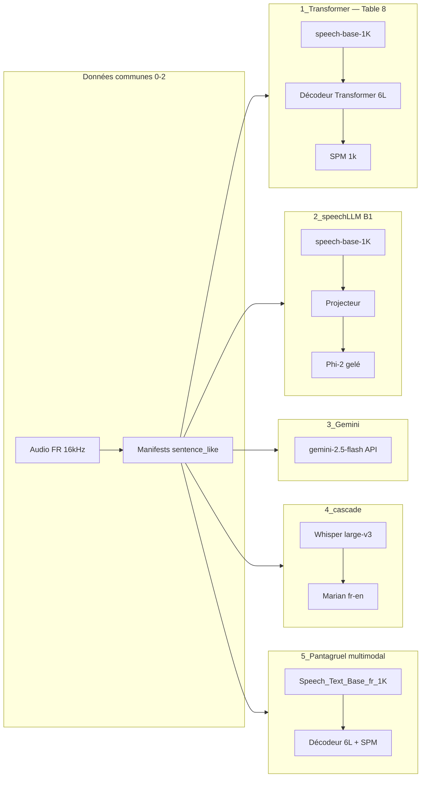

# Multimodalité : speech-to-text translation avec Pantagruel
# Traduction parole français → anglais sur m-TEDx : réplication Pantagruel et variantes multimodales

Statut : bench utterance partiel ; ST B-1k run_002 échoué (3,79) ; run_004 v2 **terminé** (16,84 / 16,68 — proche Table 8 ~17,5)

Références : [Pantagruel (2026)](docs/Pantagruel_2026.pdf) ; dépôt et protocole [PRD](docs/PRD.md), [README](README.md).

---

## Résumé

Nous étudions la traduction de la parole (ST) français → anglais sur le corpus multilingual TEDx (m-TEDx), en nous appuyant sur les encodeurs Pantagruel et le protocole d’évaluation SacreBLEU de l’article *Pantagruel: Unified Self-Supervised Encoders for French Text and Speech* (2026). Le dépôt S3T implémente la réplication end-to-end (encodeur SSL + décodeur Transformer 6 couches, Table 8 du papier) ainsi que quatre approches alternatives : speechLLM (projecteur + LLM gelé), API Gemini 2.5 Flash, cascade Whisper → Marian, et une variante expérimentale Speech_Text multimodale.

Les expériences couvrent deux segmentations : **`sentence_like`** (fusion de segments, runs historiques) et **`utterance`** (segments m-TEDx natifs, bench Pantagruel). Sur **utterance**, la cascade Whisper→Marian atteint **38,17 / 37,41** BLEU (dev/test), devant Gemini 2.5 Flash (**33,76 / 33,72**, run `run_001_gemini_flash_utterance_full`). La réplication ST Table 8 B-1k est **partielle** : run_002 en échec (**3,79** test) ; run_004 v2 **terminé** (**16,84 / 16,68**, early stop @20k, tour — ~0,8 BLEU sous le papier ~17,5). Sur **sentence_like**, Gemini reste en tête (**21,44 / 23,15**), puis speechLLM dégelé (**19,25 / 18,83**), ST greedy (**16,12 / 14,97**) et Speech_Text multimodal faible (**8,39 / 7,95**). Les tableaux détaillés par variante, paramètre et segmentation sont en **§5** ; ne pas mélanger utterance et sentence_like dans une même colonne de comparaison au papier.

Ce document synthétise le cadre expérimental, les différences entre variantes, les hyperparamètres testés, les résultats et les écarts de protocole par rapport au papier — matière première pour un article ou un chapitre expérimental.

---

## 1. Contexte et objectifs

### 1.1 Référence Pantagruel (2026)

L’article Pantagruel propose des encodeurs auto-supervisés unifiés pour le français (texte et parole), pré-entraînés en espace latent (data2vec 2.0 / JEPA). Pour la traduction parole → texte (ST), le papier :

- utilise les sous-ensembles fr-source de m-TEDx (≈50 h d’entraînement pour fr→en) ;
- branche un décodeur Transformer à 6 couches sur l’encodeur SSL pré-entraîné ;
- fine-tune de bout en bout et rapporte le BLEU (SacreBLEU) dans la Table 8.

Extrait Table 8 — ST (BLEU ↑, fr→en) (Pantagruel 2026, p. 8) :

| Modèle (papier) | fr→en | fr→es | fr→pt |
|-----------------|-------|-------|-------|
| LeBenchmark-w2v-B-1k | 14,0 ± 0,5 | 13,2 ± 0,4 | 8,6 ± 0,3 |
| LeBenchmark-w2v-L-14k | 23,1 ± 0,6 | 24,2 ± 0,6 | 21,8 ± 0,6 |
| Pantagruel-B-1k | 17,5 ± 0,4 | 19,0 ± 0,4 | 16,8 ± 0,3 |
| Pantagruel-L-14k | 24,0 ± 0,4 | 25,5 ± 0,4 | 21,9 ± 0,4 |
| Pantagruel-L-114k | 25,2 ± 0,4 | 25,4 ± 0,4 | 24,5 ± 0,5 |

Le papier précise que les réglages de fine-tuning ST suivent LeBenchmark 2.0 (Parcollet et al., 2024) pour une comparaison équitable avec wav2vec 2.0. L’encodeur HF utilisé dans S3T pour la baseline « 1k » est `PantagrueLLM/speech-base-1K`, aligné sur la famille Pantagruel-B-1k (référence papier ~17,5 BLEU fr→en, pas les ~24–25 des modèles Large).

### 1.2 Objectifs du projet S3T

1. Temps A — Réplication : reproduire la chaîne audio → Pantagruel → décodeur Transformer → anglais avec artefacts reproductibles (YAML, checkpoints, SacreBLEU signé), sans fairseq.
2. Comparaison de paradigmes : évaluer si des approches LLM (speechLLM), API multimodale (Gemini) ou cascade ASR→MT rivalisent ou complètent la baseline E2E sur le même protocole de données (`sentence_like`).
3. Piste expérimentale : tester un checkpoint Speech_Text multimodale récent avec le même décodeur ST.

Les paires fr→pt et fr→es sont prévues par le PRD mais non reportées dans ce rapport (focus fr→en).

### 1.3 Clarifications (retour encadrant, juin 2026)

#### Pantagruel-B-1k vs 14k / 114k (point 1)

La Table 8 du papier montre un **écart net selon la taille de l’encodeur SSL** (toujours + décodeur Transformer 6L, protocole utterance) :

| Famille (papier) | BLEU test fr→en (indicatif) |
|------------------|----------------------------|
| LeBenchmark-w2v-B-1k | 14,0 |
| **Pantagruel-B-1k** | **17,5** |
| Pantagruel-L-14k | 24,0 |
| Pantagruel-L-114k | 25,2 |

**Choix S3T actuel :** `PantagrueLLM/speech-base-1K` pour la **réplication minimale** de la ligne B-1k (budget GPU, alignement PRD « Temps A »). Ce n’est **pas** le plafond du papier (~24–25), qui correspond aux encodeurs **Large**.

**Suite logique (validée) :** après `run_002_transformer_baseline_utterance` (B-1k, utterance), prévoir des runs ST + speechLLM avec **`speech-base-14K`** (et éventuellement 114k si checkpoint HF disponible), **même** décodeur / budget d’updates / protocole SacreBLEU — sinon comparer nos ~16–20 BLEU aux ~24 du papier est trompeur.

#### speechLLM « 1 » et « 2 » : gelé / dégelé, pas 1k / 14k (point 2)

Les lignes speechLLM du tableau README **ne sont pas** deux tailles Pantagruel. C’est **la même** encodeur `speech-base-1K` ; seul change l’**entraînement** :

| Run | Encodeur Pantagruel | Projecteur | LLM Phi-2 | Question testée |
|-----|---------------------|------------|-----------|-----------------|
| `run_002` | **gelé** (poids fixes) | entraîné | gelé | B1 minimal (SLAM-ASR) |
| `run_005` | **fine-tuné** (+ projecteur) | entraîné | gelé | Le dégel encodeur aide-t-il ? (test +2,9, dev −0,7) |

Autre confusion possible : « variante 1 / 2 » du dépôt = dossiers `1_Transformer` (ST classique) vs `2_speechLLM` (LLM), pas les runs 002/005.

#### Organiser les résultats (point 3)

**Sources de vérité (à utiliser dans l’ordre) :**

1. `runs/experiments_tracking.csv` — une ligne par run, colonnes `pipeline`, `segment_mode`, BLEU, statut.
2. `runs/fr-en/<run_id>/eval/sacrebleu_*.txt` — scores signés + signature SacreBLEU.
3. Tableaux README (vue rapide) et ce rapport (analyse).

**Convention de nommage** : `run_<NNN>_<pipeline>_<segment_mode>` (ex. `run_002_transformer_baseline_utterance`).

**Axes à ne pas mélanger dans un même tableau :**

| Axe | Exemples |
|-----|----------|
| Paradigme | ST E2E, speechLLM, Gemini, cascade |
| Taille encodeur | B-1k (actuel), L-14k (à faire) |
| Segmentation | `utterance` (papier) vs `sentence_like` (S3T) |
| Décodage | beam 5 (ST), beam 1 / 48 tokens (speechLLM) |

#### Leviers d’amélioration par variante (point 4)

| Variante | Changer de modèle | Hyperparamètres | Données / corpus | Décodage | Autre |
|----------|-------------------|-----------------|------------------|----------|-------|
| **ST Table 8** | `speech-base-14K`, 114k | LR, freeze, 80k→120k updates, batch | `utterance` vs `sentence_like` | beam 5 vs greedy | stack fairseq vs S3T |
| **speechLLM** | LLM gelé (Llama-3.2-3B, Mistral-7B) ; encodeur 14k | LR, WD, 20k updates, gel encodeur | utterance + train dédié | beam, `max_new_tokens` | quantisation LLM |
| **Gemini** | id API (2.5 Flash, autre snapshot) | température, max tokens | segment mode | prompt | coût / quota |
| **Cascade** | Whisper medium/large ; NLLB vs Marian | — | utterance | — | erreur ASR en cascade |
| **Speech_Text + ST** | autre checkpoint | comme ST | utterance | beam | prétrain multimodal complet |

Priorité encadrant : **encodeur 14k** pour ST et speechLLM **avant** de pousser Phi-2 ou le décodage.

#### Gemini 3.5 Flash (point 5)

**Gemini 3.5 Flash** est sorti en **GA** (Google I/O, mai 2026) ; id API stable : **`gemini-3.5-flash`** ([doc modèle](https://ai.google.dev/gemini-api/docs/models/gemini-3.5-flash)).

| Version | `gemini_id` | Runs S3T (scores actuels) | Config YAML |
|---------|-------------|---------------------------|-------------|
| 2.5 Flash (référence actuelle) | `gemini-2.5-flash` | `run_001_gemini_flash_sentence_like_v2` — 21,44 / 23,15 | `gemini_flash*.yaml` |
| **3.5 Flash (à lancer)** | `gemini-3.5-flash` | `run_003_gemini_35_flash_*` (prévu) | `gemini_flash_35_*.yaml` |

**Protocole :** même prompt, `temperature=0`, `max_output_tokens=256`, SacreBLEU signé — **ne pas** réécrire les artefacts 2.5 ; comparer 2.5 vs 3.5 sur `sentence_like` puis `utterance`.

**Tarifs API (tier Standard, ST audio)** : 2.5 Flash — entrée **1,00** / sortie **2,50** USD par 1M tokens ; 3.5 Flash — **1,50** / **9,00** ([grille officielle](https://ai.google.dev/gemini-api/docs/pricing#gemini-3.5-flash)). Le 3.5 est nettement plus cher au token ; le coût run dépend surtout du volume audio + longueur des hypothèses EN.

```bash
python 3_Gemini/pipeline.py evaluate \
  --config 3_Gemini/configs/fr-en/gemini_flash_35_sentence.yaml \
  --run-id run_003_gemini_35_flash_sentence_like
```

#### Protocole d’évaluation figé (point 6)

**Version `2026-06-02-v1`** — document complet : [docs/protocole_evaluation.md](docs/protocole_evaluation.md) ; implémentation : `scripts_communs/eval_protocol.py` ; artefact par run : `eval/protocol.json`.

Résumé : SacreBLEU corpus (défaut bibliothèque), pas de normalisation texte ; ST en **greedy** (beam 5 YAML journalisé seulement) ; speechLLM beam 1 / 48 tokens ; Gemini temp 0 / 256 tokens. Toute modification de protocole impose une **nouvelle version** et une re-évaluation des runs comparables.

Bench : `bash scripts/bench_evaluate_variants.sh` puis `update_experiments_tracking.py --all`.

#### LeBenchmark vs utterance / sentence_like (point 7) — pas la même chose

| Terme | Nature | Rôle |
|-------|--------|------|
| **LeBenchmark** | Famille de **modèles SSL** (ex. wav2vec 2.0 B-1k, L-14k) | Lignes de comparaison dans la **Table 8** du papier |
| **Pantagruel-B-1k / L-14k** | Autres encodeurs SSL (Pantagruel) | Même tâche ST, autre pré-entraînement |
| **`utterance`** | Mode de **découpage** m-TEDx (segment YAML natif) | Protocole papier |
| **`sentence_like`** | Mode de **découpage** S3T (fusion de segments) | Protocole expérimental S3T |

LeBenchmark et Pantagruel sont comparés **à segmentation et protocole identiques** dans le papier. Nos runs `sentence_like` ne remplacent pas LeBenchmark : ils changent la **granularité des clips**, indépendamment de l’encodeur.

---

## 2. Corpus, préparation des données et métriques

### 2.1 Corpus m-TEDx (fr→en)

- Source : OpenSLR-100, partition française, direction fr→en.
- Volume : ≈50 h d’entraînement (aligné PRD / papier).
- Audio : 16 kHz, mono, PCM_16 ; filtrage durée et normalisation texte via `scripts_communs/2_prepare.py`.
- Anti-fuite : contrôle train / valid / test activé par défaut.

### 2.2 Mode de segmentation `sentence_like`

La majorité des runs documentés ici n’utilisent pas la segmentation utterance native m-TEDx, mais une fusion `sentence_like` :

| | `utterance` | `sentence_like` (choix actuel) |
|---|-------------|--------------------------------|
| Unité | 1 segment YAML = 1 clip | Segments contigus fusionnés (même talk, même locuteur si possible) |
| Objectif | Comparabilité stricte au corpus publié | Unités plus phrase-like (contexte local plus long) |
| Chemins | `datasets/manifests/fr-en/` | `datasets/manifests_sentence/fr-en/` |

Règles de fusion : durée cible ~10 s, max 15 s, coupe préférentielle sur `.?!` ; identifiants `{talk_id}_m{index}`.

Conséquence méthodologique : les BLEU de ce rapport (§5) portent surtout sur `sentence_like` ; ils ne sont pas directement comparables aux chiffres Table 8 du papier.

### 2.3 Protocole utterance (comparaison Pantagruel)

Pour aligner la segmentation sur l’article (segments m-TEDx natifs, sans fusion) :

| Élément | Valeur |
|---------|--------|
| Mode `prepare` | `--segment-mode utterance` (défaut) |
| Manifests | `datasets/manifests/fr-en/*.tsv` |
| Audio | `datasets/processed/fr-en/` |
| Référence papier | Pantagruel-B-1k, fr→en ≈ **17,5 BLEU** (Table 8) |

Runs dédiés (configs et scripts dans le dépôt, voir [docs/protocole_utterance_pantagruel.md](docs/protocole_utterance_pantagruel.md)) :

| Variante | Run ID | Statut (juin 2026) |
|----------|--------|-------------------|
| Cascade Whisper→Marian | `run_001_cascade_utterance` | **OK** — 38,17 / 37,41 (tour) |
| Gemini 2.5 Flash | `run_001_gemini_flash_utterance_full` | **OK** — 33,76 / 33,72 (local) |
| ST Transformer + SPM | `run_002_transformer_baseline_utterance` | **échec** — 3,90 / 3,79 (collapse) |
| ST Transformer + SPM v2 | `run_004_transformer_baseline_utterance_v2` | **ok** — 16,84 / 16,68 (tour, early stop @20k) |
| speechLLM B1 | `run_003_speechllm_b1_utterance_long` | à lancer (~20k updates) |

Règle : ne pas réutiliser un modèle entraîné sur `sentence_like` pour scorer des manifests utterance.

### 2.4 Métrique, sélection de modèle et protocole d’évaluation

Protocole figé : [docs/protocole_evaluation.md](docs/protocole_evaluation.md) (`2026-06-02-v1`).

- Métrique principale : SacreBLEU corpus (dev + test), signature dans `eval/sacrebleu_*.txt` et `eval/protocol.json`.
- Critère de checkpoint : meilleur BLEU dev → `checkpoints/best.pt` (loss dev secondaire).
- Suivi agrégé : `runs/experiments_tracking.csv`.
- Bench multi-variantes : `scripts/bench_evaluate_variants.sh`.

---

## 3. Architectures et variantes



### 3.1 Variante 1 — ST end-to-end (réplication Table 8)

Pipeline : `1_Transformer/` (étapes 3–6 : SPM, train, evaluate, infer).

| Composant | Choix S3T |
|-----------|-----------|
| Encodeur | `PantagrueLLM/speech-base-1K` (`trust_remote_code`) |
| Décodeur | Transformer 6 couches, 8 têtes, hidden 768 |
| Tokenisation cible | SentencePiece vocab 1000 |
| Entraînement | Jusqu’à 80 000 updates ; freeze encodeur 1000 updates ; LR pic 2e-4 ; batch effectif 8 (2×accum 4) |
| Décodage (config) | beam 5, `max_len_b` 128 |

Run : `run_001_transformer_baseline_sentence_like` — entraînement et évaluation terminés (juin 2026).

Journal train (update 80 000) : `loss=1,2303`, encodeur non gelé (`freeze=False`), `bleu_dev=15,51` (greedy, 20 batches), `best=18,72` (meilleur checkpoint retenu).

SacreBLEU corpus (`evaluate`, beam 5, config YAML) : **dev 16,12**, **test 14,97** (`runs/fr-en/run_001_transformer_baseline_sentence_like/eval/`).

Écart connu vs papier : segmentation `sentence_like` (vs utterance m-TEDx) ; stack PyTorch/HF (vs fairseq) ; le BLEU dev greedy partiel en train (18,72, 20 batches) surestime la mesure corpus (16,12).

### 3.2 Variante 2 — speechLLM B1 (ligne prioritaire)

Inspirée de *Embarrassingly Simple* (SLAM-ASR) : aligner la parole sur l’espace token du LLM sans réentraîner le LLM.

| Composant | run_002 (gelé) | run_005 (dégelé) |
|-----------|----------------|------------------|
| Encodeur | `speech-base-1K` gelé | `speech-base-1K` fine-tuné |
| Downsampling | k = 5 | k = 5 |
| Projecteur | Linear → ReLU → Linear (hidden 2048) — seul entraîné (002) / + encodeur (005) | idem |
| LLM | `microsoft/phi-2` gelé | idem |
| Prompt | `Translate the French speech to English.` | idem |
| Budget train | 20 000 updates | 20 000 updates |
| LR / WD | 1e-4, WD 0 | 5e-5, WD 0,01 |
| Décodage éval | beam 1, max_new_tokens 48 | idem |

Choix Phi-2 : compromis VRAM / latence pour valider la pipeline (≈2,7B paramètres) avant ablations LLM plus lourds (Llama-3.2-3B, Mistral-7B quantisé).

Anti-pattern documenté : `beam ≥ 4` et `max_new_tokens ≥ 128` provoquent répétitions et dégradent fortement le BLEU.

### 3.3 Variante 3 — Gemini Flash (baseline API)

- **2.5 (évalué)** : `gemini-2.5-flash` — 21,44 / 23,15 (`sentence_like`).
- **3.5 (à évaluer)** : `gemini-3.5-flash` (GA mai 2026) — configs `gemini_flash_35_*.yaml`, même prompt / decode que 2.5.
- Entrée audio native, sortie texte anglais ; pas d’entraînement local.
- Prompt : identique à speechLLM pour comparabilité.
- Décodage : `temperature=0`, `max_output_tokens=256`.
- Pas d’entraînement local ; coût API estimé dans `eval/metrics.json` (grille juin 2026 : 1 USD / 1M tokens audio entrée, 2,50 USD / 1M tokens sortie).

Run : `run_001_gemini_flash_sentence_like_v2`.

### 3.4 Variante 4 — Cascade ASR → MT

- ASR : `openai/whisper-large-v3` (langue `fr`).
- MT : `Helsinki-NLP/opus-mt-fr-en`.
- Évaluation seule (pas de fine-tuning) ; non lancée sur corpus complet (contrainte GPU).

### 3.5 Variante 5 — Pantagruel Speech_Text + décodeur ST

- Encodeur : `PantagrueLLM/Speech_Text_Base_fr_1K_4GB` (multimodal speech-text).
- Tête : même décodeur Transformer 6L + SPM que la variante 1 (délégation `1_Transformer`).
- Run : `run_001_pantagruel_multimodal` — scores faibles vs `speech-base-1K`, hypothèse : inadéquation du checkpoint ou réglages de fine-tuning à affiner.

---

## 4. Protocole expérimental et paramètres testés

### 4.1 Facteurs contrôlés ou variés

| Facteur | Valeurs testées | Notes |
|---------|-----------------|-------|
| Segmentation | `sentence_like` (principal) ; `utterance` (prévu / partiel) | Impact majeur sur BLEU — à ablater |
| Encodeur | `speech-base-1K` ; `Speech_Text_Base_fr_1K_4GB` | Nom HF corrigé (`Pantagruel-Base` → 404) |
| Gel encodeur | 1000 updates (ST) ; gelé vs dégelé (speechLLM) | run_005 : fine-tune encodeur + projecteur |
| Tête de génération | Transformer+SPM ; Phi-2 ; Gemini ; Whisper+Marian | Paradigmes différents |
| Décodage speechLLM | beam 1 / 48 tokens (officiel) ; beams larges (échec) | Figé pour run_002 et run_005 |
| Décodage ST | greedy (train) ; beam 5 (config éval) | À mesurer à la fin du run_001 |
| Seed | 42 (runs reportés) | Multi-seeds PRD si gain prometteur |

### 4.2 Hyperparamètres par configuration (fr→en, sentence_like)

| Paramètre | ST `base_sentence_like.yaml` | speechLLM `b1_sentence_long` | speechLLM `unfreeze_encoder` | Gemini `gemini_flash_sentence` |
|-----------|------------------------------|------------------------------|------------------------------|--------------------------------|
| max_updates | 80 000 | 20 000 | 20 000 | — |
| freeze_encoder_updates | 1 000 | — (gel booléen) | false | — |
| learning_rate_peak | 2e-4 | 1e-4 | 5e-5 | — |
| weight_decay | 0,01 | 0 | 0,01 | — |
| batch × accum | 2 × 4 | 2 × 4 | 2 × 4 | — |
| beam (éval) | 5 (config) | 1 | 1 | N/A |
| max tokens sortie | 128 (len) | 48 | 48 | 256 |

### 4.3 Incidents méthodologiques

| Run | Problème | Impact |
|-----|----------|--------|
| run_004 | `best.pt` ne persistait que le projecteur (`encoder.*` absent malgré `freeze_encoder: false`) | BLEU dev 0,30 / test 0,46 — éval invalide |
| Correctif | Préfixes checkpoint `_speechllm_checkpoint_prefixes` + tests `tests/test_speechllm_checkpoint.py` | — |
| run_005 | Retrain avec checkpoint corrigé | Scores valides (voir tableau §5) |

---

## 5. Résultats

Métrique : **SacreBLEU corpus** (signature habituelle `tok:13a|smooth:exp|version:2.6.0`). Sources : `runs/fr-en/<run_id>/eval/sacrebleu_*.txt`, agrégat `runs/experiments_tracking.csv`. Protocole : [docs/protocole_evaluation.md](docs/protocole_evaluation.md) (`2026-06-02-v1`).

**Règle de lecture :** comparer deux runs seulement si **`segment_mode` identique** (utterance vs sentence_like). Le décodage ST S3T v1 est **greedy** en pratique (YAML `beam_size: 5` journalisé, pas beam search — voir protocole §4.1).

### 5.1 Corpus complet — `sentence_like`

| Variante | `run_id` | Modèle(s) | Décodage | BLEU dev | BLEU test | Statut |
|----------|----------|-----------|----------|----------|-----------|--------|
| Gemini 2.5 Flash | `run_001_gemini_flash_sentence_like_v2` | `gemini-2.5-flash` | temp 0, max 256 tok | 21,44 | 23,15 | ok |
| speechLLM B1 (encodeur gelé) | `run_002_speechllm_b1_sentence_long` | `speech-base-1K` gelé → Phi-2 gelé | beam 1, max 48 tok | 19,99 | 15,89 | ok |
| speechLLM B1 (encodeur dégelé) | `run_005_speechllm_b1_sentence_long_unfreeze_encoder` | `speech-base-1K` FT + Phi-2 gelé | beam 1, max 48 tok | 19,25 | 18,83 | ok |
| ST E2E Transformer | `run_001_transformer_baseline_sentence_like` | `speech-base-1K` + décodeur 6L + SPM 1k | greedy (v1) | 16,12 | 14,97 | ok |
| Pantagruel Speech_Text + ST | `run_001_pantagruel_multimodal` | `Speech_Text_Base_fr_1K_4GB` + décodeur 6L | greedy (v1) | 8,39 | 7,95 | ok |
| Cascade ASR→MT | `run_001_cascade_sentence_like` | Whisper large-v3 → Marian fr-en | ASR+MT (cascade) | — | — | non rapporté / à relancer |
| speechLLM (bug checkpoint) | `run_004_speechllm_b1_sentence_long_unfreeze_encoder_v2` | idem run_005 | beam 1 | 0,30 | 0,46 | invalid_eval |

### 5.2 Corpus complet — `utterance` (bench Pantagruel)

| Variante | `run_id` | Modèle(s) | Décodage | BLEU dev | BLEU test | Statut |
|----------|----------|-----------|----------|----------|-----------|--------|
| Cascade ASR→MT | `run_001_cascade_utterance` | Whisper large-v3 → Marian fr-en | ASR+MT (cascade) | **38,17** | **37,41** | ok (tour, juin 2026) |
| Gemini 2.5 Flash | `run_001_gemini_flash_utterance_full` | `gemini-2.5-flash` | temp 0, max 256 tok | **33,76** | **33,72** | ok (local) |
| ST E2E Transformer B-1k | `run_002_transformer_baseline_utterance` | `speech-base-1K` + décodeur 6L + SPM 1k | greedy (v1) | 3,90 | 3,79 | **échec** (collapse ~26k) |
| ST E2E Transformer B-1k **v2** | `run_004_transformer_baseline_utterance_v2` | idem + gel 5k + early stop | greedy (v1) | **16,84** | **16,68** | ok (tour) |
| speechLLM B1 | `run_003_speechllm_b1_utterance_long` | `speech-base-1K` gelé → Phi-2 gelé | beam 1, max 48 tok | — | — | à lancer |
| Gemini (alias protocole) | `run_002_gemini_flash_utterance` | idem 2.5 Flash | idem | — | — | config dédiée ; scores = `run_001_gemini_flash_utterance_full` si même corpus |

### 5.3 Même paradigme : `utterance` vs `sentence_like` (BLEU test)

| Paradigme | BLEU test `utterance` | BLEU test `sentence_like` | Δ test (indicatif) |
|-----------|----------------------|---------------------------|-------------------|
| Cascade | **37,41** | — | — |
| Gemini 2.5 Flash | **33,72** | 23,15 | +10,6 |
| speechLLM B1 (gelé) | — | 15,89 | — |
| speechLLM B1 (dégelé) | — | 18,83 | — |
| ST Transformer B-1k | **16,68** (run_004 v2) ; run_002 échec 3,79 | 14,97 | +1,7 (v2 utterance vs sentence_like) |

### 5.4 Paramètres d’expérience par run (fr→en)

| `run_id` | Pipeline | `segment_mode` | Encodeur / API | Train | Décodage éval | Freeze encodeur |
|----------|----------|----------------|----------------|-------|---------------|-----------------|
| `run_001_cascade_utterance` | cascade | utterance | Whisper + Marian | aucun | cascade | — |
| `run_001_gemini_flash_utterance_full` | gemini | utterance | gemini-2.5-flash | aucun | temp 0 | — |
| `run_001_gemini_flash_sentence_like_v2` | gemini | sentence_like | gemini-2.5-flash | aucun | temp 0 | — |
| `run_002_speechllm_b1_sentence_long` | speechllm | sentence_like | speech-base-1K | 20k upd. | beam 1 | **gelé** |
| `run_005_speechllm_b1_sentence_long_unfreeze_encoder` | speechllm | sentence_like | speech-base-1K | 20k upd. | beam 1 | **dégelé** |
| `run_001_transformer_baseline_sentence_like` | transformer | sentence_like | speech-base-1K | 80k upd. | greedy (v1) | freeze 1k upd. |
| `run_002_transformer_baseline_utterance` | transformer | utterance | speech-base-1K | 80k upd. | greedy (v1) | freeze 1k upd. — **échec** |
| `run_004_transformer_baseline_utterance_v2` | transformer | utterance | speech-base-1K | early stop | greedy (v1) | freeze 5k upd. |
| `run_001_pantagruel_multimodal` | pantagruel_mm | sentence_like | Speech_Text 1K | 80k upd. | greedy (v1) | freeze 1k upd. |
| `run_010_transformer_baseline_utterance_large_14k` | transformer | utterance | speech-large-14K | 80k upd. (prévu) | greedy (v1) | freeze 1k upd. |
| `run_011_transformer_baseline_utterance_large_114k` | transformer | utterance | speech-large-114K | 80k upd. (prévu) | greedy (v1) | freeze 1k upd. |

### 5.5 Référence papier — Table 8 ST E2E (`utterance` uniquement)

| Modèle (Pantagruel 2026) | BLEU test fr→en (papier) | S3T comparable |
|--------------------------|--------------------------|----------------|
| LeBenchmark-w2v-B-1k | 14,0 ± 0,5 | — |
| **Pantagruel-B-1k** | **17,5 ± 0,4** | `run_004_transformer_baseline_utterance_v2` — **16,68** test (écart ~0,8) |
| Pantagruel-L-14k | 24,0 ± 0,4 | `run_010_…` (prévu) |
| Pantagruel-L-114k | 25,2 ± 0,4 | `run_011_…` (prévu) |

Les variantes **cascade, Gemini, speechLLM** ne figurent pas dans la Table 8 du papier.

### 5.6 Runs exclus des tableaux principaux (smoke / invalides)

| `run_id` | `segment_mode` | BLEU test | Raison |
|----------|----------------|-----------|--------|
| `run_000_cascade_smoke` | sentence_like | 30,83 | `--limit 5` |
| `run_000_gemini_*` | mixte | 34–37 | 5 segments |
| `run_004_speechllm_b1_sentence_long_unfreeze_encoder_v2` | sentence_like | 0,46 | checkpoint sans `encoder.*` |

### 5.7 Comparaison indicative S3T vs papier (ST B-1k)

| Référence | BLEU fr→en (papier, utterance) | BLEU fr→en (S3T) |
|-----------|-------------------------------|------------------|
| Pantagruel-B-1k | 17,5 ± 0,4 | ST utterance run_004 v2 : **16,68** ; run_002 : **3,79** (échec) ; sentence_like : 14,97 |
| Pantagruel-L-14k / L-114k | 24–25 | Runs `run_010` / `run_011` prévus |
| Gemini 2.5 Flash | hors Table 8 | 33,72 test (utterance) ; 23,15 (sentence_like) |
| Cascade | hors Table 8 | 37,41 test (utterance) |

Lecture prudente : stack PyTorch/HF vs fairseq historique ; ST v1 en greedy vs beam 5 papier.

### 5.8 Observations qualitatives

1. **Utterance :** la cascade (**37,41** test) dépasse Gemini (**33,72**) et largement les pistes locales sentence_like — à nuancer : pas de ligne papier cascade ; qualité ASR+MT sur TEDx peut gonfler le BLEU vs ST E2E greedy.
2. **Sentence_like :** Gemini (**23,15** test) devance speechLLM dégelé (**18,83**) et ST (**14,97**) — cohérent avec le tableau §5.1.
3. speechLLM : le dégel encodeur (run_005) améliore le test (+2,9 vs run_002) au prix d’une légère baisse dev (−0,7) sur sentence_like.
4. Écart dev/test important pour run_002 speechLLM (19,99 → 15,89) : longueur max 48 tokens, sur-adaptation valid, ou effet segmentation.
5. Speech_Text multimodal sous-performe (8,39 / 7,95) : piste encodeur multimodal vs tâche ST pure.
6. **run_002 utterance** : collapse décodeur (répétitions `iveive…`, BLEU 3,79). **run_004 v2** (gel 5k, early stop, LR 1e-4) : **16,84 / 16,68** (2026-06-05, tour, early stop @20k) — réplication partielle Table 8 (~0,8 BLEU sous le papier). Encodeurs Large (`run_010` / `run_011`) à lancer ensuite.

---

## 6. Discussion

### 6.1 Paradigmes de traduction

| Paradigme | Forces | Limites observées |
|-----------|--------|-------------------|
| E2E Transformer (Table 8) | Aligné papier ; contrôle total ; pas de coût API | 16,12 / 14,97 — sous papier B-1k et speechLLM test |
| speechLLM | Peu de paramètres entraînés ; convergence rapide (20k) | Sensibilité au décodage ; plafond vs API ; LLM petit (Phi-2) |
| Gemini | Meilleur BLEU actuel ; zéro train GPU | Coût, reproductibilité, dépendance fournisseur |
| Cascade | Interprétable ; modèles SOTA ASR/MT | Propagation d’erreurs ; 2× latence VRAM |
| Speech_Text + ST | Exploite prétrain multimodal | Résultats actuels insuffisants |

### 6.2 Écarts de protocole vs Pantagruel (2026)

1. Segmentation `sentence_like` vs segments m-TEDx d’origine.
2. Stack S3T : PyTorch + Hugging Face + décodeur custom (pas fairseq / SpeechBrain complet).
3. Checkpoint HF : `speech-base-1K` (nom corrigé) vs libellés papier « Pantagruel-Base ».
4. Décodage : validation train en greedy (20 batches) ; éval finale en beam 5 (config YAML).
5. Pas de speed perturbation m-TEDx (PRD : extension Temps B).

### 6.3 Feuille de route (priorités encadrant)

| Priorité | Action | Variantes concernées |
|----------|--------|----------------------|
| P0 | Bench **utterance** : ST `run_004` ok (16,68) ; lancer `run_003_speechllm_b1_utterance_long` | speechLLM |
| P0 | **Figer** protocole SacreBLEU / décodage par écrit | toutes |
| P1 | Runs encodeur **`speech-base-14K`** (ST + speechLLM), utterance | 1_Transformer, 2_speechLLM |
| P2 | **Gemini 3.5 Flash** (`gemini-3.5-flash`, configs `gemini_flash_35_*.yaml`) vs 2.5 | 3_Gemini |
| P3 | Ablations décodage / LLM / cascade | selon gains sur dev |

### 6.4 Travaux en cours techniques

- **`run_004_transformer_baseline_utterance_v2`** : terminé (2026-06-05, tour) — rsync `runs/fr-en/run_004_…/eval/` vers ThinkPad et `update_experiments_tracking.py`.
- Lancer **`run_003_speechllm_b1_utterance_long`** (GPU libre après run_004).
- Optionnel : rsync `eval/` cascade utterance (tour → ThinkPad) ; cascade `run_001_cascade_sentence_like` (sentence_like) pour tableau §5.3 complet.
- Ablations ST : greedy vs beam (nouvelle version protocole si beam 5 implémenté).
- Ablations speechLLM : LLM gelés (Llama-3.2-3B, Mistral-7B 4-bit) ; cascade Whisper medium vs large × MT NLLB.
- MQM / relecture humaine en fin de projet (hors scope immédiat).

---

## 7. Limites

- Résultats fr→en uniquement ; une seed (42) pour la plupart des runs.
- `sentence_like` non présent dans le papier Pantagruel — comparaison Table 8 indicative.
- `run_004_speechllm_*` (invalid_eval checkpoint) exclu des conclusions ; réplication ST Table 8 **partielle** (run_004 ST v2 : 16,68 test ; run_002 échec 3,79 ; greedy vs beam 5 papier).
- Coûts GPU/API partiellement renseignés dans le CSV.
- Pas encore de significativité statistique ni d’analyse d’erreur systématique (répétitions, longueur, OOV).

---

## 8. Conclusion (provisoire)

Le projet S3T met en place un bench reproductible pour la ST fr→en sur m-TEDx avec cinq familles de modèles autour de Pantagruel. Sur **utterance**, la cascade (37,41 test) et Gemini (33,72) dominent ; la baseline ST B-1k v2 (`run_004`, **16,68** test, greedy) se rapproche de la Table 8 Pantagruel (~17,5) après correction du collapse run_002. Sur **sentence_like**, Gemini reste en tête (23,15 test), devant speechLLM dégelé (18,83) et ST (14,97). L’écart résiduel au papier peut refléter greedy vs beam 5, la stack PyTorch/HF ou des hyperparamètres encore perfectibles.

---

## 9. Références et ressources

- Pantagruel et al., 2026 — *Pantagruel: Unified Self-Supervised Encoders for French Text and Speech* — `docs/Pantagruel_2026.pdf`
- Parcollet et al., 2024 — LeBenchmark 2.0 (protocole ST de référence)
- Salesky et al., 2021 — m-TEDx (OpenSLR-100)
- SLAM-ASR / *Embarrassingly Simple* — `2_speechLLM/embarrassingly_simple_approach.pdf`
- Documentation projet : `docs/PRD.md`, `docs/plan_migration_speechllm.md`, `docs/rapport_pantagruel_uni_vers_article.md`

---

## Annexe A — Identifiants de runs et chemins

| Run ID | Config YAML |
|--------|-------------|
| `run_004_transformer_baseline_utterance_v2` | `1_Transformer/configs/fr-en/base_utterance_v2.yaml` |
| `run_001_transformer_baseline_sentence_like` | `1_Transformer/configs/fr-en/base_sentence_like.yaml` |
| `run_002_speechllm_b1_sentence_long` | `2_speechLLM/configs/fr-en/b1_sentence_long.yaml` |
| `run_005_speechllm_b1_sentence_long_unfreeze_encoder` | `2_speechLLM/configs/fr-en/b1_sentence_long_unfreeze_encoder.yaml` |
| `run_001_gemini_flash_sentence_like_v2` | `3_Gemini/configs/fr-en/gemini_flash_sentence.yaml` (`gemini-2.5-flash`) |
| `run_003_gemini_35_flash_sentence_like` | `3_Gemini/configs/fr-en/gemini_flash_35_sentence.yaml` (`gemini-3.5-flash`) |
| `run_003_gemini_35_flash_utterance` | `3_Gemini/configs/fr-en/gemini_flash_35_utterance.yaml` |
| `run_001_pantagruel_multimodal` | variante 5 (encodeur Speech_Text) |
| `run_001_cascade_sentence_like` (prévu) | `4_cascade/configs/fr-en/cascade_sentence.yaml` |

Artefacts attendus par run : `config.yaml`, `checkpoints/best.pt`, `train.log`, `eval/sacrebleu_*.txt`, `eval/metrics.json`, `eval/*_predictions.txt`.

---

## Annexe B — Sections article suggérées

Pour déclinaison LaTeX / conférence :

1. Introduction — Pantagruel, enjeux ST français, objectifs S3T  
2. Related work — SSL parole, ST E2E, speechLLM, cascades, API multimodales  
3. Corpus & preprocessing — m-TEDx, `sentence_like`  
4. Modèles — §3 de ce rapport  
5. Experimental setup — §4, SacreBLEU, hardware  
6. Results — §5 + figures courbes train  
7. Analysis — écarts papier, erreurs qualitatives  
8. Conclusion & future work — fr-pt/es, Large encoder, MQM  

*Dernière mise à jour manuelle : 2026-06-05 — cascade utterance 37,41 ; Gemini utterance 33,72 ; ST run_002 échec 3,79 ; run_004 v2 **16,84 / 16,68** (terminé, tour).*
